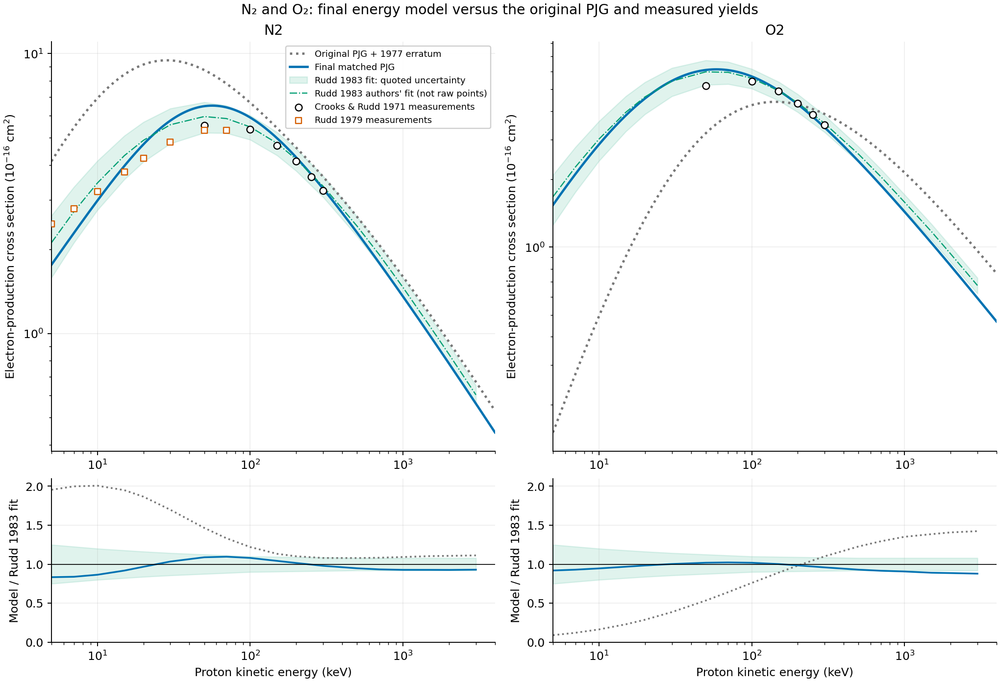
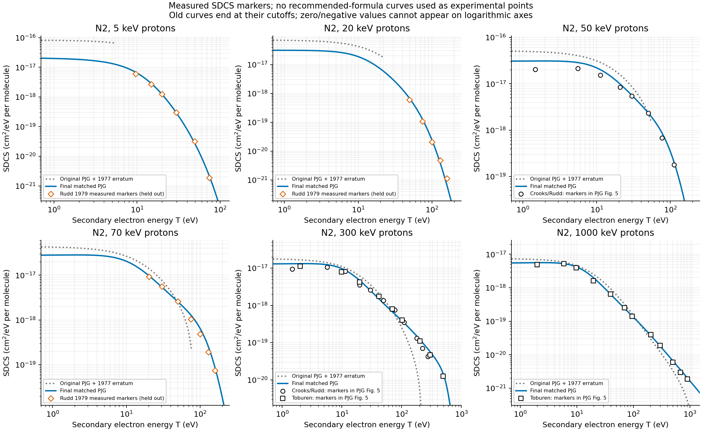
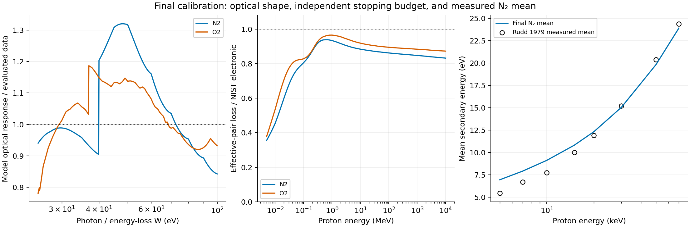

.. _multiphysics-collisions-proton-impact-ionization:

Proton and bare-ion impact ionization
=====================================

WarpX implements a calibrated Porter--Jackman--Green (PJG)-type singly
differential cross section (SDCS) for proton impact on molecular nitrogen
and oxygen. The total is the integral of this same SDCS, not a separately
normalized rate. This section specifies both the original proton model of
:cite:t:`b-Porter1976`, including the corrections in Ref. 26 of
:cite:t:`b-Garvey1977`, and its replacement. Numerical constants below define
the September 2026 calibration; they are not a new set of measured molecular
constants. The independent Python reference and reproduction tools are in
``Tools/Algorithms/ProtonImpactIonization``.

.. important::

   The observable is **inclusive electron-production yield**. Each represented
   electron is accompanied by an effective singly charged molecular ion.
   This is not the cross section for exclusive single molecular ionization.
   Multiple ionization, fragmentation, capture, and correlated electron
   emission are not resolved as separate channels. The projectile is rigid:
   this operator changes neither its momentum nor its weight. Ions inherit
   the neutral thermal velocity distribution, not event recoil.

The incident-proton numerical range is 5 keV--10 GeV. The total-data
calibration covers experiments at 5--4000 keV; the fitted measured N2 spectra
extend to 1 MeV and the O2 spectra to 150 keV. Results at relativistic
energies are constrained extrapolations, not experimentally validated
molecular spectra. No ejected-electron energy cut is applied: all sampled
secondaries, including those below the first molecular ionization threshold,
are kinetic particles. The lower *incident* energy limit is not a lower
*secondary* energy limit.

Conventions and original PJG model
^^^^^^^^^^^^^^^^^^^^^^^^^^^^^^^^^^

Let :math:`E` denote projectile kinetic energy and :math:`T` emitted-electron
kinetic energy. In the equations below :math:`m=m_ec^2`, :math:`M=M_pc^2`
and :math:`A=M_nc^2` are **rest energies**, not masses. Use eV consistently.
Let

.. math::

   \gamma=1+E/M,\qquad
   \beta^2=\frac{E(E+2M)}{(E+M)^2},\qquad
   E_e=\frac{m\beta^2}{2},\qquad K_{\rm nr}=\frac{mE}{M},\qquad
   C_B=4\pi a_0^2R_y^2.

Here :math:`R_y=13.605693122994` eV and
:math:`a_0=5.29177210544\times10^{-9}` cm. Thus :math:`C_B` has units
cm2 eV2; it equals PJG's :math:`\pi e_{\rm c}^4` when the latter uses
Gaussian electrostatic units. This notation avoids confusing the charge
:math:`e_{\rm c}` with Euler's number :math:`\mathrm e` in the logarithm.
The reference SDCS has units cm2/eV per molecule, and its integral has units
cm2. Production code multiplies cross sections by :math:`10^{-4}` to use m2.
For a direct channel :math:`j`, energy loss is :math:`W=T+I_j`;
an inclusive optical spectrum does not in general have a single such shift.

After applying the 1977 addition-sign correction, the original proton
Eq. (16) is

.. math::
   :label: pjg-original

   S_{\rm P}(E,T)=\frac{D_{\rm P}(E)}{E_e}\left\{
   K\Gamma(E)^2\sum_j f_j L_j(E)
   \left[\frac{1}{(T-T_0)^2+\Gamma(E)^2}
   -\frac{B(E_e)}{(T-T_1)^2+\Gamma_b^2}\right]
   +N_e C_B\sum_j f_j\left[
   \frac{1}{4(E+2M)^2}
   -\frac{1}{(T_{m,\rm P}+I_j+\delta)(T+I_j)}\right]\right\},

with

.. math::

   \begin{aligned}
   F_j(E)&=f_jD_{\rm P}(E),&
   D_{\rm P}(E)&=\frac{1}{1+(J/E_e)^p},&p&=1+\nu,\\
   L_j(E)&=\ln(4E_e\gamma^2C_j/I_j+\mathrm e)-\beta^2,&&&\\
   \Gamma(E)&=\Gamma_s+\frac{g_1}{E_e+g_2},&
   T_0(E)&=T_s-\frac{t_a}{E_e+t_b},&&\\
   B(E_e)&=B_0\{[\ln(E_e/E_0)]^2+B_1\},&&&\\
   T_{m,\rm P}&=\frac{E(E+2M)}{E+m+(M/m)(E+M)}.&&&
   \end{aligned}

The symbol :math:`\Gamma_b` here denotes PJG's fixed broad-width parameter
:math:`\Gamma_1`; :math:`g_1,g_2` denote its proton-width coefficients
:math:`\gamma_1,\gamma_2`. This avoids three different meanings of a
subscript ``1``. Dimensional consistency requires :math:`g_1,t_a` in eV2,
irrespective of the unit labels alongside the printed numerator parameters.
The proton row prints :math:`\nu=-0.193,0.314`, giving the powers above.

.. list-table:: Original proton parameters, including inherited Table III entries
   :header-rows: 1
   :widths: 44 28 28

   * - Quantity
     - N2
     - O2
   * - :math:`N_e`
     - 14
     - 16
   * - :math:`K` (cm2)
     - :math:`7.58\times10^{-16}`
     - :math:`6.55\times10^{-16}`
   * - :math:`\Gamma_s` (eV)
     - 11.1
     - 13.1
   * - :math:`g_1` (eV2), :math:`g_2` (eV)
     - 12700, 1810
     - 500000, 76000
   * - :math:`T_s` (eV), :math:`t_a` (eV2), :math:`t_b` (eV)
     - 4, 20300, 1970
     - 6.34, 2520, 128
   * - :math:`T_1,\Gamma_b` (eV)
     - 53.3, 115
     - 68.3, 189.1
   * - :math:`J` (eV), :math:`p`
     - 3.39, 0.807
     - 40.3, 1.314
   * - :math:`\delta` (eV)
     - 84
     - 132.1
   * - :math:`B_0,B_1,E_0` (last entry in eV)
     - 0.029, 1.035, 8239
     - 0.030, 1.035, 8239

.. list-table:: Fixed original continuum allocation, retained in the final model
   :header-rows: 1
   :widths: 12 34 30 24

   * - Target
     - :math:`I_j` (eV), in channel order
     - :math:`f_j`
     - Original :math:`C_j`
   * - N2
     - 15.58, 16.73, 18.75, 22, 23.6, 40
     - .456, .2, .104, .07, .07, .1
     - 2.48, 2.66, 2.99, 3.50, 3.76, 6.37
   * - O2
     - 12.1, 16.1, 16.9, 18.2, 20.3, 23, 37
     - .08, .19, .19, .17, .11, .16, .1
     - 1.93, 2.56, 2.69, 2.90, 3.23, 3.66, 5.89

Each set of :math:`f_j` sums to one. These are effective continuum weights,
not orbital electron occupancies; multiplying each by :math:`N_e` does not
make them an exclusive molecular-channel model. The constants
:math:`C_j/I_j` are almost common, differing by table rounding.

PJG used the modified Breit--Wigner/Lorentzian form of Green and Sawada to
describe low-energy electron spectra, with a high-energy continuation
motivated by their oscillator-strength calculation. Their text on p. 158
describes fitting electron-impact shapes to Opal et al. and normalization
to Rapp and Golden; those statements concern the electron branch. The
proton branch inherits :math:`K,T_s,\Gamma_s,T_1,\Gamma_b,C_j,f_j,B`
and changes the distortion, width and peak-energy functions. Its comparisons
use Crooks--Rudd and Toburen proton spectra and the total data in Figs. 5--6.
The paper does not supply a reproducible proton least-squares objective,
point weights, parameter covariance, or an independent measurement of
:math:`\delta`. Those details cannot be reconstructed uniquely from Table III.

PJG explicitly acknowledges electrons beyond its classical binary edge but
chooses :math:`T_{m,\rm P}` as a practical cutoff (p. 160). For the original
comparison we therefore use :math:`0\leq T\leq T_{m,\rm P}` and zero outside.
Writing

.. math::

   H(U;c,a)=\frac{\arctan[(U-c)/a]+\arctan(c/a)}{a},

its total is exactly

.. math::

   \sigma_{\rm P}=\frac{D_{\rm P}}{E_e}\left\{
   K\Gamma^2\sum_jf_jL_j[H(U;T_0,\Gamma)-B H(U;T_1,\Gamma_b)]
   +N_eC_B\sum_j f_j\left[
   \frac{U}{4(E+2M)^2}
   -\frac{\ln(1+U/I_j)}{T_{m,\rm P}+I_j+\delta}\right]\right\},
   \qquad U=T_{m,\rm P}.

This definition preserves signed original values. Negative values are not
clipped when integrating or comparing the original model; a logarithmic
plot simply cannot display them. The original subtraction does not guarantee
positivity or the free-electron hard normalization outside its empirical fit.

The complete 1977 correction notice
~~~~~~~~~~~~~~~~~~~~~~~~~~~~~~~~~~~

The following corrections in :cite:t:`b-Garvey1977` define what is meant by
``original PJG`` throughout this comparison:

* Eq. (14): :math:`\arctan\alpha_2\to\arctan(\alpha_2/2)` and the denominator
  :math:`\beta_1\to\beta_2`.
* Fig. 1(a): :math:`w=52.2\to58.2`.
* Table II: add :math:`b_5` to :math:`\beta_2` and :math:`g_5` to :math:`\gamma`;
  :math:`b_5=0.654` for N2 and 0.619 for O2, and :math:`g_5=1` for both.
* Table II: the O2 :math:`a_2` is :math:`4.107\times10^{-1}`.
* Eq. (16): the raised plus sign means ordinary addition of the next term,
  **not** a positive-part operation or a superscript.
* Table III: the electron-branch O2 :math:`E_\Gamma` is :math:`-129.1` eV.

Eq. (14) and Table II concern the generalized-oscillator-strength (GOS)
construction; they are not used directly by the proton Eq. (16).
The electron-branch :math:`E_\Gamma` likewise does not enter its proton
width. Only the addition-sign correction changes the parsing of Eq. (16).
The notice does not correct its printed :math:`T_m` or Bhabha factors.

Direct evaluation of the original equation and Table III still does not
reproduce the low-energy N2 curve in Fig. 6. Restoring the printed cutoff
and hard remainder therefore does not resolve that inconsistency. An
undocumented difference between the figure calculation and the printed
equation/table is a plausible explanation, not an established historical
fact. The comparison below uses the explicitly defined equation, not a
substitution of the plotted line or invented missing coefficients.

Correct free-collision kinematics and hard factor
^^^^^^^^^^^^^^^^^^^^^^^^^^^^^^^^^^^^^^^^^^^^^^^^^

For a free stationary electron, the initial invariant is
:math:`s=M^2+m^2+2m(E+M)`. The largest spacelike transfer has
:math:`-t_{\rm inv,max}=\lambda(s,M^2,m^2)/s`, with
:math:`\lambda=4m^2E(E+2M)`. Since :math:`t_{\rm inv}=-2mT`,

.. math::
   :label: pjg-free-endpoint

   T_m=\frac{2mE(E+2M)}{(M+m)^2+2mE}
      =\frac{2m\beta^2\gamma^2}{1+2\gamma m/M+(m/M)^2}.

The nonrelativistic result is :math:`4mME/(M+m)^2`, approximately twice
the printed PJG expression. For an 800 MeV proton the exact result is
2.4807396 MeV; the printed result is 0.670701 MeV. Evaluation through
:math:`\beta^2\gamma^2=(E/M)(E/M+2)` avoids subtracting nearly equal numbers.

The hard kernel is the distinguishable, pointlike spin-1/2, tree-level
electromagnetic result associated with Bhabha's heavy-particle treatment
:cite:t:`b-Bhabha1938`, not electron--positron annihilation or Moller exchange.
It was checked independently through the spin-averaged Dirac trace. In
natural units, with :math:`\alpha` the fine-structure constant and
:math:`\lambda=\lambda(s,M^2,m^2)`,

.. math::

   \overline{|\mathcal M|^2}=
   \frac{2(4\pi\alpha)^2}{t_{\rm inv}^2}
   \{(s-M^2-m^2)^2+(u-M^2-m^2)^2+2t_{\rm inv}(M^2+m^2)\},
   \qquad \frac{d\sigma}{dt_{\rm inv}}=
   \frac{\overline{|\mathcal M|^2}}{16\pi\lambda}.

Substitute :math:`s-M^2-m^2=2m(E+M)`,
:math:`u-M^2-m^2=-2m(E+M-T)` and :math:`t_{\rm inv}=-2mT`.
The trace numerator divided by :math:`8m^2(E+M)^2` becomes

.. math::

   F_B=1-\frac{T}{E+M}-\frac{(M^2+m^2)T}{2m(E+M)^2}
       +\frac{T^2}{2(E+M)^2}
      =1-\beta^2\frac{T}{T_m}+\frac{T^2}{2(E+M)^2}.

Using :math:`|dt_{\rm inv}/dT|=2m` gives, per molecule,

.. math::
   :label: pjg-bhabha

   S_B(E,T)=\frac{N_e C_B}{E_eT^2}F_B(E,T),\qquad 0<T\leq T_m.

Equivalently, the bracket after extraction of :math:`N_e C_B/E_e` is
:math:`T^{-2}-\beta^2/(T_mT)+1/[2(E+M)^2]`.
Thus PJG's constant remainder :math:`1/[4(E+2M)^2]` is not the Dirac
spin term, its inverse-energy remainder lacks :math:`\beta^2`, and neither
an :math:`I_j` shift nor :math:`\delta` is a free-electron QED parameter.
Changing only those remainders is insufficient: the original empirical
soft term also contributes a :math:`T^{-2}` coefficient proportional to
:math:`D_{\rm P}K\Gamma^2(1-B)\sum_j f_j L_j`.
That coefficient need not equal :math:`N_eC_B`.

On the allowed free domain, writing :math:`x=T/T_m`, the numerically stable
factor is :math:`(1-x)+x/\gamma^2+T^2/[2(E+M)^2]`, explicitly positive.
These checks establish the kinematics and specified tree-level kernel, not
proton form factors, anomalous-moment corrections, radiative corrections,
or a complete molecular calculation. Those corrections are not fitted here.

Final calibrated SDCS
^^^^^^^^^^^^^^^^^^^^^

The new model keeps PJG's narrow/broad Lorentzian structure, peak-energy
function, continuum allocation, logarithm and low-speed distortion. It
reassigns their roles so that the hard coefficient cannot be changed by
an empirical soft subtraction:

.. math::
   :label: pjg-final

   S(E,T)=\frac{G(E,T)}{E_e}\left[
   D(E)K\Gamma^2L(E)(L_n-L_b)
   +D_h(E,T)N_eC_B L_b\widetilde F_B(E,T)\right],

.. math::

   \begin{aligned}
   T_0&=T_s-\frac{q_t t_a}{E_e+t_b},&
   L_n&=\frac{1}{(T-T_0)^2+\Gamma^2},&
   L_b&=\frac{1}{(T-T_0)^2+\Gamma^2+\Lambda^2},\\
   D&=\frac{1}{1+(J/K_{\rm nr})^p},&
   D_h&=1-\frac{1-D}{1+(T/\Lambda)^2},&&\\
   L(E)&=\ln(4E_e\gamma^2/\bar I+\mathrm e)-\beta^2,&
   \bar I&=\sum_jf_jI_j.&&
   \end{aligned}

Here :math:`t_a` is the original value and :math:`q_t` its replacement
multiplier: their product is one fitted numerator, not two independent
parameters. The width :math:`\Gamma` is constant. The values of
:math:`\bar I` are 19.59248 eV (N2) and 19.945 eV (O2).
They are **not** the stopping-power mean excitation energies, 82 and 95 eV
in PSTAR. They replace the almost-redundant printed :math:`C_j/I_j`
constants with a fixed binding scale, not an exact energy-dependent Bethe
constant. Using :math:`K_{\rm nr}=mE/M` in :math:`D` gives :math:`D\to1`
as incident energy increases; using :math:`E_e`, which saturates at
:math:`m/2`, would leave a residual asymptotic empirical suppression.
At low velocities the two energies agree to leading order.

The soft/hard separation is algebraic:

.. math::

   L_n-L_b=\frac{\Lambda^2}
   {[(T-T_0)^2+\Gamma^2][(T-T_0)^2+\Gamma^2+\Lambda^2]}>0.

With a common center and unit subtraction, the inverse-square terms cancel;
the soft tail is :math:`O(T^{-4})` and the hard term is :math:`O(T^{-2})`.
The hard distortion tends to one with increasing secondary energy, while
:math:`D_h(E,0)=D(E)`. It introduces no additional coefficient.
In the overlap region
:math:`|T_0|,\Gamma,\Lambda,I_j\ll T\ll T_m`, with the binary edge distant,
:math:`G\to1`, :math:`D_h\to1`, :math:`T^2L_b\to1`, and Eq. :eq:`pjg-final`
recovers Eq. :eq:`pjg-bhabha`. This is an overlap limit, not
:math:`T\to\infty` at fixed finite incident energy. Near the broadened edge,
bound-electron effects are intentionally retained.

Positive molecular edge and above-free tail
~~~~~~~~~~~~~~~~~~~~~~~~~~~~~~~~~~~~~~~~~~~

For :math:`T\leq T_m`, :math:`\widetilde F_B=F_B` exactly. For
:math:`T>T_m`, use the positive, value-and-slope-matched continuation

.. math::

   \widetilde F_B(E,T)=F_B(E,T_m)
   \exp\left[\frac{\partial_TF_B(E,T_m)}{F_B(E,T_m)}(T-T_m)\right],
   \qquad \partial_TF_B(E,T_m)=-\frac{\beta^2}{T_m}
                         +\frac{T_m}{(E+M)^2}.

This continuation is empirical molecular modeling, **not** an extension of
free-electron scattering into its forbidden region. It has no fitted
coefficient. Since :math:`T_m<p_E=\sqrt{E(E+2M)}`, its logarithmic slope is
nonpositive. Production evaluates the derivative as
:math:`-(\beta^2/T_m)[1-(T_m/p_E)^2]` with a factored difference to avoid
cancellation. The smooth gate is

.. math::

   G(E,T)=\sum_j f_j\Phi_j(E,T)\,
     \operatorname{expit}\!\left[\alpha_g\frac{T_m-2w_j-R_y/4-T}{w_j}\right],
   \quad w_j=g(E)\sqrt{E_eI_j},\quad
   g(E)=\frac{\gamma(\gamma+r)(1+r)^3}{(1+2\gamma r+r^2)^2},\quad r=m/M.

:math:`\operatorname{expit}(z)=1/(1+e^{-z})` is evaluated without
overflow. The Rudd binary-edge form supplies the center and the reference
steepness :math:`\alpha_g=0.70q_g` for N2, :math:`0.59q_g` for O2
:cite:t:`b-Rudd1992`. The N2 multiplier is fitted and O2's is fixed to one.
This replaces PJG's abrupt cutoff and removes :math:`\delta` entirely.

The relativistic broadening factor follows from the sensitivity of the
collinear binary endpoint to initial longitudinal electron momentum, not
from a new molecular width fit. In units with :math:`c=1`, set
:math:`\epsilon_k=\sqrt{m^2+k^2}`, :math:`P=\sqrt{E(E+2M)}`,
:math:`H=E+M`, and :math:`s_k=M^2+m^2+2(H\epsilon_k-Pk)`. The moving-target
endpoint is

.. math::

   T_*(k)=\epsilon_k-m+
        \frac{2(P+k)(P\epsilon_k-Hk)}{s_k}.

Differentiate at :math:`k=0` and divide by the nonrelativistic derivative
at the same speed, :math:`-2\beta(1-r)/(1+r)^2`; the result is :math:`g(E)`
above. An independent centered derivative of this two-body solution checks
the formula. The construction is not an exact convolution over a molecular
momentum distribution.

The support factor :math:`\Phi_j` supplies a parameter-free endpoint taper.
The unobserved projectile-plus-ion system has minimum rest energy
:math:`R_j=M+A-m+I_j`. With :math:`p_T=\sqrt{T(T+2m)}`, its invariant mass
condition gives

.. math::

   c_{\min,j}=\frac{R_j^2-[(E+M+A-m-T)^2-p_E^2-p_T^2]}{2p_Ep_T},
   \qquad
   \Phi_j=\operatorname{clip}_{[0,1]}\frac{1-c_{\min,j}}{2}.

This is the fraction of isotropic directions allowed by molecular support,
used only as a taper; it is not the angular distribution. The stable
numerator of :math:`c_{\min,j}` is

.. math::

   (E+M+A)T-C_j^*,\quad
   C_j^*=(A-m)(E-E_{{\rm th},j})
        -\frac{m I_j(M+I_j/2)}{A},\quad
   E_{{\rm th},j}=I_j(1+M/A)+I_j^2/(2A).

The stable denominator is :math:`p_Ep_T`. At zero momentum use the sign
of the numerator to take the limiting allowed fraction. Below
:math:`E_{{\rm th},j}` or at/above that channel's molecular endpoint,
:math:`\Phi_j=0`. The neutral rest energies use molar masses 28.0134 and
31.9988 times 931494103.72 eV. The exact endpoint follows by treating the
co-moving projectile and residual ion as a composite body:

.. math::

   s_n=(M+A)^2+2AE,\qquad
   \epsilon_* =\frac{s_n+m^2-R_j^2}{2\sqrt{s_n}},\qquad
   T_{{\rm mol},j}=\frac{E+M+A}{\sqrt{s_n}}\epsilon_*
       +\frac{p_E}{\sqrt{s_n}}\sqrt{\epsilon_*^2-m^2}-m.

The implementation rationalizes the near-threshold differences. The model
is zero above :math:`T_{\rm mol}=\max_j T_{{\rm mol},j}`.
The logistic gate makes the distant molecular endpoint negligible over the
fitted spectra, but keeping the exact support avoids formally emitting more
energy than molecular kinematics permits. It does not enforce event energy
balance in the prescribed-beam source.

Soft limit, optical response and what is not imposed
~~~~~~~~~~~~~~~~~~~~~~~~~~~~~~~~~~~~~~~~~~~~~~~~~~~~

For the supported incident energies, Eq. :eq:`pjg-final` is finite and
positive at :math:`T=0`. This is appropriate for an electron escaping in
the attractive Coulomb field of a residual ion: a neutral short-range Wigner
threshold power law cannot simply be imposed on this continuum. The smooth
model does not resolve molecular resonances or individual near-threshold
channel structure. Its positive coefficients, :math:`L>0`, positive gate
and positive factored Lorentzian difference guarantee a nonnegative SDCS
without clipping. The free/tail junction is continuously differentiable.

The relativistic dipole/PWBA limit has a coefficient proportional to the
optical oscillator-strength density divided by loss energy, with a
longitudinal logarithm and transverse contribution. In the dipole limit the
transverse integral contributes :math:`\ln\gamma^2-\beta^2`.
Independent longitudinal and transverse momentum-transfer integrals in
``reference.py`` check this result. The retained :math:`L(E)` contains
these terms. Its leading logarithmic SDCS coefficient is

.. math::

   a(T)=\frac{K\Gamma^2}{C_B}(L_n-L_b),
   \qquad
   \left(\frac{df}{dW}\right)_{\rm model}
     =W\sum_j f_j a(W-I_j)\Theta(W-I_j),

where the limiting peak uses :math:`E_e\to m/2`. This forward map is fitted
to a smooth optical constraint in **loss energy** :math:`W=25`--100 eV.
It does not shift an experimental total spectrum by a single average binding.
The conversion is
:math:`\sigma_{\rm photo}[\mathrm{Mb}]=109.76097\,(df/dW)[\mathrm{eV}^{-1}]`.
No Jacobian is applied merely when changing the abscissa of a cross section
from wavelength to photon energy; a Jacobian is necessary when changing an
integration variable.

This is an optical-constrained PJG approximation, not an exact molecular
GOS or a complete Bethe expansion. In particular, its nonlogarithmic
constant is not derived at every loss energy; its fixed opening steps near
40 eV (N2) and 37 eV (O2) are model artifacts, not measured resonances.
The integrated effective soft strengths are 8.076 and 10.940, not the full
TRK strengths 14 and 16. Discrete excitation, inner-shell structure, Auger
peaks and decay multiplicities are not restored by arbitrarily normalizing
this continuum to the electron count.

Parameters and reduction of the original fit
^^^^^^^^^^^^^^^^^^^^^^^^^^^^^^^^^^^^^^^^^^^^

.. list-table:: Frozen final coefficients; energies in eV
   :header-rows: 1
   :widths: 38 31 31

   * - Quantity
     - N2
     - O2
   * - :math:`J`
     - 13.8235317299573
     - 8.76635921598519
   * - :math:`K` (cm2)
     - :math:`6.679516247830822\times10^{-16}`
     - :math:`5.119050696037388\times10^{-16}`
   * - :math:`K/K_{\rm printed}`
     - 0.8812026712177866
     - 0.7815344574102883
   * - :math:`\Gamma`
     - 12.503227296612915
     - 16.757498368297895
   * - :math:`\Lambda`
     - 88.54007881169514
     - 159.2697988004284
   * - :math:`q_t`
     - 0.17909741025355236
     - 0.37449064801445814
   * - :math:`q_t t_a` (eV2)
     - 3635.677428147113
     - 943.7164329964345
   * - :math:`q_g`
     - 1.1911400606628986
     - 1 (fixed)
   * - :math:`p,T_s,t_b`
     - 0.807, 4, 1970 (fixed)
     - 1.314, 6.34, 128 (fixed)

The independent fitted quantities are :math:`J,K,\Gamma,\Lambda,q_t,q_g`
for N2 and the first five for O2. Values of :math:`K` and :math:`K/K_{\rm printed}`
are two representations of one coefficient. Likewise :math:`q_t,t_aq_t`
are not separate freedoms. Changes from the printed model are:

* Replace the printed binary maximum and incomplete hard remainder by the
  exact :math:`T_m` and complete fixed-normalization Dirac/Bhabha factor.
* Set the broad Lorentzian center equal to the narrow center; replace
  :math:`\Gamma_b` by :math:`\sqrt{\Gamma^2+\Lambda^2}`.
* Remove :math:`B_0,B_1,E_0` and the empirical :math:`B(E_e)` subtraction;
  use its unit-coefficient positive difference exclusively for the soft term.
* Remove :math:`\delta`, the shifted hard denominators and the abrupt
  binary cutoff; use the smooth molecular gate and exact molecular support.
* Set :math:`g_1=0`, eliminating both it and its unused denominator
  :math:`g_2`. Refit the constant width and existing peak numerator.
* Replace the printed :math:`C_j` by the fixed :math:`\bar I` logarithm.
  The offline parameterization expresses this as a multiplier 0.3206373727
  (N2), 0.3149676528 (O2) on the geometric mean of printed :math:`C_j/I_j`;
  this multiplier is derived, not fitted or evaluated by production code.
* Use the unbounded incident-energy scale :math:`K_{\rm nr}` in :math:`D`
  and fade that distortion out of the hard-secondary coefficient.
* Refit the remaining empirical coefficients jointly to totals, spectral
  shapes, measured means and the qualified optical constraint.

Fitting only :math:`J` cannot change the asymptotic optical coefficient or
repair a wrong hard-secondary normalization. The selected reduction trials
instead compare five- and six-parameter models with the hard factor fixed.
For O2, freeing :math:`q_g` gives 1.0007327 and an objective norm 0.26689724;
fixing it to one gives 0.26689843. That freedom is unnecessary. N2's norm
changes from 0.24739024 to 0.26614192 with fixed edge, or to 0.25321057
with zero peak numerator. The latter worsens the maximum measured-mean ratio
from 1.279 to 1.335, so N2 retains six coefficients. These objective changes
are selection diagnostics, not likelihood ratios or significance tests.

Data, provenance and fitting procedure
^^^^^^^^^^^^^^^^^^^^^^^^^^^^^^^^^^^^^^

.. list-table:: Numerical constraints and held-out comparisons
   :header-rows: 1
   :widths: 35 30 35

   * - Source
     - Numerical information
     - Treatment
   * - :cite:t:`b-Crooks1971`, Table I
     - Six N2/O2 totals, 50--300 keV
     - Measured inclusive electron yields; approximately 17% shared normalization uncertainty
   * - :cite:t:`b-Rudd1979`, Table I
     - Eight N2 totals and mean secondary energies, 5--70 keV
     - Measured constraints, with lower weight at the least reliable low incident energies
   * - :cite:t:`b-Rudd1983`, Table V
     - 18 rows, 5--3000 keV
     - Authors' fit to measurements, **not raw measured points**; omit the extrapolated 5000 keV row
   * - :cite:t:`b-Porter1976`, Fig. 5; :cite:t:`b-Crooks1971,b-Toburen1971`
     - 49 digitized N2 spectral markers at 50, 100, 300 and 1000 keV
     - Measured shapes; separate incident energy and experimental source normalizations
   * - :cite:t:`b-Cheng1989`, Fig. 1
     - 30 digitized O2 markers at 7.5, 50 and 150 keV
     - Shapes; published spectra already adjusted to recommended totals
   * - :cite:t:`b-Rudd1992`
     - Analytic recommended SDCS on a coarse logarithmic grid
     - Weak interpolation prior, not additional experimental points
   * - :cite:t:`b-Sakamoto2010`
     - N2 evaluated absorption, loss 25--100 eV
     - Approximate smooth ionization/dipole constraint
   * - :cite:t:`b-Heays2017,b-Hrodmarsson2023`
     - Leiden O2 evaluated photoionization, loss 25--100 eV
     - Ionization column, not total absorption
   * - :cite:t:`b-Rudd1979`, Fig. 7
     - 18 N2 markers at 5, 20, 70 keV
     - Held out of the spectral fit; same paper's totals/means are fitted
   * - NIST PSTAR
     - Electronic mass stopping for nitrogen/oxygen gases
     - Independent energy-budget comparison, no fit penalty

Digitization coordinates, axis calibration, source-PDF SHA-256 digests and
unit conversions are retained in ``source_datasets.py``. Cheng's plotted
ordinate is :math:`K_{\rm nr}(T+13.1\,{\rm eV})^2S/C_B`, not the SDCS
itself; 13.1 eV is the reference binding used in that paper's Table I.
Marker-reading sensitivity is additional to experimental uncertainty.
The N2 1979 absolute scale was tied to the 1971 measurements; these are not
independent normalizations. Toburen quotes about 25% absolute uncertainty
over most of the secondary-energy interval. Table V of Rudd 1983 is
calculated from that paper's Eq. (17); its negative-charge electron yield
is distinct from the positive-ion yield that also includes capture.

Minimize the sum of squared **logarithmic residuals**, in logarithmic fit
parameters, with the following residual-block weights:

* Rudd-1983 totals: :math:`0.15/u(E)`, divided by the square root of 18.
  The published estimated fractional uncertainties are 0.25, 0.20, 0.15,
  0.10 and 0.08 at 5, 10, 25, 100 and 500 keV, interpolated in log energy
  and held at 0.08 above 500 keV.
* Crooks totals: 0.5 divided by the square root of six.
* N2 1979 totals and means: respectively 0.4 and 1, divided by the square
  root of eight, with confidence multipliers 0.5 at 5 keV, 2/3 at 10 keV,
  and 1 at/above 30 keV, interpolated in log energy.
* Recommended Rudd-1992 SDCS: 0.25 divided by the square root of the number
  of retained samples. Use 48 logarithmic secondary points from 2 eV to
  :math:`\min(8K_{\rm nr},3000\,{\rm eV})`; retain reference values above
  :math:`10^{-4}` of the first value. Incident grids in keV are
  (5, 10, 30, 50, 100, 300, 1000) for N2 and
  (7.5, 10, 30, 50, 100, 300) for O2.
* Optical: 60 logarithmic points at loss 25--100 eV, with weight 1 for N2
  and 2 for O2, divided by the square root of 60. O2 has an ionization
  column; N2 uses the more approximate absorption proxy.

For measured SDCS group :math:`g` with :math:`n_g` points, define
:math:`r_i=\ln[S(E_i,T_i)/S_i^{\rm data}]` and :math:`h_i=0.5` below
10 eV, otherwise 1. Its residuals are

.. math::

   R_{g,i}=\frac{h_i(r_i-\bar r_g)}{\sqrt{N_gn_g}},\qquad
   \bar r_g=\frac{\sum_i h_i^2r_i}{\sum_i h_i^2}.

There are five N2 groups, separated by energy and measured source, and
three O2 groups. Profiling the shared log normalization prevents counting
it once per marker. This does **not** rescale the final absolute SDCS or
any plotted curve after fitting. The total and shape remain coupled by
Eq. :eq:`pjg-final`.

These are explicit judgment weights for heterogeneous, correlated evidence,
not fabricated pointwise standard errors, confidence bands or a chi-squared
statistic. The positive bounds used by the optimizer for
:math:`(J,K/K_{\rm printed},\Gamma,\Lambda,q_t,q_g)` are
(0.01, 0.01, 0.1, 1, 0.0001, 0.25) to (100000, 10, 100, 1000, 5, 4).
The zero-peak reduction sets :math:`q_t=0` outside this positive
parameterization and does not optimize it. Least-squares termination uses
``ftol=xtol=1e-10``, ``gtol=1e-9`` and at most 600 function evaluations.
Alternate starts reproduce the selected spectra within about
:math:`1.2\times10^{-6}` (N2) and :math:`7.4\times10^{-8}` (O2), a numerical
stability check, not a global identifiability or parameter-uncertainty result.

Optical and GOS source qualifications
~~~~~~~~~~~~~~~~~~~~~~~~~~~~~~~~~~~~~

The NIFS-DATA-109 report is a 2010 evaluation based principally on
Berkowitz's compilation, not a new measurement at its later repository
deposit date. Its selection used sum rules and polarizability; agreement
with those quantities is consequently not independent validation.
The retained extraction includes 239 N2 and 729 O2 continuum rows, discrete
strengths and integrated O2 bands. On the full evaluated response through
100 keV, linear interpolation gives integrated strengths 14.0307/15.9725,
logarithmic mean excitation energies 83.8438/97.5802 eV and polarizabilities
11.9571/10.6479 :math:`a_0^3`. Log--log interpolation changes the strengths
to 13.8994/15.8098 and mean excitation energies to 83.1648/96.9754 eV.
These are interpolation sensitivities. They are not properties of the
fitted PJG soft term alone.

The `Leiden O2 numerical file
<https://home.strw.leidenuniv.nl/~ewine/photo/data/photo_data/cross_sections/O2/O2.txt>`_
was compiled in March 2020 and uses Brion et al. (1979),
`DOI 10.1016/0368-2048(79)85032-X <https://doi.org/10.1016/0368-2048(79)85032-X>`_,
and Holland et al. (1993),
`DOI 10.1016/0301-0104(93)80148-3 <https://doi.org/10.1016/0301-0104(93)80148-3>`_,
including the latter's ionization efficiency. Current website maintenance
does not turn those into 2026 measurements. On the fitted optical interval,
the alternative Leiden/NIFS N2 ratio is 0.898--1.117 and the NIFS-absorption/
Leiden-ionization O2 ratio is 0.927--1.028. Shared sources prevent treating
these evaluations as independent replicates. Interpolation does not
extrapolate past tabulated support or bridge the separate O2 band interval.

The full texts of :cite:t:`b-Gallagher1988` and :cite:t:`b-Mahla2025` and
the latter's `numerical supplement
<https://doi.org/10.60893/figshare.jcp.30757583.v1>`_ were examined. The
2025 O2 calculation has a raw ground-channel onset of 10.993 eV, rather
than the experimental adiabatic threshold near 12.07 eV, and does not apply
a term-energy correction. Its three grouped partial tables sum to 81.593 Mb
at 23.313 eV versus a total of 92.81 Mb. The cause of the nonclosure is
unresolved; the partials are not silently renormalized. This newer calculation
is therefore a comparison, not the absolute optical anchor. The JILA
Data Center Report No. 32 numerical tabulation cited by Gallagher was not
available, so no additional numerical partial-channel block was fabricated.

:cite:t:`b-Sun2005,b-Lin2013` provide N2/O2 finite-momentum-transfer
electron-energy-loss information. The N2 normalization uses optical data
and a valence sum rule; the O2 work quotes roughly 20--40% uncertainties
and normalizes to an earlier spectrum. Its reported 0.23 and 0.91 atomic-unit
quantities are :math:`q^2`, not :math:`q`. Dipole-forbidden structure has
different momentum dependence from the optical continuum. These papers
constrain interpretation, but an already momentum-integrated SDCS does
not define a unique :math:`F(q,W)`; no numerical full-GOS fit is claimed.
The 2016 low-energy ion/fragment study,
`DOI 10.1016/j.ijms.2016.05.014 <https://doi.org/10.1016/j.ijms.2016.05.014>`_,
is excluded because the available abstract does not establish the required
capture and multiplicity conversion to inclusive electron yield.

Comparison with totals and differential data
^^^^^^^^^^^^^^^^^^^^^^^^^^^^^^^^^^^^^^^^^^^^

All ratio ranges below refer to the stated comparison grid, not a guaranteed
uniform accuracy bound. Against the Rudd-1983 authors' total fit the final
N2/O2 ratios span 0.834--1.096 / 0.879--1.023, with log-RMS residuals
0.0908 / 0.0695. The original PJG+erratum ranges are
1.079--2.007 / 0.090--1.424. Final ratios to Crooks' measured totals are
1.016--1.174 / 0.976--1.177. Some discrepancies exceed individual nominal
bands; this is a joint spectral/optical/total compromise, not the best
possible total-only interpolation.

   Totals and residual ratios. Gray: original Eq. (16) plus erratum;
   blue: final model. Symbols denote measurements. The green curve and
   envelope are Rudd's measurement-derived fit and estimated uncertainty,
   not recovered raw experimental points.

   N2 SDCS comparisons. The 5, 20 and 70 keV spectral markers are held out
   of the shape fit, though their paper's totals and means enter it.
   The original curve terminates at its printed binary cutoff.

.. figure:: pjg_figures/o2_sdcs.png
   :width: 100%
   :alt: Original and final O2 differential spectra compared with the Cheng measured shapes.

   O2 SDCS with Cheng's published, recommendation-normalized markers.
   Markers are not rescaled to the final model.

.. list-table:: Final SDCS / digitized data and normalization-profiled shape log-RMS
   :header-rows: 1

   * - Target and incident energy
     - Ratio range
     - Shape log-RMS
   * - N2, 50 keV, PJG markers
     - 1.009--1.519
     - .128
   * - N2, 100 keV, PJG markers
     - .919--1.509
     - .151
   * - N2, 300 keV, PJG markers
     - .784--1.569
     - .184
   * - N2, 1 MeV, PJG markers
     - .939--1.244
     - .087
   * - N2, 5 keV, held-out markers
     - .857--1.131
     - .098
   * - N2, 20 keV, held-out markers
     - .571--1.191
     - .285
   * - N2, 70 keV, held-out markers
     - .962--1.336
     - .124
   * - O2, 7.5 keV
     - 1.101--1.345
     - .073
   * - O2, 50 keV
     - .873--1.481
     - .158
   * - O2, 150 keV
     - .750--1.278
     - .151

The displayed 300 keV N2 summary pools two experimental sources; the fit
profiles them separately. Important residuals remain: the last held-out
20 keV N2 point near 160 eV is underpredicted by about 43%, and O2 has an
approximately 48% excess near 202 eV at 50 keV. Optical forward-map ratios
over 25--100 eV are .842--1.320 (N2) and .781--1.185 (O2), with log-RMS
.140 and .097. Agreement with Rudd's analytic SDCS is reported separately
by the reproduction tools and must not be relabeled experimental agreement.

Moments, stopping budget and limiting checks
^^^^^^^^^^^^^^^^^^^^^^^^^^^^^^^^^^^^^^^^^^^^

Define

.. math::

   M_k(E)=\int_0^{T_{\rm mol}}T^kS(E,T)\,dT,\quad
   \sigma=M_0,\quad \langle T\rangle=M_1/M_0,\quad
   {\rm Var}(T)=M_2/M_0-\langle T\rangle^2.

With :math:`g_j=f_j\Phi_j\operatorname{expit}(\cdots)`, the conditional
effective binding is :math:`I_{\rm eff}=\sum_jI_jg_j/\sum_jg_j`.
The effective-pair loss cross section is
:math:`L_{\rm pair}=M_1+\int I_{\rm eff}S\,dT`.
To convert eV cm2 per molecule to MeV cm2/g, multiply by
:math:`10^{-6}N_A/\mathcal M`, with molar mass :math:`\mathcal M` in g/mol.
Do not multiply by gas density again. This quantity omits discrete excitation
and recoil and is not a unique reconstruction of projectile loss from
inclusive electron yield. It is also not the cascade-inclusive gas
:math:`W` value. It is used diagnostically; the projectile is not slowed.

.. list-table:: Reference totals (cm2) and full-spectrum means (eV)
   :header-rows: 1

   * - Incident proton energy
     - N2 total
     - O2 total
     - N2 mean
     - O2 mean
   * - 5 keV
     - :math:`1.75922\times10^{-16}`
     - :math:`1.53538\times10^{-16}`
     - 6.935
     - 9.035
   * - 10 keV
     - :math:`2.98413\times10^{-16}`
     - :math:`2.84783\times10^{-16}`
     - 9.109
     - 11.609
   * - 50 keV
     - :math:`6.48962\times10^{-16}`
     - :math:`6.09444\times10^{-16}`
     - 19.827
     - 21.997
   * - 100 keV
     - :math:`5.91061\times10^{-16}`
     - :math:`5.70481\times10^{-16}`
     - 28.847
     - 29.986
   * - 1 MeV
     - :math:`1.35471\times10^{-16}`
     - :math:`1.43274\times10^{-16}`
     - 52.848
     - 57.424
   * - 800 MeV (extrapolation)
     - :math:`9.32765\times10^{-19}`
     - :math:`9.79091\times10^{-19}`
     - 68.491
     - 78.468

The N2 measured means at 5/10/30/50/70 keV are
5.42/7.74/15.2/20.4/24.4 eV; the model gives
6.935/9.109/15.039/19.827/23.907 eV. The lowest mean is still 28% high.
O2's sparse digitized spectra should instead be compared over the same
observed windows: measured/model means are 11.779/12.040 eV on
3.04--40.31 eV at 7.5 keV, 25.890/25.037 eV on 2.95--294.71 eV at
50 keV, and 42.494/39.081 eV on 2.90--390.69 eV at 150 keV.
These measured-window means use piecewise log--log interpolation, with no
invented extrapolation to unmeasured tails.

.. list-table:: Effective-pair / PSTAR electronic mass stopping (MeV cm2/g)
   :header-rows: 1

   * - Incident energy
     - N2 model / PSTAR
     - O2 model / PSTAR
   * - 5 keV
     - 100.54 / 283.0
     - 84.17 / 222.4
   * - 50 keV
     - 541.98 / 722.9
     - 476.05 / 584.4
   * - 100 keV
     - 611.61 / 759.4
     - 532.78 / 643.3
   * - 1 MeV
     - 210.96 / 225.9
     - 208.61 / 216.1
   * - 800 MeV (extrapolation)
     - 1.7663 / 2.081
     - 1.8134 / 2.050
   * - 10 GeV (extrapolation)
     - 1.7153 / 2.062
     - 1.7799 / 2.040

The reference is `NIST PSTAR
<https://physics.nist.gov/PhysRefData/Star/Text/PSTAR.html>`_, materials
007 (nitrogen) and 008 (oxygen), electronic rather than electronic-plus-nuclear
stopping. Original rows and retrieval metadata are in ``pstar_reference.json``.
The maxima of model/reference over its tabulated 5 keV--10 GeV grid are
.93850 for N2 at .7 MeV and .96534 for O2 at 1 MeV. There is no excessive
relativistic first-moment growth, but O2 leaves only about 3.5% at its
maximum for omitted electronic losses under this pair-cost convention.
This is a limitation, not proof of a complete stopping model.

At 5 keV, 19.73%/29.49% of N2/O2 electrons lie above free :math:`T_m` and
carry 50.38%/64.62% of the kinetic first moment. At 50 keV the count
fractions are .825%/1.582%. Clipping the spectrum at free :math:`T_m`
would therefore spoil the calibrated yield and mean. At 50 keV the
median/90th/99th percentiles are 12.07/48.59/104.45 eV (N2) and
13.54/52.27/123.18 eV (O2); at 1 MeV they are
14.42/108.37/755.81 and 18.33/114.37/786.65 eV.

At 800 MeV, full SDCS/free-Bhabha ratios for :math:`T=1,10,100` keV are
1.00994/1.000816/1.000080 (N2) and 1.02571/1.001399/1.000128 (O2).
The soft term no longer controls the hard normalization. The analytic
free-electron second moment is

.. math::

   M_{2,B}=\frac{N_eC_B}{E_e}
     \left[T_m(1-\beta^2/2)+\frac{T_m^3}{6(E+M)^2}\right].

At 10 GeV, :math:`M_2/M_{2,B}=.999900/.999881`. Further checks enforce
:math:`M_1^2\leq M_0M_2`, :math:`M_2\leq T_{\rm mol}M_1`,
nonnegative CDF increments and a positive above-free tail. Large high-energy
variance is physical within this model: at 800 MeV,
:math:`{\rm Var}(T)/\langle T\rangle^2\simeq1839/1525`.
For independent samples the mean's relative variance is this value divided
by sample count; for a compound-Poisson energy sum it is
:math:`M_2/(M_0\langle T\rangle^2)` divided by expected count.
Low count noise does not eliminate rare-hard-electron sampling variance.

   Optical, first-moment, stopping and hard-limit diagnostics. Optical loss
   energy and emitted-electron kinetic energy have different meanings.

Production tables, source and verification
^^^^^^^^^^^^^^^^^^^^^^^^^^^^^^^^^^^^^^^^^^

Initialization constructs 256 logarithmic incident-energy rows. Each row
integrates the positive SDCS on four secondary intervals: zero to
:math:`\max(T_m/2,T_m-32w_{\max})`, then to :math:`T_m`, then to
:math:`\min(T_{\rm mol},T_m+32w_{\max})`, then to :math:`T_{\rm mol}`.
The first and last intervals have logarithmic nodes in :math:`1+T`, the
middle ones linear nodes in :math:`T`, with 1024 cells per nonempty interval.
Each cell uses positive four-point Gauss--Legendre quadrature in
:math:`\log(1+T)`, including its exact Jacobian. Total, first, second,
binding and above-free moments use the same SDCS. Independent reverse
survival accumulation avoids subtracting a nearly unit CDF for rare tails.

The inverse is stored at 1025 uniformly spaced values of :math:`x`, where

.. math::

   q(x)=\frac{x^4}{x^4+(1-x)^4},\qquad
   x(q)=\frac{q^{1/4}}{q^{1/4}+(1-q)^{1/4}}.

Host construction inverts a slope-limited monotone cubic local CDF by
bounded bisection. Runtime events use bilinear interpolation in incident
log energy and :math:`x`, storing :math:`\log(1+T)` and the conditional
binding. The final exponential is evaluated with ``expm1`` for small
secondaries. Roundoff is bounded by the **molecular** endpoint, never by
the free binary endpoint. Cross-section lookup is zero outside the
configured incident interval, allowing only floating-point boundary slack.
The table bounds must lie within the audited range.

The table footprint is 525056 particle-precision scalars: 4.20 MB in double
or 2.10 MB in float per collision object. There is no per-event quadrature,
CDF search, rejection loop or root solve. Probabilities retain double
precision even with float particle tables: forming :math:`1-q` in float
would truncate rare hard tails. A 53-bit independently shifted base-2
radical-inverse sequence uses two integer random draws per cell, not per
electron. The low-discrepancy sequence has period :math:`2^{32}`.

In cell :math:`c`, the prescribed source weight per collision call is

.. math::

   W_c=n_{n,c}\Delta t\sum_{p\in c} w_pZ_p^2\sigma(E_p)v_p.

A checkpointed remainder :math:`R_c` carries fractional product weight.
If :math:`N_c=\lfloor(W_c+R_c)/w_{\rm fixed}\rfloor` does not exceed
``max_products_per_cell``, emit :math:`N_c` equal-weight pairs and retain
the remainder. Otherwise emit the capped number of pairs, each with weight
:math:`(W_c+R_c)/N_{\rm cap}`, and clear the remainder. The cap bounds
work and memory, not physical yield. Systematic parent selection uses
scores :math:`w_p\sigma(E_p)v_p`; the independent energy shift makes each
energy quantile uniform conditional on its selected parent. Pairing ordered
parent choices with ordered energy quantiles would bias mixed-energy beams.
Aligned power-of-two blocks are exactly stratified; general blocks have
low discrepancy. This removes Bernoulli event-count noise but is not an
exact Poisson representation of physical emission fluctuations.

The collision kernels use dense particle bins, disjoint cell writes,
a device scan and product creation in disjoint output ranges. They do not
use scatter atomics or event-local allocation. A host-visible count is
needed to resize particle tiles. Per-cell product loops favor bounded
``max_products_per_cell``; GPU throughput depends on occupancy, cell-count
distribution, table locality and the selected cap. CUDA/HIP/SYCL use the
same device executor; CPU timing is not evidence of accelerator throughput.

The electron and effective ion have equal position and weight. Ion velocity
components have variance :math:`k_BT_n/M_n`, using the product-ion mass
plus one electron mass as :math:`M_n`, neglecting the binding mass defect.
The angular closure is not recalibrated in this change. It retains the
practical IAA-style expression

.. math::

   \mu=\operatorname{clip}_{[-1,1]}\left[
   \mu_f\frac{T+I_{\rm eff}/2}{T+I_{\rm eff}}
   +\frac{I_{\rm eff}}{T+I_{\rm eff}}\xi\right],\quad
   \xi\sim\mathcal U[-1,1],\quad
   \mu_f=\sqrt{\frac{T_f(T_m+2m)}{T_m(T_f+2m)}},\quad T_f=\min(T,T_m).

The reference axis becomes forward above the free endpoint; the free
formula is not evaluated outside its domain. Azimuth is uniform.
This geometry is not a validated molecular DDCS, does not sample the
support factor's isotropic fraction, and clipping may create angular point
masses. The SDCS calibration establishes no angular-accuracy claim.
Because the beam is not slowed or deflected, neutrals are not depleted,
and ions receive thermal velocities rather than recoil, the represented
particle system is not energy- or momentum-closed: beam and background are
external reservoirs.

The independent tests separate three questions:

* Physics/reference tests: invariant free and molecular endpoints, Dirac
  trace, dipole/PWBA integrals, units, source semantics, positivity, adaptive
  versus segmented integration, moment inequalities, optical and stopping
  diagnostics, and the measured-data comparisons.
* Implementation tests: actual C++ SDCS and moments versus independent Python
  fixtures; float/double device-executor CDF monotonicity and moments across
  the full table; full PIC N2/O2 yield, paired weights/positions, unchanged
  beams, thermal ions, bound tails, mixed parent energies and bounded creation.
* Performance tests: startup separated from collision timesteps, synchronized
  device-table microbenchmarks and a many-cell bounded-source case. Hardware
  results and reproduction commands are recorded with the reference tools;
  accelerator execution must be measured on the intended backend.

The independently checked table error budgets are 0.1% for total, mean and
binding and 0.2% for the second moment. These numerical tolerances are much
smaller than molecular-data uncertainty. Reducing the table to 513 quantiles
can bias the second moment by about 1.8% at 10 GeV; 1025 quantiles were
chosen to retain that tail moment. No experimental error bars were changed
to accommodate a numerical test.

Configuration and applicability
~~~~~~~~~~~~~~~~~~~~~~~~~~~~~~~~

For example::

    collisions.collision_names = n2_ionization
    n2_ionization.type = proton_impact_ionization
    n2_ionization.species = beam
    n2_ionization.product_species = electrons n2_ions
    n2_ionization.ionization_target = N2
    n2_ionization.background_density = 2.5e25
    n2_ionization.background_temperature = 300.0
    n2_ionization.fixed_product_weight = 1.0e7
    n2_ionization.max_products_per_cell = 64

The PICMI class is ``picmi.ProtonImpactIonizationCollisions``. Use a
separate collision object and appropriate singly charged molecular product
for O2. Neutral density/temperature expressions are evaluated at cell
centers; refine cells to resolve their variation. Test timestep,
``fixed_product_weight`` and cap convergence for the intended observable,
especially high-energy tails and small-yield cells with delayed emission.

Bare ions use :math:`Z_p^2` scaling with actual projectile mass and speed.
Default table limits scale with mass so that :math:`(m_p/M_p)E` lies between
5 keV and 10 GeV. This is an unvalidated same-velocity, point-projectile
extension, not an ion-specific fit. Screening, electron capture, projectile
charge-state evolution, finite nuclear structure and large-charge corrections
are absent. A custom interval can narrow, but not enlarge, the audited
range. Old input files explicitly requesting the former 1 keV lower table
bound must be updated; silent extrapolation below calibration is not used.
