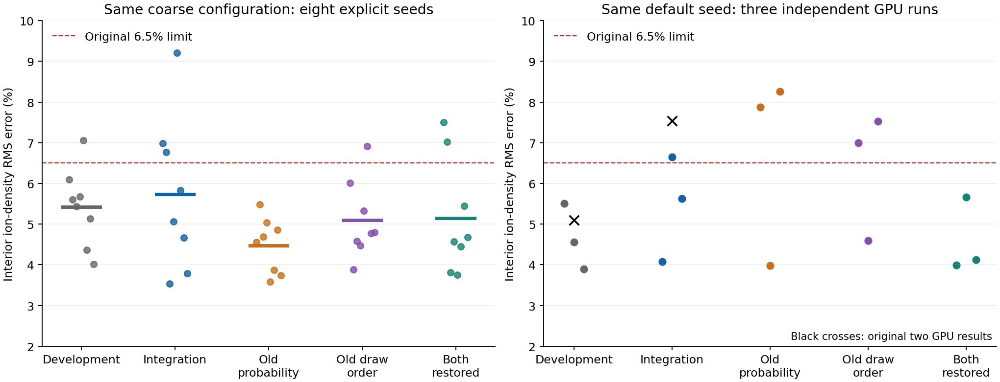
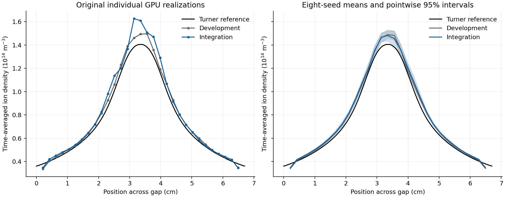

DSMC discharge branch comparison, October 2026
==============================================

The original 7.536% versus 5.093% GPU comparison does not establish a
systematic 2.443-percentage-point accuracy regression. The coarse discharge
benchmark varies substantially across stochastic realizations, including
repeated GPU executions of the same code and default seed. The two branches
also have a real, small finite-timestep difference in electron elastic MCC
acceptance. This audit separates these facts; it does not claim that their
mean errors or variances are identical.

All 55 new GPU simulations and 16 CPU simulations completed successfully.
Every density profile was evaluated against the original reference and
unchanged 6.5% assertion; failed analyses are retained below. No production
physics source, cross-section file, or assertion tolerance was changed.

Controlled configuration
------------------------

The two original ``warpx_used_inputs`` files are byte-identical, with SHA256
``8c08b5b57bfbe21409533936e37d40c47cad4728c11ab5fa55428b5704f39df8``.
The original working directories resolve their relative data paths to different
directories, but all six helium cross-section files have identical hashes.
The new controls use the same files through an absolute path. The companion
JSON records these resolved paths and hashes.

Each new run uses one MPI rank and one A100-SXM4-80GB GPU, 32 cells, 256 initial
particles/cell for electrons and ions, 128 initial neutral particles/cell,
``dt = 3.687315634218289e-10 s``, and 64,000 PIC steps. The physical duration
is 320 RF cycles; the original 12,800-step averaging interval spans 64 RF
cycles. Electron DSMC runs every two PIC steps and ion DSMC every five;
electron elastic MCC runs every PIC step. The neutral reset interval and
NumPy seed 23094290 are preserved. These inputs use helium isotropic elastic
scattering, not the N2/O2 IAA elastic/rotational tables.

The eight-seed ensembles use explicit WarpX seeds 1 through 8. A separate
three-repeat series retains the original default seed. These are distinct
experiments: AMReX's default GPU seed is 12345 on rank zero, whereas explicit
WarpX seed 1 resets the GPU seed to 2 for a one-rank run. Generated inputs
match across variants for each seed. Reduced console verbosity and absolute
data paths are the only non-seed input adaptations.

The clean development commit is ``63fa5a0c1``. Integration C++ physics is
``ac0125555``; the checkout also contains the subsequent Python test fixture
repair ``30c2d90f3``. Both use AMReX ``b552c85c432d``, GCC 13.2.1 and CUDA 13.2.
Perlmutter jobs 59488976 and 59488977 completed with exit status zero in
19:43 and 24:55, respectively. A device-visibility preflight precedes the
studies. The earlier launcher failure occurred before simulations and is
excluded from the scientific results.

What differs in the active collision path
----------------------------------------

For a frozen local collision frequency ``nu``, a majorant ``nu_max`` and
collision timestep ``dt``, development's real-event probability is::

    P_old = (1 - exp(-nu_max * dt)) * nu / nu_max

Integration uses::

    P_new = 1 - exp(-nu * dt)

Both first attempt a collision with probability ``1-exp(-nu_max*dt)``.
Development then accepts with ``nu/nu_max``; integration accepts with the
ratio of the two finite-step probabilities. Integration therefore gives the
exact probability of at least one event for a frozen rate, independent of how
loose the majorant is. This does not make a whole self-consistent discharge
or an at-most-one-event collision timestep exact.

The subsequent `acceptance accuracy and GPU-cost comparison
<acceptance_comparison_2026_10.rst>`_ further distinguishes first-event
accuracy from finite-step equilibrium accuracy using an exact two-state
example and measures the cost of the two implementations.

Here ``nu_max*dt`` is approximately 0.03191. The new elastic event probability
is up to approximately 1.60% higher in relative terms. At 1 eV it changes
from approximately 0.0142054 to 0.0143296 (about 0.87% relatively). Both
expressions approach ``nu*dt`` as the timestep tends to zero. The additional
energy-lookup change from center-of-momentum to electron target-rest energy
is of order ``m_e/M_He = 1.37e-4`` in this nonrelativistic benchmark; the
conversion from proper speed to physical speed is also small here.

The random-number order changes independently of that rate correction.
Development draws the channel-selection uniform before the three neutral
velocity normal draws; integration draws it afterward. Thus equal seeds do
not give equal collision histories. The change propagates into later DSMC
pairing, ionization, particle creation, fields and wall losses.

GPU particle order is itself not deterministic. ``findParticlesInEachCell``
in ``Source/Utils/ParticleUtils.cpp`` calls AMReX ``DenseBins``; its GPU
implementation assigns within-cell offsets using atomic increments.
``BinaryCollision.H`` passes the resulting permutation to particle shuffling
and collision pairing. Atomic arrival order provides a mechanism for
repeated same-seed runs to follow different histories. This is present on
both branches; no exclusive attribution to a single source of GPU
nondeterminism is claimed.

The active DSMC collision/filter/scatter headers and particle shuffler are
unchanged between the branches. Added IAA guards are inactive for these
inputs. The new collision scheduler preserves the same object order for
this test's one MCC call per step and DSMC supercycles. The MCC acceptance
change (``53e7108fc``) and draw-order restructuring (``55a8bbb7a``) both predate
the latest development integration.

GPU ensembles and ablations
---------------------------

Each row below uses the same eight explicit seeds and coarse numerical
configuration. Standard deviation is across individual RMS errors and is
reported in percentage points. A failure means the unmodified analysis
assertion failed; no run is silently replaced with a passing repeat.

.. list-table:: Eight-seed GPU comparison
   :header-rows: 1
   :widths: 40 15 15 20 10

   * - Code
     - Mean RMS
     - Standard deviation
     - Range
     - Failures
   * - Unchanged development
     - 5.425%
     - 0.956
     - 4.022–7.054%
     - 1/8
   * - Integration
     - 5.731%
     - 1.886
     - 3.540–9.207%
     - 3/8
   * - Integration: old acceptance only
     - 4.477%
     - 0.681
     - 3.580–5.487%
     - 0/8
   * - Integration: old draw order only
     - 5.095%
     - 0.966
     - 3.879–6.918%
     - 1/8
   * - Integration: both restored
     - 5.152%
     - 1.410
     - 3.750–7.503%
     - 2/8

The integration-minus-development mean RMS difference is
0.306 percentage points, with an
exploratory paired Student-t 95% interval of
[-0.809,
1.421]. The original
2.443-point gap is not reproduced as the average difference. The integration
sample nevertheless has more spread and failures; eight seeds do not establish
equal variance or exclude smaller systematic effects.

Restoring only the old acceptance produces a lower mean in this particular
eight-seed sample. Its difference from integration is
1.254 percentage points
with a 95% interval of
[-0.528,
3.037]. It is
therefore not justified to declare the acceptance correction the sole cause,
or to conclude that restoring the old algorithm improves the physical
solution. All ablations retain integration's other code, including its
kinematic and interpolation changes.

Three new executions of the original default-seed configuration give:

* Unchanged development: 5.510%, 4.559%, 3.898%.
* Integration: 4.072%, 6.644%, 5.626%.
* Integration: old acceptance only: 7.881%, 3.984%, 8.262%.
* Integration: old draw order only: 7.002%, 4.591%, 7.526%.
* Integration: both restored: 3.988%, 5.663%, 4.122%.

In particular, the production integration code passes twice and fails once
with that same default seed, and the old-acceptance variant fails twice.
Changing the acceptance formula alone does not reliably remove the coarse
failure. CPU controls independently give means of 5.548% and 5.354% for
integration and development, respectively, with one failed assertion out of
eight on each. Their paired mean difference has a 95% interval of
[-0.766,
1.154] percentage points.

The original integration profile has an additional central density excess:
its center is 14.55% above the repository's Turner reference, versus 6.31%
for development. Averaging the eight explicit-seed profiles gives much
closer branch profiles. RMS errors of those mean profiles are 5.230% and
4.965%, respectively. These are different statistics from the mean of the
eight individual RMS errors. The common coarse discrepancy remains.

The colored curves show the interior nodes used by the analysis; the two
boundary nodes are excluded consistently with the existing assertion.
Confidence bands are pointwise sampling intervals, not simultaneous bands
or estimates of the reference profile's uncertainty.

Correction to the earlier refinement interpretation
---------------------------------------------------

The previous GPU refinement results (4.93%, 4.60%, 3.67%) used two MPI ranks
and explicit seed 1. The original coarse test used one MPI rank and the
default seed. Those passing runs cannot isolate the effect of resolution
alone. The development-sync report and its JSON now state this limitation.
The present same-configuration ensembles provide the direct branch
comparison that was previously missing.

Interpretation and retained limitations
---------------------------------------

The original failing sample combines the benchmark's coarse numerical error
with stochastic density fluctuations. Branch changes alter the stochastic
history, and GPU execution can change it even without a source or seed
change. There is also a real finite-step elastic-rate correction whose small
systematic influence is not precisely resolved by these samples. The
investigation does not identify an erroneous active DSMC equation or a
merge-induced change to the configured collision schedule.

The original failure remains valid as a failed assertion. It is insufficient
by itself to diagnose an accuracy regression, and the repeat results do not
justify calling the coarse benchmark uniformly passing. A more reliable
regression requires a separately validated reduction of sampling and
numerical error, rather than choosing a favorable seed. No such test-input
or tolerance change is made here.

Reproduction and evidence
-------------------------

``dsmc_branch_audit_2026_10.json`` contains all 71 new profiles, individual
RMS errors, assertion outcomes, commands, hashes, summary statistics and
comparisons. ``build/validation/dsmc-branch-audit`` retains the launcher,
build scripts, diagnostic patches and raw logs. The existing
``Tools/Algorithms/PrescribedFluids/discharge_convergence.py`` supplies the
unmodified analysis and coarse input adaptation. The audit-only copy adds
seed 0 as a label for the literal ``default`` setting; it does not pass 0 as
a WarpX seed.

The diagnostic probability patch replaces only the acceptance expression
with ``collision_frequency/nu_max``. The draw-order patch moves only the
channel uniform above neutral-velocity sampling. The third patch combines
those changes. Each is compiled into a separate saved Python extension.
The production extension is copied before builds, and the production source
is restored and rebuilt afterward. Its final MCC source SHA256 is
``0450995db8fa58e51fc68860ec016214f1d404d46735cdefb0ad3c3eb50414f1``.

The summary generator recomputes every RMS error from the stored profile,
checks every analysis outcome against the original threshold, verifies
one-rank commands and coarse parameters, and checks input and data hashes.
Diagnostic build job 59488434 completed successfully; no diagnostic source
patch remains in the production checkout.
