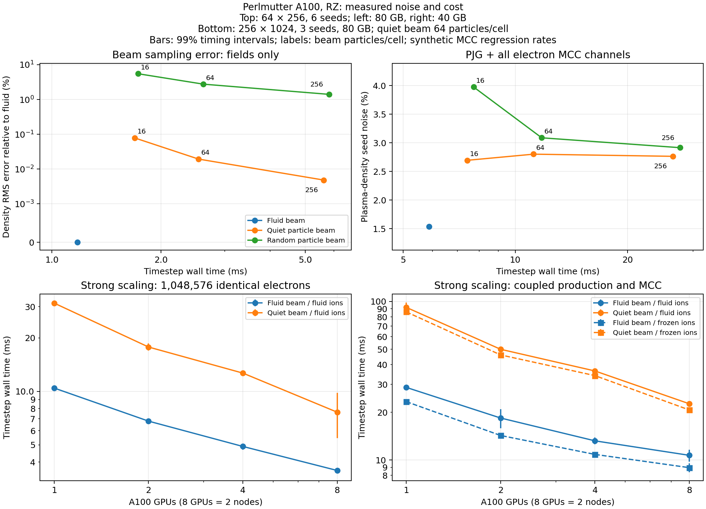

# Fork development integration, 2026-09-22

Status on 2026-09-23: integration and validation are complete. Local regressions, distributed
mass-matrix/diagnostic controls, 1/2/4/8-GPU scaling, same-rank restarts,
the complete noise campaign and targeted CUDA memory checks have completed.
All four solver/subcycling ensembles and the expanded 48-pair stochastic
restart study pass. The complete GPU regression has finished; stock controls,
execution-condition controls and Coulomb convergence checks are complete.
All twelve discharge refinements pass the original criterion. Retained
regression failures and their investigations appear below; this is not a
blanket all-tests-pass claim. Historical
checkpoints retain the progress state at which they were written.

## Source provenance and scope

The integration branch is
`codex/rigid-beam-immobile-ions-development-sync`. Its first parent is the
user's fork `ssarwar/WarpX:development`, at
`cee2ca2fd5d514dca1c8096571e4b213a7e5a125`; its merged parent is
`ssarwar/WarpX:codex/rigid-beam-immobile-ions`, at
`a681a47c7f76be5f356c2d0e269c45b3933f8b76`. Their merge base is
`8d71e576744b961cc709a79d32b7f912a97235ee`. No upstream repository branch
was substituted for the fork's development branch. Neither source branch
is changed by this integration. No pull request is opened.

The resolved source tree, before adding this report and follow-up validation
changes, is `a671deb9e1ee4d0bd59a5edaf4eaa2422160309a`. The same indexed tree
was transferred to the authorized Perlmutter checkout at
`/pscratch/sd/s/ssarwar/warpx-rigid-fluid-validation` and verified with
`git write-tree` before CUDA compilation. Raw logs are retained under
`build/development-sync-cee2ca2fd` on each machine.

## Merge conflicts

The four conflicts come from the overlap between the feature branch's
collision work and development's Legendre fusion scattering commit
`a9811a54a`, rather than the mass-matrix commit:

- `BackgroundMCCCollision.cpp`: development extends the shared two-product
  scattering call with a Legendre coefficient table and range-status pointer;
  the feature branch replaced the surrounding collision selection,
  kinematics, attachment, and product-destination logic. Retain that complete
  feature implementation and pass an empty table and null status for its
  non-Legendre scattering call. MCC explicitly rejects Legendre input.
- `ImpactIonization.H`: development adds an enum include to a header the
  feature branch deleted after replacing its physics/product implementation.
  Retain the deletion and the replacement helpers; restoring this header
  would not integrate the new collision architecture.
- `WarpXAlgorithmSelection.H`: both branches append to the scattering enum
  and add neighboring enums. Retain IAA's existing ordinal, append Legendre,
  and keep both ionization-energy-sharing and fusion-table-format enums.
- `parameters.rst`: both branches document additions at the same location.
  Retain both the Legendre table/product-order requirements and the
  proton-impact/PJG particle/fluid documentation.

Review of the automatically merged `ImplicitSolver.cpp` confirms that the
new mass-matrix completion helper is retained unchanged. Prescribed-fluid
current remains outside the field-dependent matrices, is added after
kinetic current scaling, and charge is not resummed during matrix-only
residual evaluations.

## What the development mass-matrix change addresses

Commit `cee2ca2fd` deposits exactly one half of each diagonal 2D mass-matrix
stencil, and completes the other half by the symmetry
`S(i,d) = S(i+d,-d)`. The deposited half satisfies
`di+dj < 0 || (di+dj == 0 && dj <= 0)`; the complementary half reads those
separate components. The new common folding routine also serves 1D.

The independent stock tests compare `S dE` with particle push/current
response, for three particle shapes and both synchronization schemes, with
nonzero magnetic field and periodic/multibox boundaries. All six cases in
each of 1D and 2D pass locally at the existing tolerance. This fixture does
not cover RZ; coupled RZ mass-matrix simulations require separate validation.

The previous acceleration/restart reproducibility failures occurred with
explicit CKC/PSATD solvers. This commit does not modify those paths. It is
therefore not evidence that those failures are fixed. Fresh GPU controls
(`58773853` branch, `58775987` unchanged development) reproduce failures in
all three C++ full/restart comparisons and in independent uninterrupted
repeats. All observed native E/B values at checkpoint step 5 are restored
exactly, before the first resumed step, including averaged fields. For
time-averaged PSATD, the relative Ez differences are 4.668e-9/3.974e-9 for
branch restart/repeat and 4.882e-9/2.450e-9 for stock restart/repeat, against
the original 1e-12 criterion. This is the same class of reproducibility issue
as before the mass-matrix change. The kernel-level amplification remains
unisolated; no assertion tolerance is changed. Every component, particle-ID
comparison and native-state check is retained in
[the fresh acceleration archive](results/development-sync-acceleration.json).

## Initial validation and build environment

The merged source compiles locally in 1D, 2D, RZ, and 3D with MPI, Python,
FFT, and openPMD enabled; QED and embedded boundaries are disabled. It uses
the repository-pinned AMReX `d6d1aa11f38cab90fc592ee193ae574cdc001aaf`
and pyAMReX 26.09. The local build directory is `build-sync`.

Local setup issues were distinguished from physics failures:

- The conda Clang linker cannot read the current macOS SDK's `arm64e.x1`
  stubs. The build uses Apple's `/usr/bin/clang{,++}`.
- Vendored openPMD 0.17.1 fails to compile against the current libc++ in
  `ADIOS2IOHandler`. The compatible installed conda openPMD 0.17.1 is used
  via `WarpX_openpmd_internal=OFF`.
- MPICH 5.0.1's default sockets provider hangs in `MPI_Finalize`, including
  in a minimal mpi4py program with no WarpX import. A sampled stack locates
  the hang in the OFI/libfabric sockets finalization path. `FI_PROVIDER=tcp`
  makes that control initialize and finalize successfully and is used for
  local MPI validation. No simulation code is changed for this workaround.

Before the merge commit, validation passes comprise 64 Python model/archive
tests, independent Gaussian quadrature checks, both Cartesian mass-matrix
unit suites, and eight MCC/fluid/interface/source/restart/load-balance CTest
stages. No physics assertion tolerances or checksum reference files were
changed.

Perlmutter uses the repository's documented module profile and CMake build
recipe, through `perlmutter_stock_build.sh`, in separate branch/stock
`build_pm_gpu_sync` directories. Both include the added 2D geometry needed
for mass-matrix validation. CUDA builds are in progress at this checkpoint;
this report must not be interpreted as completed GPU acceptance.

## Angular-model compatibility follow-up

The shared enum allowed IAA to be selected for fusion or DSMC even though
those kernels do not implement the electron-MCC closure. A zero-step fusion
initialization with IAA returned success before the fix. Explicit guards
now reject IAA in both constructors, before any scattering can fall through
to a different model. A new test checks forward/backward/isotropic success
and IAA/Legendre-without-a-table rejection for fusion and DSMC. The MCC
invalid-input test also checks the development branch's Legendre rejection
for both elastic scattering and ionization. Both CTest stages pass in the
local Release build; their tolerances are unchanged.

## Reproducible complete-suite driver

`run_full_regression.py BUILD OUTPUT` inventories and runs every configured
CTest stage, preserving the dependency ordering through checksum stages.
Checksum failures are reported separately, not hidden by removing those
stages. The build-configuration exclusions include the nonlinear QED tests, collider
diagnostics, beam-beam, and nodal-electrostatic groups requiring QED diagnostics or photon emission
when `WarpX_QED=OFF`. Embedded-boundary injection groups require `WarpX_EB=ON`.
The manifest, raw log, JUnit XML, and classified summary are retained.
An optional MPI launcher runs the Python unit suites inside an allocated
GPU step, with their original CTest environment and working directory.

The stock Perlmutter build driver accepts `WARPX_AUDIT_DIMS` (defaulting to
its previous `1;RZ;3` configuration), and uses CMake's actual `BUILD_TESTING`
option. This campaign sets `WARPX_AUDIT_DIMS='1;2;RZ;3'` and
`WARPX_AUDIT_BUILD_NAME=build_pm_gpu_sync`. The restart-failure driver also
accepts that build-name setting, so the new comparison cannot accidentally
load an older library. Shell syntax and Python lint/compilation checks pass.

The same six mass-matrix identities in each Cartesian geometry also pass
with two local MPI ranks. The GPU driver includes one-, two-, and four-rank
runs, with separate JUnit files per rank.

The complete local run exposed missing `lasy`, `axiprop`, and `dill` test
packages. After installing these test-only packages without replacing the
active MPI/openPMD stack, all six laser-file preparation stages pass.
Perlmutter's missing generator and pytest dependencies are also installed
before GPU execution. Three stock flux-from-embedded-boundary groups are
registered even in an EB-disabled build; their required capability is absent.
The initial local failures are retained (the processes additionally hung in
MPI_Abort). The driver now identifies all nine stages as configuration
exclusions for `WarpX_EB=OFF`, alongside the QED-dependent process and diagnostic stages. The nodal-electrostatic test
requests QED emission and checks the QED chi diagnostic, so removing its
zero-valued Schwinger option alone does not make it a non-QED test; its
original input deck is retained.


The three embedded-boundary injection registrations now use the same
`if(WarpX_EB)` guard as the neighboring EB test directories. The supplemental
SYCL driver accepts `WARPX_AUDIT_SYCL_BUILD_NAME` so this campaign can use
`build_pm_sycl_sync` while retaining the earlier build. SYCL compilation
is distinct from GPU runtime acceptance; Perlmutter has no Intel or AMD GPU.

The QED configuration filter also excludes the nonlinear Breit-Wheeler,
quantum-synchrotron, and Schwinger groups when QED support is absent. The
hybrid Maxwell vacuum-polarization test remains enabled: its field solver
is available independently of the particle-QED build option. The initial
local run retained the unavailable-feature failures; the corrected driver
records the explicit excluded-test list before launching the GPU suite.
The beamsize/virtual-photon groups also request compiled QED functionality
and are listed with those exclusions. The manifests record exact names;
none of the rigid-fluid, PJG, MCC, implicit, or fluid diagnostic/restart
checks is excluded by these capability filters.


## Follow-up diagnostic findings

The 116-stage OpenMP selection completes with 111 passes and five strict
`BeamRelevant` restart-comparison failures. All five are the same near-zero
centroid issue: the uninterrupted run reports exactly zero mean z, while
MPI redistribution gives approximately -1.10436e-18 m. The comparison divides
by its 1e-30 floor. A separate run with every fluid feature disabled also
fails the unchanged centroid comparison. The original diagnostic implementation
was identical to stock development. These failures remain recorded; no assertion
or tolerance has been relaxed. Other field, charge, energy, and momentum
comparisons in these cases agree at roundoff.

Review of that diagnostic identifies a separate dimensional error predating
this branch: its dimensionless Twiss alpha contains an extra speed-of-light
factor. For x=x0+a*s and u=u0+b*(h*s+k*t), with independent equiprobable signs
s,t, the exact alpha is -h/abs(k). The new 64-particle covariance test expects
-2/3 and obtains -199861638.666667 from the old implementation, exactly the
extra factor c. Alpha must be -Cov(x,u)/sqrt(Var(x)Var(u)-Cov(x,u)**2), or
-Cov(x,p)/(m*c*normalized_emittance). This follows the covariance definition
of Twiss parameters in the [USPAS ellipse notes](https://uspas.fnal.gov/materials/18ODU/Fund/some-notes-on-ellipses.html).

A correction removes that factor and places the empty-population guard before
normalizing by total weight. The associated documentation retains normalized
emittance and beta definitions. Exact populated- and empty-beam tests pass
in the 2D/RZ OpenMP build and all four NOACC unit suites. The same covariance
reference fails on untouched development by the factor c, confirming the
error predates this merge. GPU acceptance of the correction is pending.
This correction is independent of the centroid reduction-order sensitivity.


The documented CUDA build now passes for both the merged source (58773767)
and unchanged fork development (58773769). Both revisions pass the independent
1D/2D mass-matrix identities on one, two, and four A100s (58774151/58774153).
Native float-particle physics tests pass on A100 (58774663); the supplemental
SYCL RZ build and standalone kernels compile (58774662). These portability
results precede the diagnostic-only correction above; the corrected diagnostic
is being rebuilt separately before the remaining runtime studies are released.

Two local analysis timeouts were caused by interactive `plt.show()` calls.
The complete-suite driver now sets `MPLBACKEND=Agg` for its subprocesses.
The Compton analysis then passes; the effective-potential analysis reaches
its existing assertion and reports 0.07277108% against a 0.07% bound. The
unchanged stock comparator reproduces those same effective-potential values.
Neither analysis assertion was changed. The EB-dependent ion-extraction
case is also excluded when EB support is not compiled.

For local stock comparisons, a detached checkout at `cee2ca2fd` uses the
same AppleClang, AMReX, pyAMReX, and openPMD as the branch. Installing the
full original build into a local prefix exposed an absolute `/usr/local`
WarpX alias in its install script; the install stopped there and no alias
was created. The already installed dependency packages are sufficient.
Their Python modules needed an explicit local library RPATH before they
could load; those isolated copied modules were adjusted and re-signed.
Setup failures are retained separately from the subsequent physics controls.

GitHub pushes from the activated conda shell initially used conda Git's
credential-cache helper rather than macOS Git's Keychain helper. Using
`/usr/bin/git` fixes the push path. This is a local tooling difference,
not a GitHub authorization or source-state change.

The corrected diagnostic compiles in CUDA (58775901) and SYCL (58775908).
The Perlmutter checkout had a restricted Git fetch refspec: fetching a branch
updated `FETCH_HEAD` without advancing its tracking ref. An explicit branch
refspec and a checked `08124f33a` HEAD resolved this before either rebuild ran.
The subsequent runtime jobs depend on that verified CUDA build.

The first fresh stock acceleration comparison (58773855) timed out on
`nid008341`; its logs report NVML "GPU requires reset" before the first step.
This is hardware execution failure, not checkpoint or physics evidence.
A separate rerun excludes that node and retains the original failed attempt.

The original local helium discharge checks give 9.62% (MCC) and 7.40%
(DSMC) density RMS error against the unchanged 6.50% Turner-profile bound.
The fresh stock comparator gives 3.03% and 5.30%. These are not classified as
stock failures. `discharge_convergence.py` retains the original analysis and
its assertion, records every seed and input/library hash, and varies particle
count, mesh, and timestep independently before joint refinement. Physical
simulation time and averaging time remain fixed. Its results must be assessed
before attributing the difference to sampling or finite-step collision effects.
It does not replace failed individual assertions with an ensemble pass.

`export_reaudit.py` now archives nested JUnit files using relative paths,
including complete-suite and per-rank mass-matrix/diagnostic evidence, without
silently overwriting identically named XML files from different configurations.

The initial joint-refinement driver enlarged the mesh after allocating its
ion-density averaging array, producing a 33-versus-65-element callback error.
The driver now resizes that array consistently and also preserves the DSMC
neutral rethermalization interval in physical time when reducing the timestep.
The affected attempts are retained separately and repeated; this was an audit
driver error, not a change to either simulation's collision implementation.
MPI launches are bounded and their process groups are terminated on timeout.

## Complete local regression disposition

The original complete run attempted 1,141 CTest stages. After accounting for
the disabled QED/EB capabilities, 1,090 stages are eligible. Six missing laser
generator dependencies and the interactive plotting backend were repaired
and their affected stages repeated. The corrected four-geometry Python unit
suites pass. The reconciled result retains 16 physics-analysis failures and
162 platform-dependent checksum failures; the latter are ignored according
to this repository's instructions, without modifying benchmark files.

| Remaining local analysis failures | Investigation |
| --- | --- |
| Two differential-luminosity tests | Untouched stock reproduces the same failures: total luminosity errors 0.2173% and 0.2636%, versus 0.2%. |
| Three focusing/rotated Gaussian tests | Untouched stock also fails their existing slice-width assertions. |
| RZ Ohm modes, 1D Ohm ion-beam instability | Untouched stock reproduces the same amplitude/growth-rate reference failures. |
| Effective-potential electrostatic | Both versions give a maximum density RMS error of 0.07277108%, versus 0.07%. |
| Time-averaged PSATD acceleration restart | Fresh stock/GPU repeat controls above also fail; saved native fields restore exactly. |
| Five fluid diagnostic continuations | Only the near-zero BeamRelevant z centroid fails; the corrected 26-stage diagnostic rerun retains those five failures. A no-fluid OpenMP control changes by 1.767e-18 m. |
| Helium MCC and DSMC discharge | Seed and resolution studies are separate from the failed original assertions; they are not classified as stock failures. |

[The local evidence archive](results/development-sync-local.json) retains all
original complete-suite outcomes, explicit capability exclusions, follow-up
provenance, failure text, stock controls, absolute centroid differences and
the corrected diagnostic/unit runs. The initial stock Python loading failures
are setup attempts; the subsequent `stock-python-controls.xml` provides the
valid physical comparison. The legacy collision assertions are not superseded
by a favorable seed or a differently resolved run.

The first GPU reference batch (58773847) passes all ten standalone C++ tests,
64 Python model/archive checks, independent Gaussian quadrature, external IAA
DCS comparisons, invalid-input guards, stationary probes and Yee/PSATD flux
diagnostic continuations from four ranks to two. Initial integrated power is
exact in both flux cases. Their worst continuation discrepancy is 4.98e-15;
these GPU runs pass the unchanged diagnostic criterion, unlike the local
near-zero centroid cases.

## Helium discharge resolution controls

The local ensemble uses two MPI ranks for both MCC and DSMC, four explicit
WarpX seeds, and the unchanged input and 6.50% analysis bound. Three of four
branch seeds pass for each method; all four stock seeds pass. RMS errors of
the mean density profiles are 5.02%/5.00% for branch MCC/DSMC and 3.50%/3.92%
for stock. These means are descriptive and do not replace individual failures.
The original DSMC CTest uses one rank and remains a separately recorded case.

| Seed 1 control | Branch MCC | Stock MCC | Branch DSMC | Stock DSMC |
| --- | ---: | ---: | ---: | ---: |
| 32 cells, 256 particles/cell | 9.622% | 3.032% | 5.853% | 5.287% |
| Half timestep | 6.647% | 4.210% | 5.879% | 5.747% |
| Four times particles/cell | 4.856% | 3.487% | 5.476% | 4.043% |
| 64 cells, 512 particles/cell, half timestep | 3.741% | 3.876% | 4.070% | 3.648% |

Both versions pass the original density criterion after particle refinement
and joint refinement. Their jointly refined density profiles differ by
1.36% (MCC) and 1.82% (DSMC) in 1D RMS relative to stock
at the interior nodes. This supports sampling/discretization sensitivity in
the coarse regression, rather than a demonstrated converged density bias.
It does not prove exact equality of their stochastic trajectories or turn the
original assertion into a pass. Every attempted and corrected run is retained
in [the discharge archive](results/development-sync-discharge-local.json).

The equation review also makes an existing profile limitation explicit in
the input documentation: a finite rigid train is clipped in laboratory z,
not periodically wrapped. Entry/exit tests use nonperiodic longitudinal
boundaries. The periodic particle-reference benchmarks require the profile
to remain inside the domain; their driver rejects beam transit through a
periodic boundary. No new periodic-beam model is introduced by this merge.

## Implicit collision substep timing

The second temporal audit finds another pre-existing stock error. Implicit
collisions run after the field/particle push, with `cur_time` already at the
end of the PIC step. Adding `i_sub*dt_sub` to that time evaluates later
substeps in the future. An exact control defines zero gas throughout the
simulated interval [0, 1 ps], with gas appearing only after 1.125 ps.
Four implicit substeps incorrectly scatter all 512 test particles on the
branch, and three on untouched development. The different counts reflect
the collision algorithms; the analytical answer is exactly zero in both.

The handler now samples left endpoints for explicit evolution and right
endpoints for implicit evolution within the same elapsed physical interval.
For an implicit step ending at t, the placement is
`t - (N-1-i)*dt/N`, for i=0,...,N-1; N=1 preserves the original time exactly.
The rigid-source integration interval remains independently defined, so this
also corrects time-dependent neutral temperature sampling without changing
its Gaussian space-time integration. Constant gas/temperature benchmarks
are unaffected by this change.

Nine short MPI controls cover future gas at one/four substeps and gas present
only early in the step, for explicit Yee, semi-implicit EM and mass matrices.
The early-gas control prevents accidentally fixing the future evaluation by
sampling every substep at the final endpoint. All nine pass in the rebuilt
local MPI library. The affected regression selection retains only the known
coarse helium-MCC assertion failure. GPU acceptance is in progress; the
pre-fix controls and their logs remain retained.

The repeated four-GPU RZ covariance unit test exposed a separate test setup
error: its manually constructed RZ simulation omitted the common helper's
on-demand arena setting. With repeated initialization, it aborted in
`Arena::Initialize` with an out-of-memory error before the empty-beam case
(uncaptured reproduction 58779101). It now uses the same zero initial arena
reservation and exception settings as the Cartesian helper. Both populated
and empty cases pass on four local MPI ranks. No covariance expectation or
tolerance is changed. The earlier NVML reset failures remain separate
device-execution incidents, with their logs preserved.

The post-fix OpenMP/MPI selection completes 121 stages with 116 passes and
the same five near-zero-centroid comparisons described above. The three
scatter-deposition fixtures explicitly use four OpenMP threads on two MPI
ranks; ordinary CTests retain the repository's one-thread default. The
[local follow-up archive](results/development-sync-followups-local.json)
retains all nine exact timing cases, the 77-stage collision selection, the
121-stage OpenMP selection, and pre-fix branch/stock timing controls.

CUDA acceptance job `58779585` completes successfully: populated/empty exact
covariance tests in 1D, 2D, RZ, and 3D on one and four GPUs, all nine timing
cases, and all ten standalone fluid/PJG/MCC physics tests. CUDA and SYCL
rebuilds `58779552`/`58779553` also succeed. Subsequent performance studies
keep checkout `242559e71` and its compiled libraries fixed for their duration.

An interrupted allocation can leave an empty topology JSON or partial XML.
The evidence exporter now records the filename, parse error, content hash,
length and final bytes explicitly, while retaining other valid records.
Such output is never counted as a successful check. Its regression uses a
mixture of passing, failing and incomplete nested records. Future source
manifests also include `tests/unit`; earlier manifests identify those tests
through their Git revision and JUnit results instead of per-file hashes.

## Distributed studies and retained unsuccessful attempts

The [GPU study archive](results/development-sync-gpu-studies.json) preserves
completed studies and incomplete attempts separately, with each study's
own source/library fingerprint. It includes the following earlier controls:

- `58773847`: standalone physics, 64 Python model/archive tests, Gaussian
  quadrature, measured N2/O2 elastic DCS, input guards, stationary probes and
  nonzero Yee/PSATD Poynting flux. Four-to-two-GPU diagnostic continuations
  pass, with maximum reported normalized difference 4.98e-15.
- `58773852`: 12 particle-deposition comparisons, three joint refinements
  and eight solver/timestep settings pass their unchanged analyses.
- `58773849`: two-node/eight-GPU ownership cases cover both source and
  attachment in all four solver configurations, including four-GPU restarts.
  Coupled six-pair restarts pass for Yee, PSATD and semi-implicit EM. The
  mass-matrix continuation fails only its O-minus population criterion:
  mean resumed-minus-uninterrupted difference -1583.33, standard error 258.74,
  versus the predeclared five-standard-error bound 1293.68. Immediate saved
  fields, particles, counters, primary budgets and charge checks pass. A
  separately scheduled 48-pair follow-up retains this original failure.
- `58773848`: all ten completed coupled solver/subcycling ensembles pass
  population/energy and simultaneous spectral-band checks. Yee at two
  substeps stops because a documentation/tool commit changed the recorded
  checkout revision during the ensemble; the four-substep Yee case was not
  run. The same metadata issue stops `58773850` during four-GPU scaling.
  A fixed-checkout 1/2/4-GPU repeat `58777473` completes successfully.
- `58773851`: fields and equal-electron-work noise ensembles complete, but
  the source ensemble is interrupted by the allocation limit; the coupled
  phase never acquires a usable topology record. This is incomplete
  evidence, not an accepted noise campaign. A longer allocation repeats it.
- `58776972`: independent continuum-error qualification and 16 synchronized
  source/coupled profiles complete. Instrumented timings include profiler
  synchronization and source startup; they are separate from ordinary
  timestep timing ensembles.

The four-seed, two-GPU helium control `58776386` retains one coarse MCC
failure: branch seed 1 has 8.719% RMS error against the original 6.5%
criterion. Branch seeds 2--4 give 3.913%, 3.684%, 4.957%; untouched stock
gives 3.712%, 3.954%, 5.007%, 5.386%. All eight DSMC controls pass
(branch 4.093--5.556%, stock 4.461--6.129%). The planned independent
timestep, particle and joint refinements are separate from these original
assertions, as in the local study.

[The submission archive](results/development-sync-submissions.json) stores
the actual Slurm-retrieved scripts and job descriptions for the final
campaign. Its descriptions were captured before those jobs completed and
are allocation provenance, not test outcomes. Command-line and scheduler
overrides take precedence over the saved script's default directives.

The same-rank counterpart also passes: exact attachment survival and native
ion/electron charge-footprint checks run uninterrupted and through checkpoint
restoration on two local MPI ranks for all four solver configurations. GPU
job `58779962` repeats the eight runs on four GPUs with unchanged rank count
and passes. These supplement the rank-redistribution controls; neither
expects bitwise replay of the stochastic MCC history.

## Focused source review

The equation/time review rechecks Gaussian normalization with the annular
measure, signed axial velocity/current, the order-p charge versus order-(p-1)
cumulative current primitive, cylindrical axis normalization, and time
placement versus source integration. It verifies that the fixed-energy PJG
source uses the same two neighboring incident-energy rows and interpolation
as the particle implementation. The total cross section is the code's
integral of the calibrated N2/O2 PJG spectrum; a user-supplied proton total
cross-section table is not required. Electron MCC rate tables remain separate
inputs; `RBEQ` names its energy-sharing model and `IAA` its angular model.

The execution/lifecycle review rechecks that scatter loops use `amrex::For`
and host/device atomics where necessary, each creation scan owns disjoint
particle output, and fluid-ion footprints use the electron's stored position
and weight. Only fresh increments undergo volume scaling and `SumBoundary`.
Persistent populations, remainders, budgets and quiet counters are mandatory
restart state; analytic caches rebuild without chemistry or self-field replay.
The implicit residual adds prescribed current once, after kinetic scaling,
and never commits chemistry inside a nonlinear/Jacobian evaluation. The
development stencil-folding helper remains unchanged by conflict resolution.
The timing and Twiss fixes above are the additional production corrections
found during these passes; all other findings retain their measured evidence
and limitations instead of changing assertion thresholds.

## Final-library performance controls

Jobs `58779668` and `58779669` complete strong scaling on 1/2/4/8 A100s with
the same compiled libraries from checkout `242559e71`. Four GPUs use a full
node and eight use two nodes; topology records check distinct devices and
a GPU-buffer MPI reduction. Each number below is the mean of three per-run
median ordinary timestep times, after two warm-up steps. Timers synchronize
the device and report the maximum rank duration. The mesh is 256 by 1024;
quiet particle beams use 64 particles/cell.

| Timestep, milliseconds | 1 GPU | 2 GPUs | 4 GPUs | 8 GPUs |
| --- | ---: | ---: | ---: | ---: |
| Coupled, fluid beam / fluid ions | 28.718 | 18.411 | 13.219 | 10.712 |
| Coupled, quiet beam / fluid ions | 91.802 | 49.955 | 36.468 | 22.650 |
| Coupled, fluid beam / frozen ions | 23.351 | 14.287 | 10.855 | 8.955 |
| Coupled, quiet beam / frozen ions | 85.995 | 46.034 | 34.086 | 20.705 |
| Identical electrons, fluid beam | 10.440 | 6.798 | 4.894 | 3.583 |
| Identical electrons, quiet beam | 31.430 | 17.782 | 12.679 | 7.636 |

For the coupled cases with fluid ions, changing the beam representation gives
speedups of 3.20, 2.71, 2.76 and 2.11 respectively. The equal-electron-work
cases use 1,048,576 identical kinetic electrons with chemistry disabled.
These are fixed-resolution comparisons, not universal speedup estimates.
Sparse frozen ions remain faster here because fluid updates communicate mesh
data; their particle storage instead grows with accumulated ion events.

Independent continuum-error qualification in `58779671` retains the
predeclared Er/B-theta 1% and Ez 2% targets, checking six seeds and all saved
outputs on the expanded domain. The fluid case qualifies at 4.554 ms/step.
Quiet particle beams qualify already at 4 particles/cell and 3.808 ms/step;
random particle beams first qualify among the tested resolutions at 64
particles/cell and 4.969 ms/step. Thus the fluid beam removes beam sampling
noise, but is not the fastest representation for every accuracy requirement.
The separate all-channel plasma noise ensemble is still being completed;
beam determinism does not imply zero kinetic-electron sampling noise.

The same-build storage comparison retains 682,112 bytes for four persistent
ion-density fields at both 20 and 80 steps, including guards. Matched frozen
ion particle payload grows from 3.504 to 14.975 MB. Complete fluid/frozen-ion
checkpoints grow from 8.211/11.033 MB to 19.063/33.364 MB because electrons
remain kinetic in both representations. Inclusive checkpoint-step times are
46.59/60.46 ms and 66.18/96.35 ms; these include the physical step and variable
filesystem cost. Density increments and aggregate-charge scratch are excluded
from the persistent-density figure and also scale with mesh size.
The numerical results and confidence intervals are preserved in
[the follow-up GPU archive](results/development-sync-gpu-followups.json).

The final Sphinx build `58780066` succeeds after the timing/boundary input
documentation changes, retaining the previously observed single Doxygen
`warpx::fields::FieldType` lookup warning. Ruff lint and format checks pass
for all ten Python files changed by this integration. No generated stubs or
checksum reference files are updated.

## CUDA memory-check investigation

The first sanitizer job `58777655` completes its three physics programs but
returns the requested error status 99 for each (776, 180 and 124 reported
errors). Printed reports are CUDA API diagnostics: Cray MPI calls
`cuPointerGetAttribute` on ordinary host addresses, and CUDA's extended
logging reports internal symbol probes in `libcublasLt`. The initial print
limit truncates later records, so this run is not memory-check acceptance.

The MPI-only program in `58780012` reproduces the pointer-query reports
without importing WarpX or CuPy. Its GPU-disabled counterpart completes the
host collective but the sanitizer returns 255 because no CUDA API was used;
the follow-up control explicitly allows this intentional host-only case.
The CUDA driver documents `CUDA_ERROR_INVALID_VALUE` for this query on
unregistered pointers, and the sanitizer distinguishes returned API errors
from device memory-access failures. See the
[CUDA pointer-query reference](https://docs.nvidia.com/cuda/cuda-driver-api/group__CUDA__UNIFIED.html)
and [sanitizer reporting/suppression reference](https://docs.nvidia.com/compute-sanitizer/ComputeSanitizer/index.html#cuda-api-error-checking).

The next attempt, `58780113`, fails before running physics: its stack-qualified
suppression leaves 50 of the 58 MPI reports, and a test executable named `positive` collides
with the intended output directory. Both setup issues are retained in the
archive. All 58 XML records have the same API/error signature, but 50 lack
a saved stack, which prevents the frame-qualified suppression from matching.
The corrected attempt uses a separate executable name and an exact
API/result-code suppression (`cuPointerGetAttribute`, error 1), with explicit
API reporting and unrestricted device-memory checks. GPU-aware MPI remains
enabled. A deliberate out-of-bounds CUDA write must still produce status 99,
while the suppressed MPI-only control and all three physics programs must
return zero. Corrected job `58780214` satisfies all these checks: unfiltered
MPI returns 99, targeted MPI and host-only MPI return zero, the deliberate
invalid write is detected with 99, and rigid production, attachment and coupled
mass-matrix physics each return zero. The exact suppression, probe source,
status records and first/final log segments are archived. This is device-memory
and explicit-API acceptance with the stated pointer-query suppression; leak
checking and racecheck are not claimed. No physical tolerance is changed.

## Scheduling the remaining studies

The final noise/coupled bundles `58779667` and `58779670` were cancelled
while still pending and are replaced by their independent short studies.
Noise fields/push/source/coupled use `58781343`, `58781344`, `58781345` and
`58781348`; the Yee/subcycling ensemble uses `58781350`. The other three
solver allocations will follow within the debug queue's submission limit.
Meshes, seeds, physics settings, tolerances and compiled libraries are
unchanged, and the remote checkout stays frozen at `242559e71`. The plotting
tool accepts multiple noise-job identifiers while still rejecting mixed
compiled libraries and duplicate families. The longer complete regression,
discharge refinement and expanded restart studies remain queued separately.

The regression driver also supports independent geometry allocations. A
dry inventory verifies that 148 one-dimensional, 341 two-dimensional, 226 RZ
and 384 three-dimensional stages (including the four Python unit suites)
cover all 1,099 currently eligible stages exactly once. The complete
inventory retains 47 capability exclusions. The driver rejects dependencies
crossing geometry groups; it does not silently drop restart prerequisites.
This check validates scheduling coverage, not the pending GPU test outcomes.

## Final-library noise campaign

All four noise allocations complete: 42 field-only cases, 42 cases with
identical kinetic-electron work, 84 proton-impact source cases and 84 coupled
cases. The coupled ensemble passes all 78 population/energy comparisons and
13 simultaneous spectrum-band comparisons, as well as charge balance at
every sampled output. These are the original criteria; no tolerances are
changed. Numerical evidence is in
[the final noise archive](results/development-sync-gpu-noise.json).

On the 64 by 256 mesh, field-only density RMS differences from the prescribed
mesh profile are 5.507%, 2.761% and 1.405% for random beams at 16, 64 and 256
particles/cell. Quiet beams give 0.07829%, 0.01929% and 0.004805%. The fluid
reference takes 1.176 ms/step; quiet beams take 1.692, 2.539 and 5.628 ms/step.
Zero fluid-reference difference is not zero continuum discretization error;
the independent continuum qualification above measures that separately.

With all electron MCC channels enabled, volume-weighted electron-density
seed variation is 1.540% with the fluid beam at 5.867 ms/step. Quiet beams
give 2.695--2.802% at 7.437--26.495 ms/step; random beams give 3.977%, 3.088%
and 2.916% at 7.733, 11.783 and 27.698 ms/step. All these comparisons use
fluid ions and six seeds. Kinetic electrons retain finite sampling noise.
The source-only yield including pending production differs from independent
PJG quadrature by 0.0151461% for N2 and 0.0151054% for O2, reproducing the
previously documented 0.1% table-interpolation acceptance bound. This error
is distinct from seed variation and from particle-beam quadrature error.



The [PDF figure](results/development-sync-noise-scaling.pdf) and PNG are
generated by `plot_reaudit.py` from noise jobs
`58781343 58781344 58781345 58781348` and scaling jobs `58779668 58779669`.
The plotting input is the union of the final noise and follow-up GPU archives;
the script checks their compiled-library fingerprints before plotting.
The figure explicitly identifies the synthetic MCC regression rates. It is
performance/noise evidence for these controlled cases, not a full Prabir-beam
air-discharge prediction.

The allocations include both A100 memory variants. Field-only and equal-electron
noise jobs use 80 GB GPUs; source-only and coupled noise jobs use 40 GB GPUs.
The final strong/weak scaling and equal-error/profile jobs use 80 GB GPUs.
The eight-rank startup reports the total device-memory range as
`[81151 ... 81151] MB`, confirming both nodes have the same variant; this
log excerpt and its hash are retained in the follow-up archive.
Each within-family representation comparison uses the same GPU model and
allocation. Cross-panel timing differences must not be interpreted as pure
physics-cost differences. The figure labels the variants from the archived
device metadata; `gpu_topology.py` now records model and memory for every rank
as well as checking distinct devices and a CUDA-buffer MPI reduction.

## Complete solver/subcycling ensembles and checkpoint I/O control

Jobs `58781350`, `58781509`, `58781510` and `58781646` complete all 288
coupled cases: four solver configurations, collision subcycling by 1, 2 and
4, four beam/ion representation combinations, and six seeds. All 216
population/energy checks and 36 simultaneous spectrum-band checks pass,
with unchanged charge-balance criteria. Results are in
[the coupled archive](results/development-sync-gpu-coupled.json).
The raw diagonal mass-matrix stencils are folded before cylindrical volume
scaling; the inverse volume factor is applied to the resulting accumulated
current, preserving the symmetry used by development's folding helper.

The expanded 48-pair restart job `58777489` times out after 20 minutes.
It completes only two pairs, both passing the complete native-state check
before resumed stepping; a third uninterrupted run completes. The first two
restart initializations take 578.55 and 166.46 seconds, while their subsequent
ten steps take 0.411 and 12.634 seconds. This is incomplete acceptance, not
an ensemble pass. The original six-pair O-minus failure remains unresolved.

Captured host backtraces locate a rank in a filesystem `read()` inside
`amrex::VisMF::readFAB`, with the kernel reporting a Lustre lock wait;
another rank waits in the corresponding MPI receive. The open descriptor
identifies a required N2-ion density checkpoint file. Later independent plain
reads of its 13,448 bytes complete in 0.001--0.002 seconds on both nodes and
give identical hashes. A bounded restart from the other node also fails to
finish within 60 seconds. These observations locate the delay in checkpoint
I/O, without identifying its Lustre/client/server cause. The complete
[I/O investigation](results/development-sync-checkpoint-io.json) preserves
backtraces, open files, read controls, partial results and timeout status.

Job `58781928` repeats all 48 fixed seeds with the same library, physics,
eight-to-four-GPU decomposition and acceptance criteria. Its new output
directory requests one stripe on OST 137, the storage placement of an
earlier successful checkpoint, instead of the delayed file's OST 21.
The two prior nodes are excluded for this control. Individual launches are
bounded at 180 seconds, and the actual layout is recorded. This is a storage
placement control, not a WarpX code change or evidence that the delayed
attempt passed.

The complete GPU suite uses four disjoint geometry jobs:
`58781685` (1D), `58781794` (RZ), `58781795` (2D) and `58782015` (3D).
[The CUDA inventory](results/development-sync-gpu-inventory.json) verifies
all 1,099 eligible stages and 47 capability exclusions. Discharge refinements
use `58782042` (timestep), `58782043` (particles) and `58782044` (joint),
each covering both collision models and both branch/stock libraries.
The original full-suite/discharge bundles were cancelled while still pending;
no running scientific case was replaced by this scheduling change.

## Completed GPU regression and failure controls

The four geometry jobs finish all 1,095 CTest stages and four Python unit
suites. The original outcomes, including checksum differences and skip
reasons, are retained in
[the complete GPU regression archive](results/development-sync-gpu-regression.json).
The 47 QED/embedded-boundary capability exclusions remain explicit in the
inventory; they are not claimed as tested.

| Geometry | CTest passed | Non-checksum stage failures | Checksum differences | Python unit passed / skipped |
| --- | ---: | ---: | ---: | ---: |
| 1D | 140 | 2 | 5 | 15 / 0 |
| RZ | 214 | 1 | 10 | 2 / 13 |
| 2D | 317 | 11 | 12 | 15 / 0 |
| 3D | 365 | 5 | 13 | 9 / 6 |
| Total | 1,036 | 19 | 40 | 41 / 19 |

All added RZ collision/fluid/diagnostic/restart CTests pass in this full run.
The unit skips are geometry restrictions: seven Cartesian-volume deposition
cases in RZ, and six Cartesian mass-matrix fixture cases each in RZ and 3D.
The inherited skip message about Cartesian-only mass matrices is broader
than the actual restriction: its adjacent comment says the fixture does not
construct RZ. Production RZ Jacobian and preconditioner mass matrices are
enabled in the separate coupled `semi_implicit_mm` campaign. A skip is not
a failed assertion or a successful physical validation.

Fresh unchanged-development controls `58782465`, `58782878` and `58782800`
use the same compiler/dependency recipe and preserve the original analyses:

- The 1D Ohm beam growth-rate and RZ Ohm-mode amplitude failures reproduce
  on stock with the same printed values. The RZ amplitude vector is
  `[81.83691208, 118.03960954, 51.36346495, 120.26957116]` in both versions.
- The photon luminosity comparison gives a 2D-versus-1D relative difference
  of 0.0660679 against 0.06 in both versions. The 3D Galilean current-correction
  test gives charge error 0.01343033694 against 0.01 in both versions; its
  energy-stability check passes. These remain physical regression failures,
  not branch acceptance passes.
- Two implicit VandB runs and the refined Langmuir PSATD run abort at the
  configured high-warning threshold: 25 or 29 boxes on two GPUs exceeds
  eight boxes/GPU. Their three analysis failures are consequences of missing
  completed output. With the identical mesh on four GPUs, all three runs
  and their unchanged analyses pass on both branch and stock.
- The particle-ID reader passes a CuPy array to a binding requiring NumPy.
  An explicit `to_numpy(copy=True)` fixes the fixture, preserving its exact
  ID/CPU-sum assertions. The local CPU CTest and both GPU library controls
  pass. This changes test data access, not checkpoint serialization.
- The reflection test fixes a particular CPU random realization at 63
  absorbed particles; both GPU libraries obtain 60. Independent probability
  zero/one controls pass on both versions, including the exact absorption
  counts and original scrape-step assertions. The original probability-0.5
  failure is retained; these controls do not convert it into a pass.
- PML initial-energy differences are 1.14e-14 (branch) and 1.16e-14 (stock)
  against 1e-14. PML restart Ex differences are 1.69e-12 and 1.68e-12 against
  1e-12. The separate acceleration/restart investigation above reproduces
  all three 3D comparison failures on stock, with exact native field restore.
- The coarse 1D helium MCC error is 6.77% against 6.5%. Independent timestep
  and particle-number refinements pass for both MCC and DSMC on both
  libraries, as recorded below. The original coarse failure is preserved.
- The Coulomb split-push energy error is 6.016224842689e-5 against 6e-5;
  the first stock control passes. Further original-input repeats pass on
  both libraries, while a six-seed ensemble has one branch and two stock
  coarse failures. All twelve halved-timestep cases pass, as detailed below.

The control driver records every command, input transformation/hash, return
code and analysis. It skips downstream analysis when a simulation fails,
preventing stale output from being mistaken for a new result. The exporter
keeps the first traceback as well as log tails, so lengthy shutdown profiling
cannot hide the cause. No original assertion or checksum reference is relaxed.

## Expanded restart acceptance

Storage-placement control `58781928` completes in 12 minutes 21 seconds.
All 48 fixed seeds pass the native-state comparison before the first resumed
step, including persistent ion density, pending production and sampling state.
The subsequent eight-to-four-GPU continuations pass charge/source budgets
and the original stochastic criteria. All 96 full/restart result records,
48 pre-step success markers and log hashes are preserved in
[the final control archive](results/development-sync-gpu-final.json).
For O-minus, the paired mean difference
is -237.5, standard error 183.2920, within its original five-standard-error
bound of 916.4601. All other population and energy comparisons pass as well.

The earlier six-pair O-minus discrepancy (-1583.33 with standard error
258.74) is not reproduced in this larger, predeclared 48-pair sample. That is
consistent with sampling variation; it is not proof of exact unbiasedness or
cross-decomposition bitwise identity. The original failed six-pair test and
timed-out first 48-pair attempt remain in the evidence. Successful execution
on the alternate nodes/storage placement does not identify or fix the
transient Lustre cause.

## Coulomb energy convergence

Job `58783122` performs 26 runs on one A100 allocation: an unchanged-input
repeat and six seeds at each of two timesteps, for both branch and stock.
The input and analysis hashes match between versions. The physical duration,
mesh, particle number and original 6e-5 maximum-energy-error bound are fixed;
halving the timestep doubles the number of steps. Periodic elastic Coulomb
collisions and the electromagnetic field provide an independent conserved
total-energy reference. The driver also runs the unmodified equipartition
analysis, rather than checking conservation alone.

| Library | Timestep | Mean maximum relative energy error | Standard error over six seeds | Original analysis failures |
| --- | --- | ---: | ---: | ---: |
| Branch | dt | 5.56047e-5 | 1.01865e-6 | 1 / 6 |
| Stock | dt | 5.82531e-5 | 1.92866e-6 | 2 / 6 |
| Branch | dt/2 | 1.36154e-5 | 1.73787e-7 | 0 / 6 |
| Stock | dt/2 | 1.32638e-5 | 2.57378e-7 | 0 / 6 |

Mean errors fall by factors 4.08 and 4.39, consistent with second-order
temporal error. The original-input repeats give 5.59870e-5 and 5.49790e-5,
both passing. These controls demonstrate the coarse failure is sensitive
to stochastic realization and occurs on unchanged stock as well. They do
not establish bitwise reproducibility or make the original failed run pass.
No production Coulomb kernel or assertion tolerance is changed.

The same [final control archive](results/development-sync-gpu-final.json)
retains all 26 cases, original analyses, commands, library/source fingerprints
and failures. Its earlier timestep-only and particle-only discharge records
also retain every density profile used by the original Turner comparison.

The standalone drivers are reproducible within a configured GPU allocation:

```bash
python3 Tools/Algorithms/PrescribedFluids/gpu_failure_controls.py \
    "$PWD" "$PWD/build/gpu-failure-controls"
python3 Tools/Algorithms/PrescribedFluids/split_push_convergence.py \
    "$PWD" "$PWD/build/split-push-convergence"
```

They consume the actual branch/stock CTest commands from `build_pm_gpu_sync`
and `build/stock-warpx/build_pm_gpu_sync`, including launch wrappers and
environment settings. Output directories must be new. Their commands and
the exact batch scripts, allocations and subsequent scheduler overrides are
archived; Slurm success alone is never treated as physics acceptance.

## Independent discharge refinements

The Turner helium comparison retains its original 6.5% RMS density-error
criterion and published profile. Timestep refinement changes only dt and
step/averaging counts; particle refinement increases particles/cell fourfold.
The joint refinement doubles cells and particles/cell and halves dt.
Physical run duration, averaging duration and the DSMC bath-reset interval
are preserved by the driver. All cases use seed 1 and two MPI ranks/GPUs.

| Refinement | Branch MCC | Stock MCC | Branch DSMC | Stock DSMC |
| --- | ---: | ---: | ---: | ---: |
| Timestep | 4.33549% | 4.18436% | 5.84269% | 4.33634% |
| Particles | 4.09723% | 3.63958% | 5.00130% | 5.16068% |
| Joint | 2.68598% | 4.54075% | 3.57907% | 3.28049% |

The original joint allocation `58782044` completes both branch cases and
stock MCC. Slurm refuses an extension beyond its original 30-minute limit.
Those three completed cases are retained and verified before cancelling the
original allocation; its unfinished stock DSMC launch is not an accepted
result. Separate allocation `58783308` completes that one case with the same
seed, physics parameters, rank count, reference and assertion. All twelve
refined analyses pass. This explicit allocation transition is archived
alongside the numerical results in the final control archive.

These refinements investigate the coarse stochastic discharge failure.
They do not revise its tolerance or claim the published reference is an
exact analytical solution. The separate attachment-law, Gaussian,
charge/conservation, covariance and particle-response checks provide the
independent exact or quadrature references for the added features.

## Delivery and remaining limits

The merge and follow-up fixes are pushed to
`codex/rigid-beam-immobile-ions-development-sync`. Both original fork branch
heads remain unchanged. No PR is opened. After the last scientific comparison,
the Perlmutter checkout is fast-forwarded to the final documented branch.
Production C++ and Python sources are unchanged from the frozen CUDA validation
revision `242559e71`; the only subsequent simulation-test change is the
validated host copy in the particle-ID reader. Subsequent changes concern
audit drivers, evidence and documentation, so the recorded physics binaries
remain the binaries tested by the final campaigns.

The development mass-matrix update passes direct distributed particle-response
tests and the coupled RZ cases, but does not fix the separate explicit
acceleration/restart reproducibility failures. Stock Ohm, luminosity and
Galilean analysis discrepancies and the original coarse stochastic failures
remain visible above. The transient checkpoint filesystem delay has not been
assigned a root cause. HIP validation is unavailable in this environment;
SYCL compilation is validated without an Intel-GPU runtime claim. QED and
embedded-boundary exclusions are explicit. These limits prevent a claim
that every stock regression or every backend passes.
