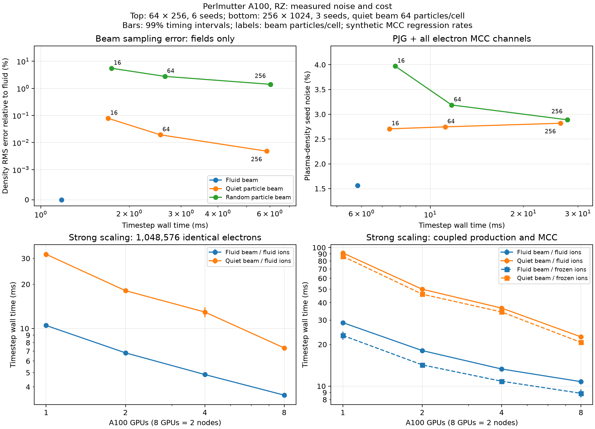

# Perlmutter coupled-physics re-audit

This record covers the re-audit requested after the upstream merges. The full
numerical campaign compares with stock `66f380f98e44b0cce493a435305009693d0e261e`,
with AMReX `d6d1aa11f38c`. Earlier measurements explicitly identified below use stock
`cb5672fae0b9099d2c7631e93ffff3404a553821` and AMReX `66028f892b7d`.
The subsequent stock `471191e3f` change affects only a 3D implicit boundary
mask; its merge, rebuild and follow-up checks are recorded separately below.
All new compilation, physics tests, regression tests and timing measurements
run on Perlmutter. The matrix gives current acceptance; the chronological
investigations below retain unsuccessful runs and intermediate findings.

## Previously committed records

- [Fluid validation](VALIDATION.md), its compact JSON measurements and figures
  record the implementation assumptions, independent references, convergence,
  CPU/A100 measurements and known coverage limits through `3ac32229a`.
- [Proton model theory](../../../Docs/source/theory/multiphysics/proton_impact_ionization.rst)
  and the [PJG research archive](../ProtonImpactIonization/Research/README.md)
  preserve the equations, calibration, input provenance, superseded approaches
  and uncertainty of the 800 MeV extrapolation.
- [Collision theory](../../../Docs/source/theory/multiphysics/collisions.rst)
  and [MCC checks](../BackgroundMCC/README.md) document the event selector,
  relativistic recoil, RBEQ energy sharing, IAA angular models and attachment.
- [Application examples](../../../Examples/Physics_applications/proton_beam_air/README.md)
  and the parameter reference document text/PICMI configuration and limits.

Raw build trees, checkpoints and most runtime logs were not committed. Compact
results and reproducible drivers were committed. This re-audit retains
machine-readable acceptance summaries and provenance in Git; large raw outputs
remain in the authorized Perlmutter validation directory.

## Acceptance matrix

| Area | Independent check and regression coverage | Status |
| --- | --- | --- |
| Stock build | Current stock Perlmutter profile, documented CMake and dependency recipes, matching branch/stock configurations | CUDA builds pass; supplementary SYCL compilation passes |
| Rigid beam | Gaussian normalization, exact space-time yield, continuity, self-fields, axis/walls, pulse overlap, shape orders | Physics checks pass; strict PSATD redistribution differences below |
| Immobile ions | Identical-event frozen-particle footprints, signed charge transfer, nonnegativity, no repeated synchronization/filtering | Selected regressions and two-node footprint checks pass |
| Proton impact | PJG N2/O2 spectra/totals, IAA angular closure, bare-ion scaling, tail precision, caps/remainders | Double/native-float and regression checks pass |
| Electron MCC | Elastic/excitation IAA DCS, RBEQ SDCS and IAA ionization angles, two-/three-body attachment, recoil and null events | Analytical, measured-DCS and selected regression checks pass |
| Coupled operation | All channels together, both particle/fluid representations, subcycling and all four solver configurations | All 288 coupled runs pass the population, energy, spectrum and charge checks |
| Diagnostics/restart | Native/plotfile/openPMD/reduced outputs, new upstream per-species particle counts, immediate restored state and continuation | Selected regressions and all 24 all-channel eight-to-four-GPU continuations pass; strict PSATD source-only exception below |
| GPU ownership | One/two/four GPUs on one node, eight GPUs on two nodes, CUDA-aware MPI and changed restart decomposition | Topology/communication pass; 7/8 source/attachment cases pass, PSATD continuation fails strict roundoff criterion |
| Performance/noise | Synchronized strong/weak scaling, matched electron work, particle references and repeat-seed statistics | Completed on 1/2/4/8 A100s; 252 noise-study runs and 54 analytical equal-error runs; measured limitations below |
| Stock regressions | Collision, fluid, implicit, diagnostics and restart; reproduce failures on the merged upstream revision | 250/254 branch stages pass; three acceleration failures reproduced on stock |

The previous coupled timing driver included ionization and attachment but did
not include elastic or excitation. The new combined fixture includes both.
In the input API, the electron SDCS model is named `RBEQ`; `IAA` names the
ionization angular closure and the tabulated elastic/excitation DCS option.
Synthetic tables establish numerical correctness, not experimental air-chemistry
accuracy. No assertion tolerance will be relaxed to accommodate a failure.

Counts of regression stages include execution and analysis as separate stages;
ensemble run counts refer to complete independent simulation settings/seeds.
Historical paragraphs below retain their status at the time of each investigation.
This matrix and the final-results sections supersede their pending statuses.

## Equation and lifecycle review

The source review checks the following invariants against the independent
tests; runtime results are recorded separately below.

- The Gaussian normalization uses the cylindrical measure `2*pi*r*dr*dz`,
  `sigma_z = abs(v_z)*sigma_t`, and the finite-support Gaussian integral.
  Current and bunch charge are positive input magnitudes. The deposited axial
  current has the sign of `charge*v_z`; clipping by the domain does not change
  the prescribed normalization. `sigma_r` is the Cartesian transverse RMS
  width, while untruncated radial RMS is `sqrt(2)*sigma_r`.
- Yee charge is projected with the particle B-spline shape; current uses its
  cumulative primitive over the physical step. The discrete spatial
  difference of that primitive cancels the discrete temporal charge change.
  RZ axis folding and the Verboncoeur volume are included. PSATD uses its
  cell-centered radial/axial layout and native spectral current correction.
- Primary production integrates `n_b*n_gas*Z_b^2*sigma(E_b)*abs(v_b)` over
  the annular cell and physical collision interval. Constant gas has a
  separable exact-measure quadrature; parser-valued gas uses positive composite
  quadrature. Placement time and integration interval are distinct, including
  the end-of-step collision placement in semi-implicit integration.
- A fractional product yield carries no charge until an electron is emitted.
  A creation cap raises the product weight; it does not discard the yield.
  Emitted electron and ion density use the same stored position, weight and
  deposition shape. Attachment deposits the removed electron's footprint
  before compaction. Rejected recoil events do not update ion density.
- Fresh ion increments are volume-scaled and synchronized once before being
  added to persistent density. Axis mirrors are consumed once, and physical
  wall shape support is retained. The persistent density is never treated as
  a fresh deposition. Only owned charge copies enter subsequent synchronization.
- Semi-implicit chemistry is outside residual and Jacobian evaluations.
  The field-independent prescribed current is added after kinetic current
  scaling, so it enters neither stored kinetic current nor mass matrices.
  Charge is not re-summed or re-filtered in a mass-matrix-only evaluation.
- Electron elastic/excitation kinematics include molecular recoil;
  ionization solves kinetic-plus-binding energy conservation for the chosen
  energy share and angles. Immobile destinations discard ion motion only
  after those kinematics. The rigid beam is externally prescribed, so its
  source energy is an external input rather than a conserved particle loss.
- MCC subcycling repeats each collision operator with the smaller collision
  timestep. Distinct gas/source operators retain WarpX's sequential splitting;
  subcycling alone does not remove the error from their ordering. Global
  timestep, emission weight and sampling refinement are separate studies.
- Checkpoints validate prescribed model/configuration metadata and require
  the density, remainder, budget and quiet-sampling counter files. Analytic
  caches are reconstructed without replaying collisions or initial fields.
  The restart driver checks restored state before stepping, then checks output
  timestamps, cadence and continuation.

The IAA angular closure is a physical approximation, not an exact molecular
double-differential cross section. The heavy-projectile version adapts its
free-electron cosine and conditions the permitted interval. PJG's extrapolation
to 800 MeV and the underlying molecular data retain the uncertainties documented
in the theory/research archive. Numerical acceptance cannot remove those model
uncertainties.

## Build environment

The saved user profile refers to older Python/HDF5 modules. A fresh copy of the
current repository's `perlmutter_gpu_warpx.profile.example` is used with account
`m3748_g`. Existing BLAS++ links CUDA 12 and existing ADIOS2 links an unavailable
HDF5 library, while the stock profile now loads CUDA 13.2/HDF5 1.14.3.9. These
dependencies must be rebuilt with the stock recipes into an isolated validation
prefix. The user's shared installation and home profile are preserved.

The build recipe follows the current
[stock WarpX Perlmutter instructions](https://warpx.readthedocs.io/en/latest/install/hpc/perlmutter.html).
Its installation/build paths are isolated within this checkout; the destructive
cleanup of the shared user prefix in the stock dependency installer is omitted.

The relevant optional features are MPI, Python, FFT and openPMD/HDF5/ADIOS2.
The validation build covers 1D, RZ and 3D, with double fields/particles. QED and
embedded boundaries are outside this simulation's scope. GPU-aware MPI and
rank-to-GPU placement follow the stock Perlmutter batch example. The earlier
single-GPU timings do not establish full-node or multi-node performance.

The final CUDA environment uses GCC 13.2 through the Cray compiler wrappers,
CUDA 13.2, CMake 3.30.2, Python 3.12.12 and Cray MPICH 9.1.0.794. Release
builds target A100 architecture 80. The build recipe enables MPI, Python,
FFT and openPMD, disables QED/embedded boundaries and Python link-time
optimization, and preserves separate branch/stock build directories. Runtime
`PYTHONPATH` selects the corresponding built package instead of installing
both revisions into one shared environment. These scope/path choices are
recorded alongside the stock module, dependency and CMake recipe; the build
does not reuse incompatible CUDA/HDF5 binaries from the user's old environment.

## Review findings and results

The merged upstream per-species macroparticle-count diagnostic accepted fluid
indices from the extended diagnostic registry and then indexed the kinetic
container with them. The fix returns an exact zero field for fluid species.
Regression coverage includes kinetic cell counts independently histogrammed
from saved particle positions, fluid-only PICMI/text output, mixed-species
plotfile/openPMD output and restart output. Runtime acceptance is pending.

Stock dependency preparation was submitted as CPU build job `58708323`. The
script's shell syntax was checked on Perlmutter before submission.
It completed successfully in 5 minutes 8 seconds. The fresh environment uses
Python 3.12.12 and rebuilt `mpi4py` against Cray MPICH 9.1.0.794. The clean
three-geometry CUDA build was submitted as job `58708497`.

The source-document review confirms Schmalzried Eq. (11.132)'s incident-energy
denominator, and Table 11.4's screening radii 0.6052/0.5677 for N2/O2. The beam
example now distinguishes Roy et al.'s illustrative 1.4 pC CST calculation,
two-sigma support, and rounded experimental beam parameters from this input's
explicit 0.6 A, 25 ps, eight-sigma normalization (37.5994 pC). A Gaussian
transverse RMS width remains a user-supplied assumption.

Release GPU runtime guards are also under review: ordinary device assertions
are compiled out by `NDEBUG`, including checks on parser-valued gas properties
and a user-supplied collision majorant. Invalid-input rejection must be verified
in the same Release configuration used for timings.

The expanded run script uses exclusive GPU nodes, the stock inverse local-rank
GPU mapping and GPU-aware MPI. `gpu_topology.py` records each rank's node/PCI
device and reduces device buffers across the communicator. The ownership phase
uses enough mesh boxes for every GPU and changes the restart decomposition.
Strong scaling holds the full problem fixed. The weak study holds cell spacing
and uniform electron work per rank fixed while extending the axial domain;
the beam is held fixed, so this is an equal-electron-work weak study, not a
weak-scaling claim for the primary source or its Gaussian support.

The baseline profile (`58709463`) completed 16 particle/fluid source and combined
MCC cases on one and four GPUs. In the four-GPU fluid/fluid combined case,
separate full-density validity scans consumed about 0.040 s of 0.218 s for
20 steps. A fused update/validity reduction is implemented; its speedup and
conservation acceptance remain pending. Timings include all MCC channels in
the new fixture, but synthetic DCS are still numerical fixtures.

### Fresh-build and test provenance

- The clean branch build finished in `58709119` after the 30-minute build limit
  interrupted `58708497`; the separate stock build finished in `58709446` after
  `58708830`. This is a scheduler limit, not a compiler failure.
- `58709466`: all seven original double-particle C++ physics tests passed.
  A strict Python archive comparison exposed a platform-dependent one-ulp
  coefficient recomputation. Commit `e2529276d` preserves the archived literals
  and separately verifies the defining expression; all 64 Python tests passed
  without changing the archive tolerance.
- `58710270`: six of seven native float-particle C++ tests passed. The cached
  monoenergetic PJG cross section differed from device evaluation. Row selection,
  interpolation fraction and cached total must be evaluated on the same backend
  as the particle reference, including energies adjacent to row boundaries.
  The expanded strict comparison is pending.
- `58710512`: the FieldProbe repair passed a four-GPU run restarted on two GPUs.
  The exact solution is constant axial B: energy is `B^2*pi*R^2*L/(2*mu0)` and
  the integrated probe is `B*t`. Maximum energy relative error was `1.12e-15`;
  cumulative-probe continuation was exact. Other reduced continuations differed
  by less than `4e-15` relative to column scales.
- `58711837`: the separate stock build reproduced both probe defects (an extra
  initial `dt`, and lost cumulative history on restart). `58712061` also
  reproduced an extra initial/restart Poynting integration interval using a
  nonzero initial radial flux with exact surface power `2*pi*R*L*E_theta*B_z/mu0`.
- `58712062`: the first stock PSATD flux fixture was invalid because its axial
  boxes were no larger than the eight-cell guards. The revised fixture uses
  16-cell boxes; this failure is not evidence of a production PSATD defect.
- `58712279`: the measured N2/O2 DCS fixture passed its angular-moment,
  backward-probability and recoil checks for elastic/excitation scattering,
  spanning 0.1 eV to 1 GeV. The source data are the user's `elmolcs` DCS files;
  their license is retained beside the raw results. A CuPy shutdown warning
  followed successful completion; it did not change the process exit status.

Two validation infrastructure errors were found and corrected. The first
incremental upload preserved source mtimes older than freshly built baseline
objects, so several fixes were not recompiled. All modified source was explicitly
touched on Perlmutter before rebuild; subsequent uploads use checksums without
preserving mtimes. Second, cached CMake MPI flags were passed as executable names
to the new CTest launcher. The recipe now clears both MPI pre- and postflags.
The failed broad run `58710513` therefore establishes no physics acceptance.
The verified rebuild `58711820` exposed real CUDA portability issues in the
new fixes: constructor-local device lambdas and host/device capture-list
differences. Those are being corrected before repeating runtime acceptance.

The clean two-node topology test `58709445` verified eight distinct A100 devices
and device-buffer MPI communication. This is communication coverage, not yet
acceptance of an eight-GPU coupled WarpX simulation. Early ownership runs
`58710514`/`58710515` used stale diagnostic objects and failed; they are not
reported as successful multi-GPU physics tests.

### Verified repairs and distributed continuation

The CUDA capture issues were resolved in build `58712396`; `58712776` rebuilt
the diagnostic repairs and both standalone particle precisions. No tolerance
was relaxed to accept these changes.

- `58712917` and `58712918` both completed successfully: ten C++ analytical
  tests, 64 Python physics/archive tests and the independent Gaussian-field
  reference checks. The native double/float PJG comparisons include neighboring
  representable energies at table-row boundaries and 4,097 probability
  quantiles per energy. The three new Poynting tests independently interpolate
  manufactured fields in 1D, RZ and 3D.
- These manufactured tests exposed a stock cell-centered axial-index error:
  the axial predecessor is `i-1` in 1D and `j-1` in RZ, not `k-1`. They also
  exposed a Yee-specific radial interpolation being applied to collocated RZ
  fields. Both repairs pass the independent interpolation checks.
- `58712916` repeats the stock PSATD nonzero-flux comparison with valid box
  sizes. It reproduces the initial extra integration interval and cumulative
  restart errors, without the earlier fixture's guard-cell violation.
- `58713754` completed six all-channel MCC Yee runs on four A100s, restarting
  each on two. `58713755` completed the corresponding PSATD study on eight
  A100s across two nodes, restarting on four. Each continuation compares saved
  particle coordinates, momenta, weights, native fields, ion densities, source
  remainders and sampling counters **before stepping**. Deterministic source
  budgets agree within the prescribed numerical bounds. Subsequent stochastic
  MCC populations/energy pass the paired five-standard-error ensemble bounds.
  This is distributed coupled-physics coverage, beyond the earlier topology
  communication test.
- In `58713746` and `58713753`, Yee source output and four/eight-GPU attachment
  footprints passed. The PSATD source simulation and restart also ran, but its
  output analysis incorrectly selected the unfiltered Yee comparison from the
  immediate directory name (`full`). The analysis now takes an explicit solver
  argument. The complete ownership matrix is being repeated.

The Release input guards reject invalid parser-valued gas density/temperature
and collision majorants through host-visible GPU error flags. Product paths
reuse their existing counter transfer, avoiding an extra device synchronization
per tile. One negative-input fixture initially failed because WarpX wrapped its
correct error message with a `#` continuation prefix; comparison now normalizes
only that presentation, and preserves each full error log.

The diagnostic continuation fixture retains the pre-checkpoint output prefix
and checks it byte-for-value against the uninterrupted run. It then compares
the new suffix, including checkpoint-time output, across MPI decompositions.
Every line-probe row is checked, rather than assuming one output row per step.
Final integrated diagnostic and full regression acceptance remain pending.

### Full-node and two-node results

- `58715002` and `58715003` completed the six-seed coupled restart studies for
  `semi_implicit_em` (four to two GPUs) and `semi_implicit_mm` (eight to four).
  Together with Yee and PSATD above, all four solver configurations pass the
  immediate restored-state checks and subsequent ensemble comparisons with
  elastic, excitation, ionization and two-/three-body attachment enabled.
- `58715464` completed source and attachment ownership tests for all four
  solvers on eight A100s across two nodes, restarting on four. Source output
  analysis now receives its solver explicitly; plotfile and Yee openPMD checks
  pass. This resolves the analysis-only PSATD failures in the earlier runs.
- `58714986` passed 228 of 257 selected regression stages. The failures include
  three PSATD analyses using the old solver selection, missing public reference
  datasets, QED-dependent inputs in a QED-disabled build, and eight restart
  comparisons that assume unchanged particle storage order. The stock build
  reproduces the eight ordering failures (`58716805`). A mixed-energy PJG
  percentile failure is under sampling-convergence investigation; its assertion
  tolerance remains unchanged.
- `58715832` completed the 84-run, six-seed all-channel coupled noise/cost study.
  At 64 by 256 cells, fluid beam/fluid ions take 5.860 +/- 0.096 ms per ordinary
  timestep (99% confidence interval). Quiet particle beam/fluid ions take
  7.409, 11.237 and 26.400 ms at 16, 64 and 256 beam particles per cell.
  Electron populations and energy have overlapping 99% intervals across these
  representations. These are one-GPU measurements; distributed scaling is a
  separate study. The fluid ions alone are not faster than frozen ions at this
  small event count (fluid beam/frozen ions: 5.648 +/- 0.056 ms).

The ion-density update now combines addition, scratch clearing and validity
checking in one reduction, replacing three separate full-density reductions.
`58714994` repeats the 16-case one-/four-GPU profile after this change. The
four-GPU fluid/fluid combined case takes 0.188 s for 20 steps versus 0.218 s in
the earlier profile. This single profile pair diagnoses overhead; it is not a
repeat-sample speedup claim. The distributed footprint and restart checks above
verify conservation after the optimization. AMReX's `tilebox()` removes nodal
tile overlap before `growntilebox()` expands only the outer tiles, so the fused
update does not write a shared nodal value twice within a CPU FAB.

### Reference-test investigations

The public `warpx-data` and `openPMD-example-datasets` repositories are now
installed at the paths used by stock CI inputs, with their revisions recorded.
`58718189` passes all 20 repeated external-field, PSATD-source and helium-MCC
stages. The helium discharge retains its upstream physics tolerance.

`58717683` varies product weight independently of the mixed projectile energies
over six seeds. At weights 200, 50 and 12.5, respectively, 3/6, 5/6 and 6/6
complete spectrum analyses pass. The failures are percentile sampling errors;
conditional 50/500 keV spectra and total yields remain consistent with the
independent PJG quadrature. The mixed-energy regression now uses weight 12.5
and a cap of 500,000 (about 340,000 products per target), retaining all previous
assertion tolerances. Monoenergetic fixtures retain their prior resolution.
The archived coarse failures remain available; the convergence study is not
reported as an all-pass test run.

The default restart comparison now matches particle records by their persistent
creation-CPU/ID pair, verifies that those identities are unique and unchanged,
and compares every physical attribute at the original tolerance. This resolves
five of the eight failures on both branch and stock. Three acceleration cases
still exceed `1e-12`: representative failing errors are about `2e-12` for
ordinary/PSATD restart and `2e-9` for time-averaged PSATD, in both builds.
These boosted, moving-window 3D cases are outside the new fluid model's scope,
but remain reported as unsuccessful stock regressions, not silently excluded.

The remote received another upstream merge during the audit. It was integrated
as `d8340a34e`, preserving the audit changes and the upstream AMReX update from
`66028f892b7d` to `d6d1aa11f38c`. The earlier measurements above use the former
dependency revision. Final validation will use a separate build against the
new stock comparator `66f380f98e44b0cce493a435305009693d0e261e`; it will not
overwrite libraries used by an active measurement.

### Analytical and statistical interpretation

The independent manufactured-field test in `58717936` fails for the stock Yee
RZ `E_r B_theta` axial interpolation: it takes the radial predecessor instead
of the axial predecessor. Correcting that index passes all three manufactured
geometry checks in `58718520`. The earlier cell-centered and temporal fixes
remain covered by their separate exact-field and continuation tests.

The complete coupled ensemble `58715832` also passes the automated population,
energy, spectrum and charge checks in `assess_ensemble.py`. Population means use
the previously documented overlapping 99% Student intervals. Spectra use
simultaneous seed-based Student bands with Bonferroni correction for both
ensembles, tails, bins and comparisons. These are nominal sampling confidence
bounds, not bounds on molecular-model or discretization error. Correlated quiet
samples and variable macro weights are not treated as independent particles.

All 1/2/4/8-GPU strong-scaling ensembles completed (`58718343`, `58718342`).
At 256 by 1024 cells, the fluid beam/fluid ion coupled timestep takes
28.86, 18.18, 13.30 and 10.90 ms, respectively (three repetitions per setting).
At equal electron work of 1,048,576 macroparticles, the fluid beam takes
10.43, 6.87, 4.89 and 3.60 ms, versus 32.03, 18.20, 12.88 and 7.48 ms for
the quiet 64-particle-per-cell beam. The raw summaries include confidence
intervals, initialization and memory measurements. Small meshes and sparse
ion populations can still favor frozen ion particles because fluid updates
communicate mesh data. These measurements do not imply ideal strong scaling.

The short coupled studies span 10 ps. They verify the numerical representation;
they do not establish that ion motion is negligible over an arbitrary nanosecond
pulse train. A physical application must compare its full duration, fields and
transverse scale with a moving-ion reference. Neutral depletion, recombination,
detachment and chemistry beyond the specified channels remain omitted model
assumptions. The explicit transverse width and molecular data still determine
the experimental relevance of a particular run.

### Fresh builds after the second upstream merge

The separate CUDA builds against AMReX `d6d1aa11f38c` completed in `58721685`
(branch, including standalone physics executables) and `58721687` (stock
`66f380f98e`). Their first allocations reached about 88% before the debug queue's
30-minute limit; resumed builds completed without a compiler error. The source
repairs through `f7568caa3` are included. Each runtime study records the loaded
library hashes as well as the source manifest, including uncommitted drivers.

`58719054` passes the ten C++ analytical checks, 64 Python model/archive tests,
and independent Gaussian-field reference. `58721808` repeats the continuum
domain/mesh study: expanded-domain refinement gives core relative RMS errors
of 0.3081% (Er), 1.0971% (Ez) and 0.3674% (Btheta), consistent with the earlier
independent calculation. The default finite-domain Ez bias remains about 21%.
These are measured discretization errors, not newly adjusted tolerances.

`58719056` passes 250 of 254 selected branch regression stages. The three 3D
acceleration restart analyses remain outside their existing `1e-12` tolerance.
The fourth failure is the PSATD source load-balance comparison: the maximum
radial-current difference is `7.11e-15 A/m^2`, or `6.84e-18` of that component's
peak, but one small value exceeds the existing `2e-14` pointwise relative
criterion. Particle coordinates/momenta, sampling counters and primary-source
budgets agree exactly; ion-density differences are at floating-point roundoff.
The original assertions remain unchanged, and this stage remains a failure.

The separate eight-to-four-GPU ownership run `58719058` similarly reaches a
PSATD continuation failure after passing the immediate restored-state checks.
At step six, the maximum axial-current difference is `1.14e-13 A/m^2`, or
`4.36e-18` of peak current; five small values fail the pointwise criterion.
The native-state difference reports preserve all components, including nearly
zero symmetry components. This is consistent with floating-point ordering
effects after redistribution, not missing source state. The complete ownership
matrix is being repeated with independent failures collected rather than
stopping the remaining solver cases.

The Sphinx build `58722814` succeeds after installing the pure-Python interface
dependencies in its separate environment. One unresolved warning remains in
the existing developer-field reference: Doxygen does not expose the
macro-generated `warpx::fields::FieldType` enum. PICMI autodoc and the added
fluid/collision parameter and theory pages render without Sphinx warnings.

The supplementary SYCL build `58725479` completes successfully, including the
RZ WarpX library/executable, ten standalone physics checks and the strided
complex-FFT test executable. This establishes compilation, not execution, of
those tests. Its initial failures were
dependency configuration issues: the stock BLAS++ release includes `sycl.hpp`
from the compiler's legacy include location, and oneAPI's `-fsycl -qmkl` link
uses ILP64 while BLAS++ initially autodetected LP64. The isolated recipe now
provides the installed SYCL include directory and consistent ILP64 settings.
Neither a failed configure nor a successful compilation is counted as SYCL
runtime acceptance. No HIP toolchain or AMD GPU runtime is available in this
Perlmutter validation environment.

### Final dependency-version physics studies

`58725147` repeats all ten standalone C++ checks with native float particles,
all 64 Python tests and the Gaussian reference, then repeats measured N2/O2 DCS
acceptance. Both phases pass. `58723759`, `58723762`, `58724325` and `58725149`
each pass 72 all-channel coupled runs for Yee, PSATD, semi-implicit evolution
and semi-implicit mass matrices, respectively: four beam/ion representation
combinations, six seeds, and collision subcycling factors 1, 2 and 4. These use the existing population,
energy, spectrum and charge criteria.

The complete two-node source/attachment matrix `58724323` passes seven of its
eight cases. The PSATD source continuation repeats the five-cell axial-current
comparison failure described above; its immediately restored state passes.
The independent remaining solver cases run to completion despite this failure.
The current stock regression `58723025` passes 79/87 stages using its original
analysis. Reanalysis `58726131` retains the upstream moving-window domain checks
and matches particle IDs: five of those eight failures disappear, while the
three acceleration failures remain. Representative stock errors are
`1.08e-12`, `1.34e-12`, and `3.18e-9` against the unchanged `1e-12` criterion.

The 78-run source study `58723763` preserves the independent primary-yield error
of approximately `1.515e-4`. At fixed mesh, reducing product weight from 400 to
100 to 25 reduces pending N2 fractions from 2.37% to 0.603% to 0.146%, and O2
fractions from 7.38% to 2.16% to 0.539%. Refining cells at fixed weight instead
increases the pending fraction. This is an emission-resolution effect and must
be checked separately from mesh convergence. Neither a smaller timestep nor
more MCC subcycles eliminates the per-cell fractional-yield threshold.

Compact records, including failures, are committed in
[the initial archive](results/perlmutter-reaudit-initial.json) and
[the latest-dependency archive](results/perlmutter-reaudit-latest.json).
The approved raw-output root is
`/pscratch/sd/s/ssarwar/warpx-rigid-fluid-validation/build/reaudit-2026-09-21`.
Library hashes and CMake configurations distinguish builds even when the remote
working tree contains explicitly uploaded, not-yet-committed driver changes.

### Completed distributed restart and convergence studies

`58726443` passes all 24 all-channel coupled continuations: six seeds for each
of the four solver configurations, starting on eight A100s across two nodes
and restarting on four A100s. Required fields, source remainders/counters,
particle records and output timestamps are checked immediately after loading,
before advancing. The later stochastic MCC continuation passes the previously
specified ensemble bounds. This does not override the stricter source-only
PSATD current discrepancy in `58724323`.

`58725959` completes the 18-run joint mesh/weight study, 48-run solver/timestep
study and 18-run semi-implicit deposition study. The independent primary-yield
assertions pass. Joint refinement from 16 to 32 to 64 radial cells, with
product weights 100, 12.5 and 1.5625, gives electron populations of
5.5941, 5.5972 and 5.6017 million; 99% interval half-widths are 17,181, 1,699
and 3,232. Pending N2 production falls from 0.1460% to 0.07246% to 0.03564%,
and O2 from 0.5451% to 0.26359% to 0.13035%. These trends quantify emission
resolution, rather than asserting that populations must be identical at
different resolutions.

For the quiet 256-particle-per-cell reference, semi-implicit direct deposition
gives Ez errors relative to the fluid beam of 0.7048%, 0.1783% and 0.04333%
over that mesh refinement. Villasenor deposition gives 0.003792%, 0.0009326%
and 0.0002322%. The mass-matrix configuration agrees at roundoff. All four
solver configurations have overlapping population/energy mean intervals at
0.5 and 0.25 ps timesteps. The archived metrics retain nonmonotone quantities;
these finite studies do not establish convergence of every observable.

### Final noise and performance measurements

All timings below use the AMReX `d6d1aa11f38c` CUDA build, synchronized GPU work
and the slowest MPI rank's wall time. Each run excludes the first two steps
and reports its median ordinary timestep; checkpoint steps are reported
separately. Tables aggregate independent runs and give 99% Student interval
half-widths where shown. They do not include simulation initialization in the
timestep cost. Initialization, device/particle storage and library hashes are
retained in the JSON archive. The figure can be regenerated from that archive.

`58726281` completes 252 runs: 42 fields-only, 42 with identical kinetic
electron work, 84 primary-source and 84 all-channel coupled cases. The coupled
population, energy, spectrum and charge comparisons pass. On a 64 by 256 mesh,
one A100, six seeds and fluid ion products:

| Beam | Beam particles/cell | Coupled step (ms) | Plasma-density seed noise |
| --- | ---: | ---: | ---: |
| Fluid | 0 | 5.831 +/- 0.058 | 1.563% |
| Quiet particles | 16 | 7.390 +/- 0.040 | 2.706% |
| Quiet particles | 64 | 11.182 +/- 0.060 | 2.746% |
| Quiet particles | 256 | 26.366 +/- 0.215 | 2.819% |
| Random particles | 16 | 7.713 | 3.970% |
| Random particles | 64 | 11.732 | 3.187% |
| Random particles | 256 | 27.713 | 2.889% |

Seed noise is the cylindrical RMS sample standard deviation across seed
realizations, normalized to the reference field norm; it is not an error bar
on the mean or a total physical error. The fields-only beam-density errors
relative to the same-mesh fluid density are 0.07829%, 0.01929% and 0.004805%
for the quiet beams, versus 5.507%, 2.761% and 1.405% for random beams.
The fluid eliminates beam-particle sampling, but emitted-electron and MCC
sampling remains. Increasing beam particle count does not remove that noise.
The fluid source has no beam macroparticle loop; its work depends on active
mesh cells, quadrature and emitted products. Particle-reference cost increases
with beam population in both the source-only and coupled archived studies.

`58726636` and `58726902` measure strong scaling on 1, 2, 4 and 8 A100s,
with three runs per setting, 256 by 1024 cells and quiet particle beams at
64 particles per cell. Four GPUs occupy a full node; eight occupy two nodes.
The topology records verify distinct A100-SXM4-40GB devices and GPU-aware MPI
on every rank. These are physics/timing runs, not just topology checks.

| Case, timestep in ms | 1 GPU | 2 GPUs | 4 GPUs | 8 GPUs |
| --- | ---: | ---: | ---: | ---: |
| Coupled, fluid beam / fluid ions | 28.733 | 18.065 | 13.302 | 10.779 |
| Coupled, quiet beam / fluid ions | 91.461 | 50.056 | 36.617 | 22.687 |
| Coupled, fluid beam / frozen ions | 23.214 | 14.249 | 10.857 | 8.888 |
| Coupled, quiet beam / frozen ions | 86.440 | 46.111 | 34.319 | 20.705 |
| Identical electron work, fluid beam | 10.476 | 6.819 | 4.852 | 3.512 |
| Identical electron work, quiet beam | 31.983 | 18.083 | 12.933 | 7.364 |

The identical-work cases contain 1,048,576 kinetic electrons, disable primary
production/MCC, and isolate the beam overhead. In the coupled cases the fluid
beam/fluid ion speedup against quiet beam/fluid ions is 3.18, 2.77, 2.75 and
2.10, respectively. Strong scaling is sublinear. Sparse frozen ions remain
faster than dense fluid ions here because fluid updates communicate mesh data.

The separate weak study holds 262,144 kinetic electrons and 64 by 256 cells
per rank fixed, extending the axial domain while keeping the beam fixed.
Fluid/quiet-beam steps are 1.935/3.320, 2.800/3.416, 3.139/3.704 and
3.391/3.747 ms for 1/2/4/8 GPUs. The eight-GPU fluid timing has a wide 99%
interval of +/- 1.691 ms; the other intervals are in the archive. This is
limited weak scaling of uniform electron work, not of the Gaussian source.

### Accuracy-matched comparison and storage

The 54-run study `58727721` qualifies vacuum fields against the independent
translated-Gaussian integral at initialization and after 2 ps. The expanded
256 by 1024 domain separates finite-wall bias from sampling error. Before
running this ensemble, the targets were set to 1% core cylindrical RMS error
in Er/Btheta and 2% in Ez, based on the separate domain-refinement study.
Qualification requires the upper 99% interval of the worse output to meet
all three targets. These are new benchmark criteria, not relaxed regression
assertions.

| Fastest qualifying setting | Step (ms), 99% interval | Mean worst-output errors: Er / Ez / Btheta |
| --- | ---: | --- |
| Fluid beam | 4.624 +/- 0.114 | 0.3089% / 1.0993% / 0.3674% |
| Quiet beam, 4 particles/cell | 3.798 +/- 0.043 | 0.3117% / 1.0865% / 0.3671% |
| Random beam, 64 particles/cell | 4.991 +/- 0.049 | 0.4371% / 1.3880% / 0.5087% |

The low-resolution quiet beam is about 18% faster than the fluid at these
vacuum-field targets. The fluid has a 1.08-fold speedup over the fastest
qualifying random beam. Random beams at 4 and 16 particles per cell fail
qualification. All settings, including failures and finer quiet beams, are
retained. This comparison is not a claim of equal nonlinear-plasma accuracy.
High-particle-count speedups alone would overstate the fluid's advantage.

The storage study in `58726636` uses 64 by 256 cells, all MCC channels and
three seeds. Four persistent ion number-density fields occupy 682,112 bytes
at both 20 and 80 steps, including their allocated guard/shared copies. The
beam density adds 170,528 bytes. Transient increments, aggregate charge and
other scratch fields are additional mesh-sized allocations. Frozen ion
particle payload grows from approximately 3.50 MB to 14.97 MB over these
durations; kinetic electron storage grows in both representations.

| Duration | Fluid-ion checkpoint size | Frozen-ion checkpoint size | Checkpoint step, fluid / frozen |
| --- | ---: | ---: | --- |
| 20 steps, 10 ps | 8.21 MB | 11.03 MB | 47.03 +/- 3.80 / 59.69 +/- 13.33 ms |
| 80 steps, 40 ps | 19.07 MB | 33.36 MB | 65.74 +/- 8.48 / 95.30 +/- 21.03 ms |

Sizes are complete checkpoints in decimal MB; times include the checkpoint
step's simulation work. Particle payload measures stored particle attributes,
not allocator reservation. These results establish bounded persistent ion
storage, not constant total simulation memory or a universal timestep speedup.

### Final upstream follow-up

Remote merge `0afd4bfd8` arrived after the timing jobs finished. Merge
`30d5b3713` incorporates stock `471191e3f`, whose only production change fixes
operator precedence in the 3D curl-curl boundary-mask direction. Its code is
guarded by `AMREX_SPACEDIM == 3`, so the RZ implementation used above is
unchanged. Stock-recipe rebuild `58728306` passes for branch and stock in
1D/RZ/3D. The follow-up implicit regressions are `58728532` (branch) and
`58728533` (stock); their results will be added after completion. This build's
hashes remain separate from the completed timing studies.

### Focused review passes

The equation review followed the production paths through `RigidBeamProfile.H`,
`RigidBeam.cpp`, `RigidBeamIonization.cpp`, and the electron collision kinematics
and sampling headers. Independent checks include:

| Quantity | Reference and applicable check |
| --- | --- |
| Gaussian charge and clipped pulse yield | Error-function integrals, cylindrical volume measure and independent SciPy quadrature; profile, boundary and train fixtures |
| Beam initialization | Independent continuum Gaussian-field integral, spherical/static limits, cylindrical Gauss law and `B_theta = v_z E_r/c^2`; particle and domain/mesh comparisons |
| Charge continuity | Nodewise finite-difference residual, both propagation directions and physical boundaries, with and without repeated filter passes |
| Primary source | Independent PJG Python quadrature, N2/O2 spectra, `Z_b^2` scaling and kinetic-projectile references; emitted plus pending yield |
| Electron collisions | Independent four-momentum/kinetic-plus-binding budgets, recoil thresholds, elastic backward limit, inadmissible-draw checks and attachment survival law |
| Angular sampling | Integrated measured DCS moments/backward probabilities, screened-Rutherford continuation and analytic IAA angular limits |
| Diagnostics | Manufactured constant-field energy and probe integrals, exact initial surface Poynting flux, independently histogrammed kinetic counts and exact zero fluid macroparticle counts |

Relativistic kinetic energy is evaluated in rationalized form,
`m*u^2/(sqrt(1+u^2/c^2)+1)`, and recoil solves use `pc` in eV to avoid
subtraction of nearly equal molecular rest energies. The ionization solver
checks its residual after its fast Newton iterations and rejects a draw without
updating either source or product density when no admissible solution is found.
The IAA and PJG distributions themselves remain model assumptions; conservation
checks do not turn their empirical closures into exact molecular predictions.

The execution/lifecycle review followed collision selection, batched creation,
fluid deposition, MPI synchronization, implicit current accumulation, field
registration, diagnostic output and checkpoint restoration. In particular:

- Scatter deposits use `amrex::For` and host/device atomics. GPU event-counter
  atomics have a separate CPU path; they are not relied on for CPU SIMD safety.
- Source prefix sums use `amrex::Long`, followed by explicit particle-tile index
  limits. Product buffers remain alive until their dependent kernels finish.
- Attachment transfers the original electron's stored footprint before
  compaction. Rejected ionization slots are invalidated and removed before the
  next collision operator. Particle IDs are reserved independently of GPU
  event ordering.
- Fresh increments are synchronized once. Persistent densities retain physical
  boundary support and are never re-summed as new deposits. Owner masks prevent
  duplicate nodal contributions to totals and field-source synchronization.
- Source remainder, emitted budgets and four exact 16-bit sampling-counter
  digits are persistent fields. Required checkpoint files and immutable source
  configurations are validated before using restored state.
- The analytic beam cache and diagnostic current are reconstructed from saved
  time without replaying chemistry. Kinetic current accumulation and mass
  matrices exclude the prescribed current; each residual receives it once.

These checks found and repaired the diagnostic, Release-guard, table-precision
and validation problems described in the chronological record. The final review
retains the unresolved strict numerical comparisons in the acceptance matrix;
it does not certify that arbitrary inputs or untested backends are error-free.

The stationary-ion approximation needs a separate application-duration check.
Useful scales are `t*sqrt(k_B*T_i/m_i)` for thermal displacement and
`abs(q_i)*E*t^2/(2*m_i)` for displacement in a constant field. The 10 ps coupled
fixtures are not a validation of every nanosecond pulse sequence. Immobile ion
densities preserve the electron event's footprint and its sampling noise;
they remove ion particle storage and motion, while the continuous beam removes
beam-particle sampling. Pending-yield resolution, mesh/boundary errors and MCC
noise remain distinct. Constant neutral backgrounds are used in the coupled
benchmarks; time-dependent MCC parsers retain WarpX's collision-placement and
operator-splitting semantics and require a timestep convergence study.
