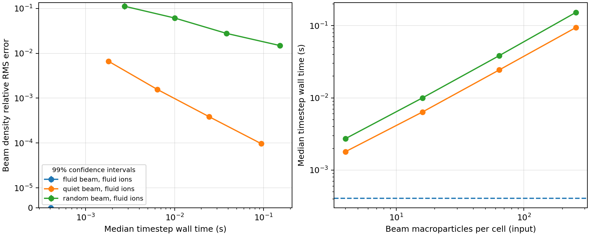
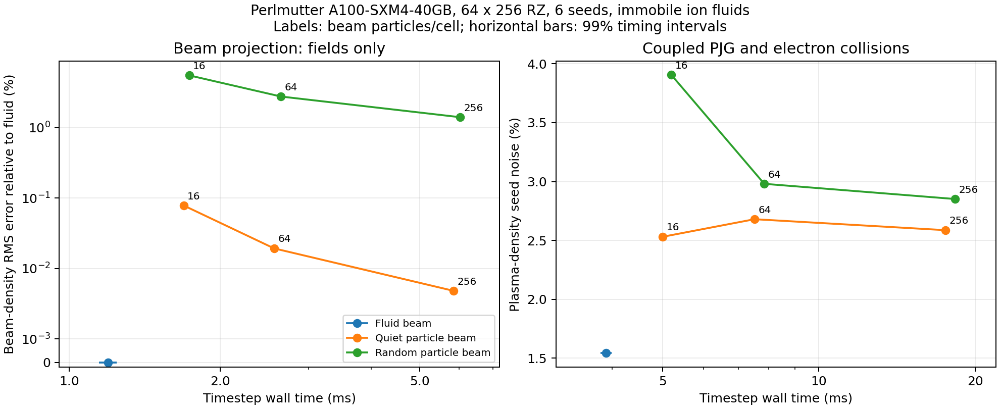

# Prescribed-fluid validation

The prescribed-fluid implementation, CPU comparisons and Perlmutter A100
acceptance are recorded here as of 2026-09-21. The complete CUDA build, feature
tests and all six GPU benchmark phases pass. Remaining backend limits are
described below.

The post-merge, stock-build re-audit is tracked separately in
[REAUDIT.md](REAUDIT.md). In the historical combined runs below, the configured
MCC channels were ionization and attachment. Elastic and excitation had
separate physics tests but were absent from the combined timing fixture.

The implementation is on `codex/rigid-beam-immobile-ions`, based on `c4f620a70`.
The final CPU timing ensembles used `385e433a2`; the subsequent lifecycle checks
and safeguards are in `1f3e60511`. The convergence drivers are in `0c108be5a`.
The 48-run solver comparison was repeated after the PSATD initial-field
centering correction in `536d0aa5a`; the other timing ensembles are unchanged.
Per-case JSON files retain the source revision, WarpX library version, benchmark
hash, configuration, MPI count, timings and populations. Raw JSON, NPZ and logs
remain under `build/fluid-comparisons/`. A compact record of the measurements is
in [cpu-2026-09-21.json](results/cpu-2026-09-21.json).

## Build and regression coverage

The CPU host is an Apple M3 Pro, using AppleClang 21.0.0, double field and particle
precision, MPI, Python, FFT and openPMD. The primary build uses `NOACC` with SIMD;
an independent RZ build uses OpenMP. The main build also compiles 1D and 3D.
Both use `-ffp-exception-behavior=maytrap` to avoid speculative floating-point
exceptions in inactive branches with this compiler.

| Coverage | Result |
| --- | --- |
| Prescribed-fluid CTest selection, NOACC | 112 checks pass |
| Same selection, OpenMP build | 112 checks pass with the normal one-thread CTest configuration |
| Shared-FAB ion scatter, OpenMP | Three additional tests pass with two MPI ranks and four threads per rank; particle tiles are 4 by 4 cells |
| Independent PJG and profile executables | Five checks pass, including a million-particle projection quadrature |
| Independent Gaussian self-field reference | Static and Lorentz-transformed spherical closed forms, and doubled quadrature order, pass |
| PSATD centering and exact attachment review | 26 affected checks pass in each CPU build, including four-thread ion scatter in the OpenMP selection |
| Perlmutter A100, CUDA 13.2 | All 112 feature checks and five standalone physics checks pass; Slurm job `58694940` |
| Existing RZ regressions on A100 | 18 checks pass, including particle collisions, electrostatic spheres, cold fluids and PSATD Langmuir waves; two analysis steps were rerun after installing the missing `openpmd-viewer` package |
| Focused rerun after the SYCL spectral changes | 23 PSATD checks pass on CPU and 23 on A100; GPU job `58697258` |

The prescribed-fluid checks cover shapes 1–4, both beam directions, axial
boundary flux, repeated filtering, N2/O2, bare-ion scaling, rejected events,
zero sources, overlapping and truncated pulses, fractional production, caps,
subcycling and repeated implicit residual evaluation. They exercise Yee,
PSATD, semi-implicit and semi-implicit with mass matrices.

Native field access, plotfile and openPMD outputs check mesh placement, units,
species names, total/species charge, physical populations, energy, momentum,
zero fluid macroparticle counts, timestamps and cumulative source budgets.
Restart checks compare restored fields, populations, sampling counters and
remainders **before the first resumed step**, then verify continuation and
diagnostic cadence. Checkpoints during pulses, between pulses and after
attachment are tested, including a change from two MPI ranks to one. Missing
required state and incompatible configuration are rejected.

Explicit load-balancing tests require an actual change of MPI ownership and
compare the final state with an unredistributed run. Runtime load balancing
with semi-implicit integration is rejected: the native implicit solver's
private work arrays retain their original distribution. Restart redistribution
remains supported for both semi-implicit configurations.

The existing collision, cold-fluid, implicit, diagnostic and restart regressions
were also exercised. Two analysis failures were reproduced in an unmodified
`c4f620a70` build, without changing their tolerances:

- The 3D time-averaged PSATD restart test reports the same By error,
  `2.2276284504645716e-12`, against its `1e-12` tolerance.
- The helium MCC benchmark reports the same 9.62% density error against 6.50%.
  The baseline and modified ion-density arrays are exactly equal.

External-field tests needing absent openPMD example datasets were unavailable.
The beam-beam QED test cannot be accepted with this QED-disabled build. EB is
also disabled; prescribed fluids explicitly exclude embedded boundaries.
Platform-dependent checksum differences were excluded as directed by AGENTS.md.

## Physics and convergence

The benchmark beam has 800 MeV kinetic energy, 0.6 A peak current, 25 ps RMS
duration, 2 mm transverse Cartesian RMS width and eight-sigma support. Its
bunch charge is 37.5994 pC. The default benchmark mesh is 32 by 128, with
particle shape 3 and a 0.5 ps timestep. Source studies use 79% N2 and 21% O2
at a total background density of `1e23 m^-3`.

**MCC cross sections in these studies are synthetic regression fixtures.**
They test representations and numerical methods, and do not establish
quantitative air-chemistry predictions for the experiment.

The primary yield, including pending production, differs from independent PJG
quadrature by 0.0151461% for N2 and 0.0151054% for O2. This satisfies the existing
0.1% table-interpolation bound throughout the independent source sweeps.
No production lookup table is used by that reference calculation.

Additional exact checks compare the Gaussian source with a closed space-time
antiderivative and the cylindrical annular integral, for both velocity signs,
overlapping pulses and finite/infinite cutoffs. The Gaussian field reference
is checked against the Lorentz transform of the spherical closed form at
beta = 0.1, -0.8 and 0.99. A frozen monoenergetic attachment fixture checks
`N(t) = N(0) exp(-n_gas sigma v t)`, with six-standard-deviation bounds from
the independent weighted Bernoulli variance. No physics tolerance was widened.

With identical events, fluid and frozen kinetic ions agree to roundoff. Across
the six-seed studies with the advancing quiet sampler, the largest density
difference divided by peak density is `2.28e-15` for primary production and
`4.88e-15` with MCC. Paired electron energy histograms are exactly equal.
Kinetic and fluid beam representations were also compared with both ion
representations, using random and quiet particle beams at increasing resolution.

The implicit particle reference uses Villasenor current deposition to match
the fluid beam's discrete continuity equation. A separate 18-run study checks
the native direct-deposition option. Its finite-mesh current shape converges
to the same result:

| Mesh | Direct-particle Ez error relative to fluid | Villasenor-particle Ez error |
| --- | ---: | ---: |
| 16 by 64 | 0.7048% | 0.003792% |
| 32 by 128 | 0.1783% | 0.000933% |
| 64 by 256 | 0.04333% | 0.000232% |

Both semi-implicit configurations show the same convergence. The particle
sampling is fixed at 256 particles per cell in this study.

The independent rest-frame Coulomb integral, transformed to the laboratory
frame, exposes finite-domain errors shared by the particle and fluid initial
self-field solves. On the default 32 by 128 mesh, core Er and Ez errors relative
to the unbounded Gaussian are 0.855% and 21.63%. Enlarging the domain and then
refining to 256 by 1024 reduces them to 0.308% and 1.097%. The benchmark's
conducting radial wall and periodic axial boundaries explain the large default
Ez bias. Particle agreement alone does not establish continuum accuracy.

A 78-run source study independently varies mesh, timestep, product weight,
creation cap, sampling resolution, subcycling and ion temperature/motion.
At fixed product weight, finer cells retain more of the yield as pending
production. This delays electron emission and changes secondary chemistry.
An additional 18-run joint refinement decreases weight eightfold whenever
both mesh spacings are halved:

| Mesh / product weight | Final electrons, mean ± 99% CI | Pending N2 / O2 fractions |
| --- | ---: | ---: |
| 16 by 64 / 100 | 5,609,859 ± 9,484 | 0.1460% / 0.5451% |
| 32 by 128 / 12.5 | 5,616,860 ± 4,290 | 0.07246% / 0.2636% |
| 64 by 256 / 1.5625 | 5,618,647 ± 2,574 | 0.03564% / 0.1303% |

The successive population differences decrease from about 7,001 to 1,787,
while pending fractions approximately halve. Pending production carries no
charge. It must remain visible in the primary-yield budget until electrons
are emitted.

A further 48 runs compare moving electrons with the configured collision channels across
the four solver configurations at 0.5 ps and 0.25 ps. At 0.25 ps, Yee and both
semi-implicit variants give the same electron population within roundoff;
their mean electron energies differ by `5.9e-7` relatively. PSATD's population
differs by 0.00655%, within the six-seed confidence intervals. Rare energetic
secondaries leave much larger uncertainty in total electron energy; those
intervals overlap across all four solvers. No cross-backend bitwise agreement
is assumed.

## Noise and CPU cost

Runs are serial, with one MPI rank and one CPU thread. Device/MPI synchronization
brackets the timed steps; Python measurements are excluded and the first two
steps are discarded. Values below are means of per-run medians over six runs.
The confidence intervals and initialization times are retained in the JSON.

[Standalone PDF](results/cpu-2026-09-21-noise-cost.pdf)

The density-error metric compares with the analytic fluid projection on the
same mesh. Quiet-particle errors are quadrature bias; random-particle errors
also include sampling noise. Finite-grid and boundary errors remain in all
representations.

| Beam | Input particles/cell | Beam-density RMS error | Field-only step | Step with 16,384 identical electrons |
| --- | ---: | ---: | ---: | ---: |
| Fluid | 0 | Numerical floor | 0.406 ms | 5.873 ms |
| Quiet particles | 16 | 0.1571% | 6.365 ms | 11.864 ms |
| Quiet particles | 64 | 0.03869% | 24.349 ms | 29.925 ms |
| Quiet particles | 256 | 0.009637% | 94.350 ms | 102.717 ms |
| Random particles | 16 | 6.140% | 9.983 ms | 15.171 ms |
| Random particles | 64 | 2.779% | 38.387 ms | 43.807 ms |
| Random particles | 256 | 1.491% | 152.692 ms | 157.629 ms |

At the existing `1e-3` mesh-projection error criterion, 64 quiet particles per
cell is the least expensive tested particle case that meets the density
criterion. The fluid representation is 60.0 times faster for fields alone and
5.10 times faster with equal electron work. Compared with 256 quiet particles
per cell, those ratios are 232.5 and 17.5. These are CPU fixture results and
equal-deposition-error comparisons, not predictions of application or GPU speedup.

An isolated profiler run separates the primary-source cost. For 20 timesteps
and two target gases, inclusive source time is 14.1 ms for a fluid beam and
35.19, 135.5 and 474.8 ms for quiet particle beams at 16, 64 and 256 particles
per cell. The fluid algorithm scales with mesh cells and emitted products and
has no beam-particle loop. These single-run attribution timings are separate
from the uninstrumented ensembles.

Advancing each batch's quiet axial strata reduces plasma-density seed noise
from 2.080% to 1.005% in the primary-source fixture, and from 2.129% to 1.069%
with MCC. Primary yield and the emitted energy samples are unchanged. Kinetic
electron sampling noise remains even when the beam has no sampling noise.

## A100 noise, physics and cost

The GPU ensembles use one A100-SXM4-40GB, CUDA 13.2, GCC 13.2, double field and
particle precision, and a 64 by 256 mesh. Each timing/physics group has six
seeds. The equal-electron-work case contains 65,536 deterministic electrons.
These use four times as many cells as the CPU timing ensembles; the tables
compare representations within each backend, not CPU/GPU speedup.

The source checkout is `d6da20fe3`; the CUDA library reports `9723d0a12389`
because the intervening commit changes restart tests only. The source tree was
clean throughout the main ensembles. Slurm jobs are `58694961` (fields),
`58694963` (equal electron work), `58695192` (source), `58695195` (coupled),
`58695336` (storage) and `58695337` (profiling). They contain 42, 42, 84, 84,
12 and 8 runs, respectively. Raw results and provenance are retained below
`build/fluid-comparisons/a100/`, and a compact record is in
[a100-2026-09-21.json](results/a100-2026-09-21.json).

[Standalone PDF](results/a100-2026-09-21-noise-cost.pdf)

| Beam | Input particles/cell | Beam-density RMS error | Field-only step | Step with 65,536 identical electrons |
| --- | ---: | ---: | ---: | ---: |
| Fluid | 0 | Numerical floor | 1.194 ms | 1.541 ms |
| Quiet particles | 16 | 0.07829% | 1.692 ms | 2.039 ms |
| Quiet particles | 64 | 0.01929% | 2.562 ms | 2.967 ms |
| Quiet particles | 256 | 0.004805% | 5.852 ms | 6.155 ms |
| Random particles | 16 | 5.507% | 1.735 ms | 2.129 ms |
| Random particles | 64 | 2.761% | 2.645 ms | 3.047 ms |
| Random particles | 256 | 1.405% | 6.024 ms | 6.371 ms |

At the same `1e-3` mesh-projection criterion used above, 16 quiet particles per
cell is the cheapest tested particle point on this finer mesh. The fluid beam
is 1.42 times faster for fields and 1.32 times faster at equal electron work.
At 64 particles per cell the ratios are 2.15 and 1.93; at 256 they are 4.90 and
3.99. Timing confidence intervals, initialization costs and physical populations
are retained in the JSON. The field-only fluid timestep is
`1.194 +/- 0.048 ms` (99% interval). The independent continuum reference still
shows finite-domain error; deposition agreement does not remove that error.

With immobile ion products, the source-only fluid run takes 2.705 ms per step,
versus 6.260 ms for the 64-particle quiet beam. Including electron motion and
MCC gives 3.893 versus 7.519 ms. In the latter case the measured plasma-density
seed noise is 1.542% for the fluid beam and 2.680% for the quiet particle beam.
All paired fluid/frozen-ion coupled populations and electron energies have
overlapping 99% intervals. GPU stochastic trajectories need not be identical
after changing a collision destination; the deterministic event-deposition
tests enforce the stricter footprint comparisons separately.

In the primary-source fixture, identical fluid-beam events with fluid and
frozen kinetic ions differ by at most `6.29e-15` of peak density. Their electron
energy histograms are exactly equal. The independently summed electron kinetic
energy matches the emitted source-energy budget within `2.89e-15` relatively;
discarded recoil agrees with the frozen ions' kinetic energy within `1.25e-12`.
The primary yield including pending production retains the 0.01515% N2/O2
agreement with independent PJG quadrature. At this mesh and product weight 100,
2.45% of N2 and 7.09% of O2 primary production is still pending at 20 steps.
This is an emission-resolution effect, addressed by the joint weight/mesh
convergence study above, and is not charge already present in the plasma.

The synchronized source profiler initially includes substantial CUDA module
loading: the first fluid timestep takes 175 ms. A separate eight-run profile
with `CUDA_MODULE_LOADING=EAGER` (job `58696154`) reduces that first timestep
to 7.70 ms. The startup-inclusive source total falls from 89.60 to 33.51 ms
for 20 steps and two gases. In the eager-loading run, corresponding quiet-beam
source times are 40.38, 71.06 and 202.8 ms at 16, 64 and 256 particles per cell.
These are instrumented single-run attribution measurements; the table above
uses the uninstrumented ensembles. Both profiles are retained in the JSON.
The fluid source has no beam-particle loop: its work depends on mesh cells
and emitted products, while the particle source traverses the beam population.
The repeated profiles retain identical product counts and energy histograms.
Fluid-source densities agree within `2.50e-15` of peak density. An attempted
exact comparison of kinetic-beam birth positions exposed the existing source's
dependence on AMReX GPU dense-bin ordering: atomic bin insertion does not preserve
projectile order, and the source selects projectiles through that order's weighted
cumulative distribution. Its spatial snapshots therefore require ensemble
comparisons even at a fixed random seed. The particle-source noise estimates
include this run-to-run variability; the fluid source uses cell-based sequences.

## Ion storage and checkpoints

The same fluid-beam source was run for 20 and 100 steps with fluid or frozen
kinetic ions. Each result below averages three runs. Persistent ion densities
occupy 47,888 bytes per species, including guards, at both durations.

| Steps | Emitted electron macroparticles | Three fluid ion densities | Frozen-ion particle payload | Complete checkpoint: fluid / frozen ions |
| --- | ---: | ---: | ---: | ---: |
| 20 | 41,148 | 143,664 bytes | 2,633,472 bytes | 3.851 / 6.341 MB |
| 100 | 207,638 | 143,664 bytes | 13,288,832 bytes | 14.507 / 27.651 MB |

The density figures exclude transient increment fields and aggregate-charge
scratch storage; those also scale with mesh size. Complete checkpoints still
grow because electrons remain kinetic. Inclusive checkpoint-step times were
12.07 / 13.68 ms at 20 steps and 19.49 / 28.02 ms at 100 steps. These include
the physical timestep and are not isolated filesystem bandwidth measurements.

The A100 storage runs repeat the same comparison on the 64 by 256 mesh. Three
persistent ion-density fields occupy 511,584 bytes at both durations, including
guards. Each row averages three seeds.

| Steps | Emitted electron macroparticles | Three fluid ion densities | Frozen-ion particle payload | Complete checkpoint: fluid / frozen ions |
| --- | ---: | ---: | ---: | ---: |
| 20 | 53,895 | 511,584 bytes | 3,449,280 bytes | 8.022 / 10.959 MB |
| 100 | 276,474 | 511,584 bytes | 17,694,336 bytes | 22.267 / 39.449 MB |

Inclusive checkpoint-step times are 44.0 / 51.1 ms at 20 steps and
64.5 / 93.4 ms at 100 steps. Filesystem timing varies; the independent logical
storage measurement establishes the mesh-versus-event scaling. Transient
increments and aggregate charge also scale with mesh size, while electron
particle storage grows in both representations.

## Review findings and remaining work

The equations and time-staggering review identified and fixed missing exterior
current faces at axial boundaries and incompatible boundary smoothing of Jz.
Continuity now holds at every charge node for both directions, including three
filter passes. Nodal boundary populations use WarpX's full dual-cell volumes;
domain clipping does not renormalize the prescribed profile.

An independent moving-source Maxwell identity exposed an inherited RZ PSATD
initialization error shared by the particle and fluid references. PSATD's
cell-centered electric field was calculated with a Yee face gradient. Averaging
the nodal-potential gradients to the actual field locations reduces the relative
residual in `B_theta = v_z E_r/c^2` from 0.11731 to `1.66e-16` on the reference
mesh. The Yee and semi-implicit tests also check cylindrical Gauss law, including
the axis. Affected particle-reference, diagnostic, restart and existing RZ
Langmuir regressions pass after the correction.

The ownership/lifecycle review checked scatter loops, shared-node ownership,
fresh versus persistent density synchronization, implicit source reuse,
diagnostics and checkpoint reconstruction. It added physical-guard nonnegativity
checks, actual MPI redistribution tests, four-thread shared-FAB tests and the
explicit implicit-load-balancing restriction described above.

The complete Perlmutter CUDA 13.2 RZ build, including Python, FFT and openPMD,
now succeeds. The existing BLAS++ dependency required rebuilding against CUDA
13 to match Cray MPI's ABI, and the Python MPI binding was rebuilt to use the
same MPICH 9.1.0 library as WarpX. The final feature run at `d6da20fe3` passes
all 112 CTests and all five standalone physics checks on an A100-SXM4-40GB.
The independent Gaussian field reference also passes in that job. These tests
include all solver configurations, shape orders, load balancing, checkpoint
redistribution, plotfiles and openPMD. Raw acceptance records are retained in
`build/fluid-comparisons/a100/acceptance/`.

The CUDA review found a float inverse-CDF endpoint rounded below the exact
molecular bound; `ce1156611` returns the exact endpoint at unit quantile.
Host-cached, device-cached and per-event sampling retain the original independent
moment tolerances, with exact cache equivalence checked on the same backend.
Three PSATD restart comparisons incorrectly scaled roundoff by an individual
field component that vanishes by symmetry. They now use the vector field norm
with the original roundoff multipliers. The six-component source-restart
differences are below one machine epsilon times that norm; populations,
remainders and cumulative budgets keep their stricter comparisons. The 29
affected CPU source/train checks pass after this test correction.

The complete FFT-enabled SYCL RZ executable now builds with oneAPI 2025.3.1,
double field/particle precision and native SYCL BLAS++/LAPACK++. This compiler
check disables MPI, Python, openPMD, QED and EB. It exposed two inherited RZ
gaps: the axial complex FFT fell through to FFTW, and Hankel BLAS received an
AMReX stream wrapper instead of its native SYCL queue. The new complex descriptor
uses the existing radial/axial strides, unit transform distance and unnormalized
forward/backward convention. Queue changes wait for outstanding transforms
before recommitting the descriptor; same-queue execution remains asynchronous.
All five standalone physics checks and the new direct-DFT test compile with SYCL.
The 23 affected PSATD checks pass on both CPU and A100 after the guarded changes.
The GPU run (`58697258`) uses a rebuilt CUDA library and covers self-fields,
particle references, current correction, source restart and MPI load balancing.
The workspace review also corrects the inherited rocFFT inverse path to query
its backward plan, rather than assuming the forward plan needs the same buffer.

SYCL runtime acceptance remains unavailable. After resolving the installed
runtime's library paths, the OpenCL backend exposes an AMD EPYC CPU, but no
SYCL GPU. AMReX's GPU selector rejects it before the test executes. The installed
runtime has no NVIDIA adapter, and no Intel GPU is available on Perlmutter.
The direct-DFT test is therefore compiled but not claimed as passing at runtime.
The installed HIP 5.5.1 configuration fails to locate `amd_comgr`, so HIP
compilation and runtime coverage remain unavailable. The A100 measurements use
one GPU for timings and host MPI transport for multi-rank acceptance tests;
they do not measure GPU-aware inter-node communication.
