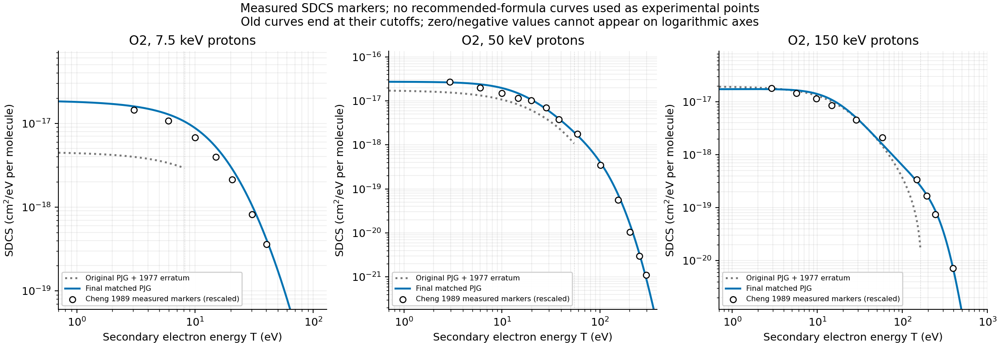

# Figure index

Every image below is an authored comparison plot, not a scan of a paper.
The numerical constraints and digitization provenance are in the data readers;
the manifest identifies original locations and exact bytes. Point styles and
legends distinguish measured data, authors' fitted curves and analytic
recommendations. A recommendation curve is not an experiment.

## Final frozen model

These are frozen copies of the production theory figures. In the model
comparison panels, gray denotes original PJG with the 1977 erratum and blue
the final calibrated SDCS; magenta, where shown, is the previous corrected
total-only refit. Measured points retain their source
normalization. The Rudd total fit and recommended SDCS are labeled separately.

The data behind these comparisons are in [frozen-validation.json](final/frozen-validation.json)
and the current fitting/data-reader code. The optical horizontal coordinate
is loss energy W, not secondary energy T. The stopping quantity is the
effective-pair loss divided by NIST electronic stopping. No equality is imposed.

## Earlier presentations and repeat fit

- The [original final-run plots](history/figures/final-original-presentation/)
  use the same selected coefficients but predate the production plotting
  refinements. Their physics-validation panel is byte-identical to the frozen
  panel above and is stored only once. Plot visibility on logarithmic axes
  must not be mistaken for clipping the signed original model's integral.
- The [production optimizer rerun plots](final/production-refit-figures/)
  correspond to [production-refit.json](final/production-refit.json), not to
  a different accepted calibration.

## Superseded investigations

| Figures | Study and caution |
| --- | --- |
| [Hard-tail audit](history/figures/pjg_hard_tail_audit.png) | Printed/corrected/total-only-refit hard-limit failure; not the final model |
| [Matched totals](history/figures/pjg-matched-results/pjg_matched_totals.png), [spectra](history/figures/pjg-matched-results/pjg_matched_spectra.png), [Bhabha comparison](history/figures/pjg-matched-results/pjg_matched_bhabha.png) | Early positive matched candidate before the final source-aware joint fit |
| [PSTAR stopping](history/figures/pjg-stopping-figures/pjg_stopping_nist.png), [optical tradeoff](history/figures/pjg-stopping-figures/pjg_optical_tradeoff.png) | Early optical-weight trials, including the O2 stopping overrun |
| [Cheng SDCS](history/figures/pjg-source-refresh-figures/cheng_1989_sdcs.png), [optical/stopping refresh](history/figures/pjg-source-refresh-figures/source_optical_stopping.png) | New source constraints and normalization assessment before final selection |
| [Totals and means](history/figures/pjg-properties-figures/totals_and_means.png), [stopping decomposition](history/figures/pjg-properties-figures/stopping_decomposition.png), [N2 mean-weight sensitivity](history/figures/pjg-properties-figures/n2_mean_weight_sensitivity.png) | Property and fit-weight sensitivity of the pre-final source-refreshed candidate |

See the corresponding [research reports](history/reports/) and
[result files](history/results/) for parameter sets, grids and limitations.
No earlier plot is relabeled as evidence for today's coefficients.
