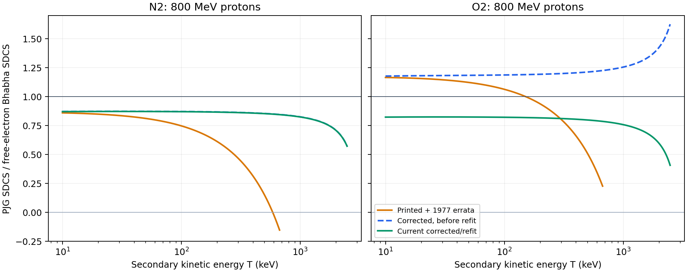

> Historical audit of commit 665031685, not the final calibrated model.
> The [archive guide](../../README.md) explains which findings were subsequently fixed.
> Links below were made portable during archiving; the unmodified original is
> retained in `history/exploratory-source.tar.gz` relative to the archive root.

# PJG proton SDCS: limits and consistency audit

Date: 2026-09-06. Repository: `codex/proton-impact-ionization`, commit
`665031685`. This is an analysis artifact, not a production-model change.

## Conclusions

Neither the original printed PJG proton formula nor the current corrected/refit
formula enforces the full free-electron Bhabha limit. PJG places the leading
inverse-square energy-transfer contribution in its empirical Lorentzian term.
Correcting the explicit hard-collision remainder therefore does not correct the
normalization of the complete hard spectrum. The total-only refit did not test or
enforce this condition. The earlier characterization of the refit as preserving
the Bhabha limit was too strong.

Both forms have a finite low-secondary-energy limit. That is compatible with the
isolated-target Coulomb threshold behavior, but does not establish the correct
molecular SDCS normalization, slope, or near-threshold structure.

Independent checks also expose a mixed-projectile-energy sampling bias,
single-precision cancellation in the device maximum-transfer calculation, and
important distinctions between electron-production yield, exclusive single
ionization, and the free-electron versus bound-electron cutoff. The production
double-precision interpolation itself is accurate on the tested default domain.

## Scope and source definitions

“Printed” always includes the 1977 corrections. Three variants are distinguished:

| Variant | Definition |
|---|---|
| Printed | PJG Eq. (16), Table III proton parameters, the printed maximum transfer and delta, with 1977 corrections applied |
| Corrected before refit | Exact free-electron maximum transfer and corrected Bhabha remainder, delta zero, otherwise Table III proton parameters |
| Current refit | Corrected form, N2 J = 59.65 eV; O2 J = 19.28 eV and K = 4.581e-16 cm2 |

The relevant source pages were checked visually, not inferred only from OCR:

- [PJG, pp. 158–159, Eq. (16) and Table III](https://doi.org/10.1063/1.432812).
- [1977 correction notice, reference 26](https://doi.org/10.1063/1.323427).
- [Bhabha, p. 270, Eqs. (2.1)–(2.2)](https://doi.org/10.1098/rspa.1938.0017).
- [Rudd et al. 1992, pp. 444, 454–455, 461–465](https://doi.org/10.1103/RevModPhys.64.441).
- [Rudd et al. 1985, p. 966, cross-section definitions](https://doi.org/10.1103/RevModPhys.57.965).

The low-energy Coulomb argument is also supported by the general final-state
interaction treatment in [Clauser and Barrachina (2016), Sections 2, 7, 8](https://doi.org/10.1088/0953-4075/49/23/235702).

## 1. Free-electron reference and exact kinematics

Use \(E\) for proton kinetic energy, total projectile energy
\(\mathcal E=E+Mc^2\), electron kinetic energy \(T\), and energy transfer
\(W\). For a bound channel, \(W=T+I_j\), neglecting recoil energy. For a
free initially stationary electron, \(W=T\). Write
\(E_e=m\beta^2c^2/2\) and \(C_B=N_e\pi e_{\rm c}^4\), with the
Gaussian-unit charge convention used in PJG.

The tree-level, point-Dirac-projectile Bhabha reference is

\[
 S_B(E,W)=\frac{C_B}{E_e}
 \left[\frac{1}{W^2}-\frac{\beta^2}{T_{\max}W}
 +\frac{1}{2\mathcal E^2}\right].
\]

Here \(N_e=14\) or \(16\) is PJG's own all-electron normalization. Using that
normalization is not a claim that an exclusive final charge-state channel has
this same coefficient.

Bhabha uses \(q=W/E\), with

\[
 q_m=\frac{2mM(\gamma+1)}{m^2+M^2+2mM\gamma}.
\]

In his Eq. (2.1), substitute \(dq=dW/E\) and \(dq/q^2=E\,dW/W^2\).
The first bracket coefficient is \(\gamma^2/(\gamma^2-1)=1/\beta^2\).
The second becomes \(-W/T_{\max}\). After extracting \(1/\beta^2\),
the last coefficient is

\[
 \frac{\beta^2(\gamma-1)}{2(\gamma+1)E^2}
 =\frac{1}{2\gamma^2M^2c^4}=\frac{1}{2\mathcal E^2}.
\]

The q-space and W-space evaluations agree within the 1e-11 relative tolerance
of the independent numerical check.

Exact two-body conservation gives

\[
 T_{\max}=\frac{2mc^2 E(E+2Mc^2)}
 {(Mc^2)^2+(mc^2)^2+2mc^2(E+Mc^2)}
 =\frac{2mc^2\beta^2\gamma^2}
 {1+2\gamma m/M+(m/M)^2}.
\]

It has the nonrelativistic limit \(4mME/(M+m)^2\). At 800 MeV the exact
free-electron transfer is 2.4807396 MeV, versus 0.6707010 MeV printed in PJG.
These results remain frozen; none of the findings calls for fitting them.

The corresponding electron direction follows from putting the outgoing
projectile on shell:

\[
 \cos\theta=\frac{(\mathcal E+mc^2)T}
 {\sqrt{E(E+2Mc^2)}\sqrt{T(T+2mc^2)}}
 =\sqrt{\frac{T(T_{\max}+2mc^2)}
 {T_{\max}(T+2mc^2)}}.
\]

Thus the free branch of the implemented angular closure is consistent with
the exact free-electron energy transfer.

## 2. Where the inverse-square term actually resides

Let \(F_j=f_jD\), where

\[
 D=\frac{E_e^{\nu+1}}{J^{\nu+1}+E_e^{\nu+1}},\qquad
 L_j=\ln\left(\frac{4E_eC_j}{I_j(1-\beta^2)}+e\right)-\beta^2.
\]

Both targets have \(\sum_j f_j=1\). The soft line shape is

\[
 G(T)=\frac{1}{(T-T_0)^2+\Gamma^2}
 -\frac{B}{(T-T_1)^2+\Gamma_1^2}.
\]

For secondary energies large compared with its centers and widths,

\[
 \frac{1}{(T-a)^2+g^2}
 =\frac{1}{T^2}+\frac{2a}{T^3}
 +\frac{3a^2-g^2}{T^4}+O(T^{-5}),
\]

so

\[
 G(T)=\frac{1-B}{T^2}+\frac{2(T_0-BT_1)}{T^3}+O(T^{-4}).
\]

Consequently the empirical coefficient of the hard inverse-square term is

\[
 a(E)=\frac{K\Gamma^2(1-B)\sum_j f_jL_j}{C_B}.
\]

In a hard-transfer window where binding and initial target momentum corrections
are small, the current corrected formula becomes

\[
 S_{\rm PJG}\simeq\frac{C_BD}{E_e}
 \left[\frac{a(E)}{T^2}-\frac{\beta^2}{T_{\max}T}
 +\frac{1}{2\mathcal E^2}\right].
\]

Terms suppressed by binding energies, line widths, and T0/T have been omitted
only in this asymptotic expression. Full formulas are used for the numerical
comparisons below. In particular, production retains Tmax + I_j in the
inverse-transfer denominator.

Matching the complete Bhabha expression requires D a = 1 for the leading
term and D = 1 for its explicit remainder. In practice D is close to one for
fast protons, but a is not constrained to one. Setting delta to zero does not
alter a at all. Adjusting J multiplies the whole fixed-E spectrum and cannot
repair its normalized secondary-energy shape. Adjusting K changes a relative
to the explicit remainder; it is not a soft-only modification in the physical
sense because the soft term already contains the hard inverse-square tail.

For the printed formula the corresponding expression is instead

\[
 S_{\rm print}\simeq\frac{C_BD}{E_e}
 \left[\frac{a(E)}{T^2}-\frac{1}{T_mT}
 +\frac{1}{4(E+2Mc^2)^2}\right].
\]

The erroneous inverse-transfer term then cancels an excessive part of the
empirical inverse-square contribution. A crossing of the reference curve at
one secondary energy is not a valid asymptotic transition.

At 800 MeV:

| Target and parameter set | a | D | D a |
|---|---:|---:|---:|
| N2, Table III | 0.875358 | 0.999847 | 0.875224 |
| N2, refit | 0.875358 | 0.998454 | 0.874005 |
| O2, Table III | 1.182523 | 0.999984 | 1.182504 |
| O2, refit | 0.827044 | 0.999994 | 0.827039 |

The full SDCS/Bhabha ratios at that proton energy are:

| Target | T (keV) | Printed | Corrected before refit | Current refit |
|---|---:|---:|---:|---:|
| N2 | 100 | 0.747232 | 0.871241 | 0.870028 |
| N2 | 500 | 0.151581 | 0.854392 | 0.853202 |
| N2 | 2000 | Outside printed cutoff | 0.709122 | 0.708134 |
| O2 | 100 | 1.063316 | 1.187331 | 0.821577 |
| O2 | 500 | 0.509956 | 1.212801 | 0.798141 |
| O2 | 2000 | Outside printed cutoff | 1.425715 | 0.596517 |

The free reference uses W = T. Binding shifts are negligible compared with
these discrepancies at the listed large transfers. The 2 MeV examples are
below, not at, the exact free-electron endpoint. At 10 MeV proton energy and
T = 5 keV, refit/reference ratios are 1.05293 and 1.27850 for N2 and O2,
respectively: the mismatch is energy dependent.

There is also no exact identity enforcing the relativistic limit. E_e tends
to mc2/2, not infinity, so D is not literally one for nonzero J. The line
parameters approach constants while L_j grows logarithmically with gamma2.
This statement must not be confused with taking E to infinity at *fixed* T:
real bound-electron dipole contributions can have a logarithmic relativistic
rise in that different limit. The appropriate hard-limit test requires large
transfer with negligible binding/dipole contributions, not just large beam
energy. The finite-energy comparisons above already demonstrate the failure.

## 3. Positivity and normalization consequences

Printed N2 at 800 MeV crosses zero at T = 587.1777 keV and stays negative
up to its printed 670.7010 keV endpoint. Thus the literal printed formula
cannot be a probability density over its entire nominal support.

A scan over 1001 logarithmic beam energies from 1 keV to 1 GeV, each with
2049 secondary-energy samples, found negative printed spectra for both gases.
For N2, 364 beam-grid points had a negative summed SDCS; for O2, 89 did.
These counts are sampled diagnostics, not claims that all intervening energies
form one connected interval. Some individual continua also become negative.

The same scan found no negative summed or individual-continuum SDCS for either
corrected variant on the default 1 keV–1 GeV domain. This is a strong sampled
check, not an analytic proof over a continuous two-dimensional parameter domain.

However, the current refit first has a zero endpoint value at approximately
1.19917 GeV for O2 and 1.86343 GeV for N2. Just beyond those energies the
unclipped spectrum is negative near the endpoint. The N2 endpoint crossing is
unchanged by its J-only refit. The unrefitted corrected O2 form did not show
this endpoint crossing over the checked 0.8–5 GeV bracket.

This exposes an implementation inconsistency outside the default domain:
[the public SDCS clips the sum to zero](https://github.com/ssarwar/WarpX/blob/665031685/Source/Particles/Collision/ProtonImpactIonization/PJGModel.cpp#L409),
whereas the analytic total and inverse-CDF construction integrate the signed
unclipped formula. If a user extends the configured energy interval, the reported
SDCS, integrated total, and sampled distribution need no longer agree. Checking
only positivity of the total at initialization does not detect this.

The small probability of hard events explains why total-only fitting is
insensitive to this problem. As a sensitivity calculation, replacing just the
part above 100 keV by the free Bhabha spectrum at an 800 MeV beam energy gives:

| Target | Change in total | Change in mean secondary energy | Change in second moment |
|---|---:|---:|---:|
| N2 | +0.000580% | +3.54% | +23.15% |
| O2 | +0.001074% | +5.12% | +35.13% |

This is only a diagnostic replacement, not a proposed discontinuous splice and
not a production change. A total cross section can be almost unchanged while
the energetic tail and its fluctuations are materially wrong.

## 4. Low-secondary-energy limit

For fixed nonzero beam energy, all Lorentzian widths and I_j are positive.
Therefore the current model has

\[
 S(E,T)=S_0(E)+O(T),
\]

where

\[
 S_0=\frac{D}{E_e}\sum_j f_j\left\{
 K\Gamma^2L_j\left[\frac{1}{T_0^2+\Gamma^2}
 -\frac{B}{T_1^2+\Gamma_1^2}\right]
 +C_B\left[\frac{1}{2\mathcal E^2}
 -\frac{\beta^2}{(T_{\max}+I_j)I_j}\right]\right\}.
\]

The printed form has the analogous finite expression with its printed
remainder. Both S0 values were positive over the sampled default beam range.
Direct evaluation at T = 1e-9 eV agrees with the explicit T = 0 limit within
the 1e-9 relative assertion tolerance.

The free-electron W^-2 singularity at W = 0 is not the applicable ionization
limit. In a bound channel T approaches zero while W approaches I_j, not zero.
For an isolated target leaving a positive residual ion, the outgoing electron
also has Coulomb final-state distortion. Schematically, its enhancement factor
is 2 pi eta / [1 - exp(-2 pi eta)], eta proportional to 1/k. This grows as
1/k and cancels the k factor in the energy-differential continuum phase space.
A finite threshold SDCS is therefore permitted, rather than a required
T^-2 divergence or a universal square-root suppression. This argument concerns
the regular continuum envelope; particular channels, resonances, screening,
and simultaneous incident-energy thresholds require separate treatment.

PJG passes that qualitative power-law test, not a quantitative threshold
validation. Its S0 and slope remain empirical. At fixed beam energy the N2
J-only refit leaves the entire normalized SDCS unchanged. It cannot by itself
correct the relative production of near-zero-energy electrons. O2's K change
mostly alters normalization where the hard remainder is tiny, while changing
the balance with the hard tail elsewhere.

For fast protons, the appropriate additional low-T check is against
shell-resolved optical/dipole oscillator strengths and measured slow-electron
SDCS. Rudd's discussion of Bethe/Platzman/photoionization consistency makes
clear why a total-only fit is insufficient. No new optical-data fit or
quantitative claim of an exact N2/O2 threshold normalization was made here.

## 5. Other physical checks

### Free-electron cutoff is not the complete molecular kinematic support

Rudd et al. 1992 explicitly distinguish the free-electron binary cutoff from
bound-electron ionization. Initial electronic momentum and momentum transfer
to the residual core allow electrons beyond the free-electron cutoff. The
exact free-electron Tmax must remain fixed, but using it as a sharp cutoff for
the complete molecular SDCS is still a modeling approximation. In particular,
it is not an exact implementation of all allowed bound-electron energies.
At low beam energies this can change the shape strongly, and an amplitude
refit cannot reconstruct the omitted spectral support.

PJG also has no exact incident-energy threshold factor: evaluated outside the
default lookup range, the corrected/refit formula gives positive totals even
at E = 10 eV, below both molecular ionization thresholds. This is an
extrapolation failure, not a failure inside the present 1 keV lower cutoff.

### Electron-production yield versus single-ionization events

Rudd 1985 defines sigma_minus = sum_i i sigma_ie, whereas the event-counting
cross section is sum_i sigma_ie and exclusive single emission is sigma_1e.
The reviewed yield can include multiple ionization and other accompanying
processes; molecular dissociation further complicates channel definitions.
It is not automatically the cross section for one electron plus a stable N2+
or O2+ molecular ion.

The existing one-pair source uses the inclusive electron-production total as
an effective pair-production rate. That may be a deliberate approximation,
but it must not be described as a validated exclusive single-ionization
channel. In particular, an all-electron Bhabha tail, inner-shell ionization,
and subsequent Auger electron production must be reconciled with whichever
event definition is selected. No branching fractions were inferred here.

### Angular closure

The free branch has the exact two-body angle, the I/T -> 0 free limit, and
the intended isotropic T/I -> 0 limit. Bounded cosine does not, however,
guarantee a physically accurate angular distribution.

Writing the unclamped cosine as mu = a + b xi, with xi uniform on [-1,1],
b = I/(T+I), and a = mu_free(1-b/2), its forward-clamped probability is
max(0, a+b-1)/(2b), when b > 0. Hard clamping therefore creates a point mass
at exactly mu = 1 wherever a+b > 1, rather than a continuous molecular
angular DCS. Integrating this mass over the current SDCS gives about 15.96%
for N2 and 15.94% for O2 at a 1 keV proton energy. At 50 keV the fractions
are about 0.119% and 0.302%. This is a closure artifact, not a divergent
energy SDCS. It motivates a continuous bounded angular construction and
comparison with angular data if this low-beam-energy regime is to be trusted.

The neutral thermal-ion source and rigid-beam approximation intentionally do
not conserve represented-particle energy/momentum in each event. That is the
requested source-model approximation, not an error uncovered by this audit.
One small implementation detail is that the thermal speed uses ion mass
rather than neutral mass; the relative variance difference is only about
2e-5 for these molecules, but it is not literally the neutral velocity law.

## 6. Independent numerical checks

The integral and first two unnormalized moments were derived separately. For
example, the Lorentzian primitive can be expressed without subtracting two
nearly equal arctangents:

\[
 \int_0^u\frac{dT}{(T-a)^2+g^2}
 =\frac{1}{g}\operatorname{atan2}(ug,g^2+a^2-au).
\]

Adding the corresponding logarithmic first-moment primitive and quadratic
second-moment primitive gives analytic M0, M1, M2. Independent adaptive
quadrature was performed in log(1+T), with normalization to avoid absolute
tolerances inappropriate for microscopic cross sections.

| Check | Result and tested scope |
|---|---|
| Continuum fraction normalization | Sum f_j = 1 for both targets; fractions and D positive |
| Dimensions and cm2-to-m2 conversion | Consistent; production host values match independent SI values |
| Bhabha q-to-W transformation | Passed, 1e-11 relative assertion tolerance |
| Analytic T -> 0 expression | Passed, 1e-9 relative assertion tolerance |
| Lorentzian tail expansion | Passed, 1e-9 relative assertion tolerance; formal algebraic test outside support labeled as such |
| M0, M1, M2 versus adaptive quadrature | Maximum relative difference < 2e-13, ten beam energies per gas, 1 keV–1 GeV |
| CDF derivative versus SDCS | Finite-difference agreement within 2e-6 relative on tested points, including tiny tail densities |
| Moment bounds | 0 <= mean(T) <= Tmax, mean(T)^2 <= mean(T2) <= Tmax mean(T), all checked cases |
| Effective binding bounds | Lies between the minimum and maximum model continuum thresholds |
| Corrected continuum positivity | Passed sampled 1001 x 2049 grid for each gas and corrected variant, default domain only |

A standalone C++ diagnostic was linked to the existing production PJG object
and used its real host reference and actual double-precision lookup executor.
It sampled 74 beam energies and 2049 quantiles per energy for each gas.
Its results were checked against the independent Python formula, not only
against the production formula itself.

| Maximum sampled error | N2 | O2 |
|---|---:|---:|
| Host total, relative | 1.3e-10 | 2.0e-10 |
| Host SDCS, relative | 2.1e-11 | 6.1e-11 |
| Lookup total, relative | 2.62e-4 | 4.05e-4 |
| Lookup inverse-CDF, absolute CDF error | 5.04e-5 | 4.57e-5 |
| Sampled first moment, relative | 1.33e-4 | 1.20e-4 |
| Sampled second moment, relative | 5.03e-4 | 4.52e-4 |
| Effective binding, absolute eV | 5.03e-5 | 8.76e-6 |

All tested lookup quantiles were monotone and within their configured
free-electron support. Small host/reference differences also include the
rounding of physical constants. The listed maxima are measured on this test
set, not proven uniform error bounds.

### Single-precision cancellation

[The executor calculates beta2 as 1 - 1/gamma2](https://github.com/ssarwar/WarpX/blob/665031685/Source/Particles/Collision/ProtonImpactIonization/PJGModel.H#L146).
An IEEE float32 arithmetic emulation gives a 0.666% Tmax error for a
1 keV proton. For an ion with M = 16 Mp at the same *total* 1 keV energy,
the error is about 79%; for M = 238 Mp it returns zero instead of
0.009153 eV. These are arithmetic diagnostics, not assertions that bare
heavy-ion charge-squared scaling is physically valid at such small velocities.

An algebraically equivalent, cancellation-resistant implementation uses
u = E/(Mc2), beta2 = u(u+2)/(1+u)2, and beta2 gamma2 = u(u+2).
This changes no frozen physics and avoids subtracting nearly equal numbers.
It is suitable for CUDA/HIP/SYCL, but no accelerator hardware or
single-precision production binary was tested in this audit.

### Joint-sampling bias for mixed-energy beams

[Parent selection progresses monotonically through cumulative rate weights](https://github.com/ssarwar/WarpX/blob/665031685/Source/Particles/Collision/ProtonImpactIonization/ProtonImpactIonization.cpp#L409),
while [the secondary-energy quantile uses the same monotone product index](https://github.com/ssarwar/WarpX/blob/665031685/Source/Particles/Collision/ProtonImpactIonization/ProtonImpactIonization.cpp#L475).
Independent random offsets within the first stratum do not remove the
correlation between the two ordered coordinates.

For an explicit counterexample, take equal total parent-selection scores from
50 keV and 800 MeV protons. If the low-energy parents come first, they receive
the lower half of the energy quantiles and the high-energy parents receive
the upper half. Reversing their order reverses that assignment. The correct
conditional quantile should instead be uniform for either parent population.

| Target | Correct mixture mean T (eV) | Low-energy parents first | High-energy parents first |
|---|---:|---:|---:|
| N2 | 37.1180 | 54.8797 | 19.3563 |
| O2 | 46.9478 | 69.7954 | 24.1003 |

These are converged continuum-quadrature counterexamples for the sampling
rule, not new full-PIC mixed-beam runs. They demonstrate systematic bias that
does not disappear by increasing the number of products. A monoenergetic
test validates the marginal SDCS but cannot detect this joint-distribution
failure. An independently randomized, measure-preserving quantile assignment
or appropriate multidimensional randomized stratification is needed; simply
increasing the table resolution does not fix it.

## 7. Regression status and remaining validation

Both existing Python regression analysis stages passed on newly generated
outputs. The physics stage checked monoenergetic sampling, rates, rigid beam,
and ion thermal statistics. The performance analysis also passed its existing
CPU checks. However, both run stages timed out at 60 seconds during shutdown
after the simulation work and profiler output. Thus CTest was 2/4 passed,
not a clean pass. MPI initialization also requires running outside the
sandbox here. The standalone diagnostic generated its complete output but
likewise stalled in finalization and was interrupted. Shutdown was not
diagnosed further; it must not be mislabeled as an SDCS failure or as a
passing end-to-end test.

The audit does not establish a quantitatively correct optical/dipole limit,
an exclusive single-ionization branching model, a validated molecular angular
DCS, heavy-ion non-Born corrections, or GPU performance. No sum rule can be
validated merely from sum_j f_j = 1: these empirical fractions are not a
complete generalized oscillator-strength distribution.

## 8. Recommended next revision, not applied

1. Keep the exact free-electron Tmax and Bhabha factors fixed. Enforce the
   leading hard coefficient as well, rather than calling only the explicit
   remainder the Bhabha correction.
2. Separate a physically normalized hard component from a bound/dipole
   component whose high-transfer contribution does not duplicate it. Do not
   add a full Bhabha cross section to the current PJG term: that double counts
   the inverse-square contribution already present.
3. Refit only the genuinely empirical component, constrained by both total
   and differential/optical information. Forcing a single B(E) to match the
   tail is only a partial algebraic repair: the global D multiplier on the
   remainder must also be handled, and positivity and the low-T shape must
   be rechecked.
4. Resolve inclusive electron yield versus exclusive single-ionization event
   semantics, and document the molecular cutoff approximation explicitly.
5. Repair the mixed-energy joint sampling, use stable single-precision
   kinematics, and prevent unsupported negative-spectrum configurations from
   silently generating incompatible totals/CDFs.
6. Add independent hard-limit, positivity, mixed-beam-ordering, float32, and
   spectral-moment regression checks before claiming a physics-complete refit.

Production source, documentation, fitted parameters, and git history were not
modified. No commit, push, or PR was made for this analysis-only request.

## Reproducibility

Scratch files in this worktree:

- [Exploratory source archive](../exploratory-source.tar.gz): `tmp/pjg_limit_audit.py`,
  `tmp/pjg_consistency_audit.py`, `tmp/pjg_table_audit.cpp`,
  `tmp/build_pjg_table_audit.py`, and `tmp/pjg_audit_extras.py`.
- [Numerical results](../results/exploratory/pjg_consistency_audit_results.json).
- [Additional moment and angle results](../results/exploratory/pjg_audit_extras_results.json).

The parameter-only import from the older `tmp/pjg_reference.py` uses its
transcribed Table III data. Its older function named `sdcs(..., "printed")`
does not itself substitute the printed cutoff and is deliberately not used
in this audit. The new script evaluates the genuinely printed cutoff and
remainder together.

Run the Python diagnostics with the `warpx-cpu-mpich-dev` conda environment.
The standalone C++ diagnostic writes native float64 records to
`tmp/pjg_table_audit.bin`; the Python analysis documents and reads that format.
The positivity scans and quadrature checks are deterministic.
